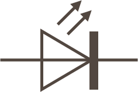

An [LED](https://en.wikipedia.org/wiki/Light-emitting_diode) is a [diode](http://localhost:4000/Hardware/Circuits/Diodes/) (a component that attempts to let current flow only one way through it) that emits light when voltage is applied to it. On a circuit diagram, it looks like a Diode with two arrows (to indicate emitting photons) pointing away from it:

Because it is a diode, it only works when a voltage is applied one way. For this reason, LEDs usually have one lead longer (the [Cathode](https://en.wikipedia.org/wiki/Cathode)) than the other (the [Anode](https://en.wikipedia.org/wiki/Anode)), to indicate which leg should be hooked to the positive (`+`) side of a circuit:

[need image and diagram]

LEDs have two fundamental properties that the electronics designer should take into consideration, namely the forward voltage (Vf)and the maximum current (Ifmax) it can conduct.  Typical values for VF and Ifmax are:

| Color  | Vf | Ifmax |
|--------|---------------|------------------|
| Red    | 1.8V          | 15mA - 20mA      |
| Green  | 2.1V          | 20ma - 30mA      |
| Blue   | 3.4V - 3.6 V  | 20mA             |
| Yellow | 2.0V          | 15mA             |
| White  | 1.9V - 2.4V   | 30mA             |

These values may vary between suppliers and the data sheet for the component purchased will provide the appropriate values.

## LED Colors

LEDs are available in a variety of colors, the most common of which are red, green, yellow, white and blue.

RGB (Red, Green and Blue) LEDs are capable of displaying a wide variety of colors.  These LEDs are actually three LEDs, one red, one green and one blue.  The wide variety of colours they are capable of displaying comes from the intensity of each of the three LEDs.

LEDs can also emit light in the infrared spectrum.  These LEDs are used in remote controls for devices such as televisions and cameras.

## LED Power

LEDs are extremely efficient and have a wide variety of uses.  Consumer electronics and hobbyist projects use LEDs to indicate the status of a system, is the power on, is the circuit connected to a network etc.

Higher power LEDs are used in modern day lighting.  Such applications often require the use of a [heatsink](https://en.wikipedia.org/wiki/Heat_sink) in order to prevent the LED from destroying itself through overheating.

## Limiting Current

LEDs are extremely efficient light generators because they convert currently directly into photons. As such, it typically doesn't take very much current to power them. Too much current (exceeding Ifmax), and they burn out.

Because of this, the current that drives an LED is typically limited by one of two methods:

 * [A current limiting resistor](Driving_w_Resistor) - A resistor can be used to reduce the current. This is probably the most common way to drive an LED.
 * [Driving it with a Pulse Width Modulation (PWM) signal](Driving_w_PWM) - By using a PWM, the LED receives pulses of current that limit the overall current through the LED over time.

## Uses and More Information

[[Can also be used as a light sensor!](http://makezine.com/projects/make-36-boards/how-to-use-leds-to-detect-light/)]

# Further Information

[LED on Wikipedia](https://en.wikipedia.org/wiki/Light-emitting_diode)
