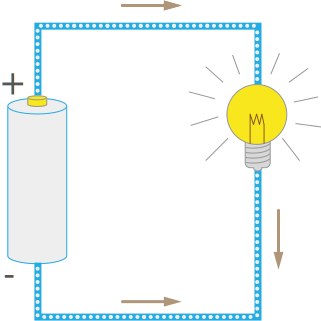

In order to understand how circuits work and how to design them, we must first understand some basic physics. Electrical theory and application comes directly from the structure and forces of atoms.

# Atoms

Physical things we interact with in the world are made of molecules, which are then composed of atoms. 

Most molecules are very small, atoms are very, very small. To give an idea of the size of an atom; a cup of water has about 6.022 x 1024 water molecules. Water's chemical symbol is H20, meaning that it is a molecule made of Hydrogen (x2) atoms, and one Oxygen atom. Therefore there are three times as many atoms as molecules in a glass of water, or 18.066 x 1024 or 180,660,000,000,000,000,000,000,000,000 atoms.

## Protons, Neutrons, and Electrons

Atoms are composed of three more elementary particles; protons, neutrons, and electrons.

Protons and neutrons are incredibly dense and make up the core, or _nucleus_ of an atom. In fact, they're so dense, that a teaspon of them packed together would weigh many tons on earth. However, an atom is mostly empty space, because while the protons and neutrons are tightly clustered in the center of the atom, electrons orbit a distance around the nucleus:
 

Atoms are classified on the [periodic table](http://www.ptable.com/) by the number of protons they posess, which is also their _atomic number_. So for example, hydrogen has (1) proton, so therefore its atomic number is 1. Helium has 2 protons, so its atomic number is 2, lead has 82, and so forth.

## Isotopes

As atoms go up in their number of protons, the number of neutrons they have also generally increases. Adding together an atom's protons and neutrons gives the _atomic weight_ of an atom. So for instance, carbon, which has an atomic number of 6, generally has 6 protons, and 6 neutrons. This means that elements actually get heavier by 2 as they go up the periodic chart; helium has an atomic weight of 4, and lithium, with an atomic number of 3, has an atomic weight > 6.

However, while an element is defined by the number of protons it has, any given element can vary in the number of neutrons it contains. These variations are called _[isotopes](https://en.wikipedia.org/wiki/Isotope)_, which is Greek for "equal places," because even though they have different densities, they still occupy the same place in the periodic chart. They also retain the same general chemical characteristics, though they may have different nuclear behaviors.

All elements may have different isotopes. For example, the element carbon can  have an atomic weight of 12, 13, or 14. Since atomic weight is `atomic number + neutrons`, we can deduce that the carbon-12 (which is how an isotope is named), has 6 neutrons, while carbon-13 has 7 neutrons, and carbon-13 has 8 neutrons.

## Electrical Charge

Both protons and electrons have an attraction/repelling force, or "charge." Protons and electrons have the same amount of charge from a quantity standpoint, but they are qualitatively different, in that protons and electrons exert opposite forces, which cause them to attract each other, while electrons will repel each other. The amount of charge a proton or electron has is known as a [_unit electrical charge_](https://en.wikipedia.org/wiki/Elementary_charge#Quantization), often denoted as _e_, and was once thought to be the smallest amount of electrical charge possible (we now know that [quarks](https://en.wikipedia.org/wiki/Quark), have an even smaller electrical charge).

**Protons are said to have a "positive charge,"** Neutrons have no charge (neutral), and **electrons have a "negative charge."**. However, the terms negative and positive in this context have no intrinsic meaning, instead, their naming has been chosen arbitrarily, in that they could have just as easily been called _up_ and _down_ charges, or protons could have been said to be negative and eletrons positive. The important part here is that they are opposites.

## Ions

Because protons and electrons have the same amount but opposite type of charge, the number of electrons in a balanced atom (in which the net electrical charge is zero), must be equal. So a hydrogen atom (atomic number of 1) should have one proton and electron. Iron, which an atomic number of 26, should naturally have 26 protons, and 26 neutrons. 

However, atoms can gain or lose electrons, causing them to have a net positive (if there are more protons) or net negative charge (if there are more electrons). These atoms are called [ions](https://en.wikipedia.org/wiki/Ion). And the process of becoming ionized is ionization. 

## Conductors

Atoms often combine together to form molecules or in a repeating lattice to form crystals and metal, by sharing electrons. In some materials, such as silver or copper, electrons move easily between atoms. Materials that readily share electrons like this are said to be _conductors_, or _conductive_.

[illustration]

## Electrical Current

Atoms want to be balanced; that is, if they are positively charged (have too few electrons), they exert an attractive forced to try and take free electrons to achieve balance; a neutral charge. Atoms that have a negative charge (too many electrons), tend to want to get rid of excess electrons.

Usually, electrons jump from negatively charged atoms to positively charged locations. We can think of this as an electron filling a "hole." When an electron moves in this direction, it leaves a hole behind it, which has a positive charge. so we can think of electrons flowing one way, and holes (or positive charges) flowing the other way:

[illustration showing electrons moving one way, and holes/positive charge flowing the other way]

This movement of electrons and holes is what we call _electrical current_. 

Hole flow was first observed and measured in the 1740s by [Benjamin Franklin](https://en.wikipedia.org/wiki/Benjamin_Franklin), who also named the charges as positive and negative.

Benjamin Franklin's work kickstarted the practical use of electricity, and a big part of electrical theory and electrical engineering were based on it. For this reason, when we see a diagram like the following, it's actually misleading:

This illustration isn't really accurate, because it implies electrons flowing from a positive charge, to a negative charge. It wasn't until 150 years later, in 1897, that [Sir J. J. Thomson](https://en.wikipedia.org/wiki/J._J._Thomson) posited that atoms were made of electrons and discovered that electrons, rather than holes, were thing that was actually moving.

However, in practical usage, it doesn't matter, because most everything has standardized on Benjamin Franklin's convention. For this reason, many people use the term _charge carrier_, which can mean either a positive charge (electron) or a negative charge (hole).

### Speed of Electrical Current

One last point of clarification on the physics of electricity, and we'll be ready to start looking at practical aspects of electricity. But first, we need to understand the speed of electricity.

We think of electricity as moving at near the speed of light, which is how we can communicate around the world on the phone or via the internet, almost instantly. But it turns out; electrons actually flow, or _drift_ as physicists say, pretty slowly. So how is this possible?

Well, it turns out, what actually moves is the _electromagnetic wave_, which is the propagation of the charge moving. Consider a hypothetical tube full of marbles:

If you add a marble in one end, a marble will fall out of the other end almost immediately, even though each marble only moved a small amount:

Now imagine that those marbles are electrons; the **effect** of adding an electron is near instantaneous, or as fast as anything can actually travel; the speed of light. In a conductive material, electricity works the exact same way, even if it's a very long wire. So the data that's encoded in the patterns of electrons on a wire when a phone call is made around the world, may actually only travel a short distance, but on the other end, the effect is the exact same as if those electrons traveled the whole way.

## Electrical Magnetism

[as discussed earlier, electrons are bound to the nucleus of atoms via the electromagnetic force]

[current flowing through a wire creates a magnetic field]

[charges can act on each other at a distance. 

[magnetic field can _induce_ a current in a wire without touching it]

[we'll see later that this is important for a lot of stuff]

[Next (Part 2)  >>](../Part2/) 
 
<!-- 

# NOTES

 * Electrons orbit the Nucleus in incredibly complex patterns, but at any given time tend to be at a particular distance away from the nucleus. That distance is a predictable distance and is called a shell.
    * this is key to how work is done with electricy

-->

