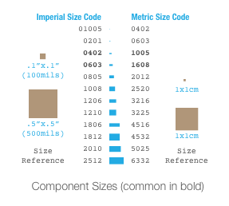

# Packages and Sizes

# Passive Rectangular Components

[Resistors and capacitors]

[numbers are width * height, so in imperial, an 0402 is 0.04" x 0.02". The metric equivalent of 1005 is 1.0mm x 0.5mm]

[Make sure when buying them that you know whether Imperial or Metric is being specified, since 0402, and 0603 are found in both Imperial and Metric codes, but specify different sizes of components]

[1812 and 1206 (Imperial) are specialized sizes, most commonly used for components that require heat dissipation]

[smaller tends to be cheaper]

http://www.radio-electronics.com/info/data/smt/smt_packages.php

https://www.wikiwand.com/en/Surface-mount_technology

https://www.wikiwand.com/en/Through-hole_technology

http://www.topline.tv/SizeChart.html