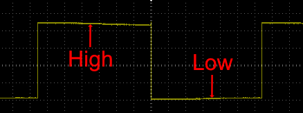
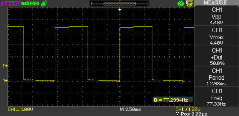
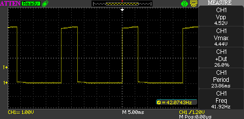
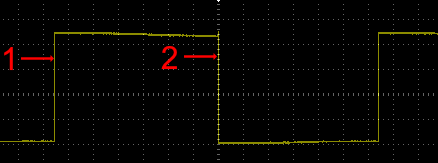

## Supply Voltage

The supply voltage determines the voltage used to represent a digital 1 and a digital 0.  Common supply voltages are:

* 5V
* 3.3V
* 2.5V
* 1.8V

Supply voltages (Vcc) of 5V are gradually being replaced by 3.3V and lower voltages.

## High (1) and Low (0)

Digital circuits work with two logic levels:

* High (known as logic 1 or true)
* Low (known as logic 0 or false)

In a perfect world, a high logic level is represented by the supply voltage and a low logic level is represented by ground.

## Oscilloscope Traces

An oscilloscope can be used to examine a digital signal in a circuit:

When understanding digital signals it is essential to understand a number of key terms:

* High and low
* Duty Cycle
* Rising and falling edge
* Period
* Frequency

### High and Low Logic Levels

Binary signals are represented by a high (logic level 1 or true) and low (logic level 0 or false):

This shows a simple trace where the signal is high for 50% of the time and low for 50% of the time.

### Duty Cycle

The **duty cylce** is a percentage of time the signal is high.  When the time the signal is high is the same as the time the signal is low then the duty cycle is 50%:

The measurement panel on the right of the oscilloscope trace presents a number of measurements for the signal.  This shows that the duty cycle is 50%.

Compare this with the following:

In this trace the amount of time the signal is high is a lot lower than in the previous trace.  The measurement panel gives the duty cycle as 26%.

### Rising and Falling Edges

The digital signals shown all present a transition from low to high and high to low.  The transitions are known as rising and falling edges:

The trace at point 1 represents a **rising edge** where the digital signal makes a transition from 0 to 1.  This is sometimes known as a _positive_ edge.

At point 2, the signal is moving from 1 to 0.  This is known as a **falling edge** or _negative_ edge.

## Period and Frequency

Signals with a repeating pattern such as a clock signal have two related properties, namely the period and the frequency.

The period is the time between two rising edges:

The frequency of the signal is the number of repeating events in 1 second.  In this case the repeating event is represented by the period.

So the frequency is 1 / the period.  So for a period of 1 millisecond (0.001 seconds), the frequency (f) is:

f = 1 / 0.001

or f = 1000 Hz (1 KHz).
