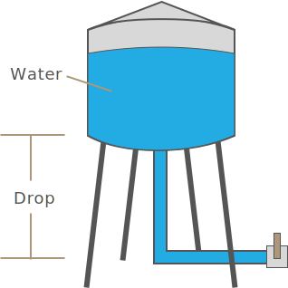
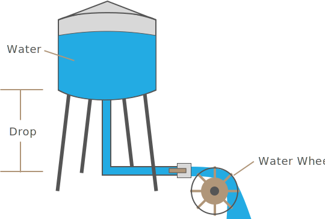
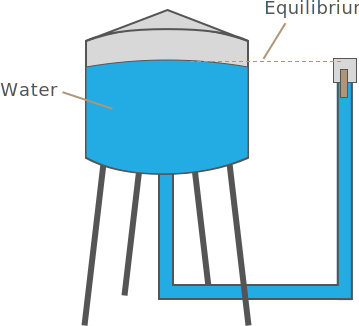

In part 1 of our electronics primer we got an understanding of the physical nature of electricity. In this part, we're going to start to look at some of the practical aspects that arise from that nature.


## Electricity's Ability to do Work; Amount and Force

Electricity is useful because of its ability to do work. We can heat with electricity, generate light, and use the magnetic force of electricity to turn electric motors that propel our cars, vacuum our houses, and mix our smoothies.

In order to describe the amount of work that electricity can do, we use two characteristics:

 * **Amperage** - Measured in amps (A), this is the quantity of electrons that are being moved.
 * **Voltage** - Measured in volts (V), this is the amount of force in which those electrons are being moved.

Water is used as a common analogy to relate these characteristics. Imagine a water tower full of water, and a pipe extending down to the ground below it:



In this analogy, we can think of the water tower as a battery. 

Now imagine, at the bottom of the pipe is a valve that can release water and a water wheel that spins when water flows over it.



The water tower has a quantity of water in it, and the gravity pulling from the water down to the ground, generates a force to move that water. When water is flowing over our water wheel, the molecules of water (analogous to our charge carriers) are causing the water wheel to move, and gravity acting on the difference in height from the top of the water to the bottom of the water to generate a force to push those water molecues and do work.

In order for electricity to be useful, we must have both a quantity of charge carriers (amps), and force to move them (volts). Imagine a water tower full of water, but the pipe outflow is the same height as the top of the water stored in the tank:



Even though charge carriers exist, there is no different in height to create a potential, or force to move them.

Similarly, even with a very tall, but empty tower, if there are no charge carriers to move, there can be no work done, even though gravity could be acting over a large height difference.

This system, taken as a whole, is analgous to something like a cordless electric drill, in which the battery is our water tower, and the electric motor is the water wheel, and the trigger is the valve that let's water flow:

[illustration of electric drill]

### Amperage (Amperes/Amps/A)

One of the simplest (though not actually the official) definitions of an [ampere (amp)](https://en.wikipedia.org/wiki/Ampere) is 1 [_coulomb_](https://en.wikipedia.org/wiki/Coulomb) of charge carriers passing through a given location per second. 

One coulomb is equal to 6.242 x10^18 (6,242,000,000,000,000,000,000) charge carriers. A fantastically large number, but given the relative size of electrons, one can imagine that number of charges moving on a relatively modest wire. Consider household wiring, which is typically 14 or 12 gauge, and rated at carrying 10 or 15 amps (at 120 volts), respectively.

#### Common Amperages

To get an idea of the amount of work that can be done with that number of electrons, consider the following household appliances and their amperage:

| Appliance                       | Amperage |
|---------------------------------|--------------|
| 60 Watt incandescent light bulb | 500mA (0.5A) |
| 10 Watt LED (60 Watt incandescent equivalent) | ~100mA (0.1A) |
| Hair Dryer | 12 amps |

#### Amp Hours (Ah)

When describing the quantity of charge either available, or used, _amp hours_ (Ah), are used. An amp hour is an hour's worth of amps, or 3,600 coulombs (since there are 3,600 seconds in an hour).

In our water tower analogy, the quantity of water flowing over our water wheel at any given second is measured in Amps, and the quantity of water stored in the water tower (battery), is described in amp hours.

[illustration of water tower with labels of Remaining Charge, measured in Ah, amount of current flowing, measured in A, and force of water, measured in V]

Amp hours are often expressed in _milliampere hours_ (mAh), which is one-thousandth of an amp hour, or 3.6 coulombs. For reference, a typical AA NiMH rechargeable battery will have ~2500 mAh (2.5Ah), and a D NiMH rechargeable has ~10,000 mAh (10 Ah).

### Electromotive Force (EMF) and Voltage

In order for a current to exist, charge carriers must be motivated to move.

Returning to our water tower analogy, gravity acting on the difference in height of the top water to the bottom, generates a potential force that can be exploited to move water and turn the water wheel.

This pressure at the valve is known as _electromotive force (EMF)_ and is expressed as a difference between the top and bottom of the water path and represents a potential for work.

#### Relative Voltage

When water (or charge carriers) is flowing through the valve, the amount of force is expressed in _volts_ (V).

It's important to note that this force is relative; even if the water towers were at different altitudes, the pressure at the valve is still dependent on the _voltage drop_ from the top of the water to the ground.


Consider the following two simple circuits:

[circuit diagrams of 10v and 20v with a drop of 5v across both to 5v/15v respectively]

While both circuits have different source and load voltages, in both cases, the voltage drop is 5v, since the source minus the load is 5v, meaning that the force of electricity in both cases is actually the same.

A minor, technical point, is that while EMF exists whether curent is flowing or not, voltage only applies when a current exists. 

#### Common Source Voltages

Voltage amounts vary greatly around the world, and for different uses, consider the following sources:


| Source                          | Voltage      |
|---------------------------------|--------------|
| High power transmission lines   | 230kV - 500kV |
| North American Household Mains  | ~117V (110 nominal) |
| European Household Mains        | ~220V (230 nominal) |
| AA Battery                      | 1.5V |
| USB Power                       | 5V   |
| Netduino Digital IO             | 3.3V |
| Low-power Peripherals           | 1.8V |

For most of the circuits that we'll explore here, voltages of 5V and 3.3V are the most common. However, many logic circuits control higher voltage circuits that power motors, heaters, and other loads that do heavy lifting and are typically powered by household mains of 110V and 220V.

## Common and Ground

Both common and ground:
[reference point from which voltages are measured]
[might be 0V. might be higher. goes back to relativity of voltage drop.]


Ground is
[where electrons go.][an infinite sink, that is something that can absorb an infinite amount of charge carriers. the earth is ground]

symbol:
[ground symbol]

[in circuits you also have common and floating return]


## Relationship of Amps & Volts

North American and European household electricity mains have different voltages (110V and 220V, respectively), but with a plug adapter, appliances generally work on both. In fact, the total amount work that they can do is essentially the same. This is because while European mains are twice the voltage, they're actually half the amperage; most wall outlets in North America are rated for 12A (technically, 80% of 15A), whereas European wall outlets are typically rated for 6A.

Through an induction circuit, we can actually trade amperage for voltage, or vice-versa. Going back to our water analogy, we can think of water in a pipe. If we use a bigger pipe, more water will travel through (amps), but it will have less speed/force (voltage):

[illustration of pipes showing north american and european voltages]


## Wattage

Because in order to properly describe the amount of work that electrical current can do you need to use both amperage and voltage, there is a convenience unit called a _[watt](https://en.wikipedia.org/wiki/Watt)_ (W) that can be described as follows:

```
Watts = Volts * Amps
```

With the watt, we can see that both North American and European wall outlets actually have the same power:

```
North American Wall Outlet = 110V * 12A = 1,320W
European Wall Outlet = 220V * 6A = 1,320W
```

Now, comparing some of the common electrical currents, sorted by wattage, they make a lot more sense when taken as a whole:

| Electrical Current              | Voltage | Amperage | Wattage |
|---------------------------------|---------|----------|---------|
| Hair Dryer                      | 117V    | 12A      | 1,404W  |
| 60 Watt Incandescent Light Bulb | 117V    | ~0.5A    | ~60W    |
| iPad/Tablet Charger             | 5V      | ~2A      | 10W     |
| Netduino                        | 5V      | 40mA     | 0.2W    |


## Review
 
 * The amount of work electricity can do is described in terms of _amperage_ and _voltage_.
 * _Amperage (A)_ describes the quantity of charge carriers flowing in an electric current.
 * _Amp hours (Ah)_ describe the quantity of available charge or charge used.
 * _Voltage (V)_ describes the force in which charge carriers are being pushed in an electric current.
 * Voltage is relative [current drop]
 * _Wattage (W)_ is a convenience unit to describe electricity that includes amps and voltage, multiplied together (watts = amps * volts).


# [Part 3 - Resistance and Ohm's Law](../Part3/) 

<br/>


