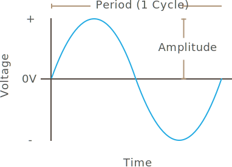

[Alternating current (AC)](https://en.wikipedia.org/wiki/Alternating_current) is a type of current in which the direction of flow of electrons (polarity), alternates over a period of time. 

Household wall outlets deliver AC and so most appliances are designed to use alternating current. However, nearly all electronic logic circuits use DC, so internally, many appliances convert AC to DC through _rectification_, which we'll learn about later. Laptops and some other devices actually convert AC to DC using an external power adapter. These AC to DC power adapters can be made very small, depending on the amount of current needed. For example, small phone chargers that plug into the wall and have USB plugs usually convert 110V or 220V AC into 5V DC.

When building connected things, AC is usually used to power motors, heaters, and other things, while a DC circuit acts as the brain, or logic controller, which determines when the AC power is switched on for various loads. For example, a connected coffee maker might have a microcontroller (such as a Netduino) that controls when the power to the boiler is turned on to heat water and make coffee. The AC portion of an appliance like that is usually on a separate circuit and controlled through _relays_, which are electro-mechanical switches that typically use a small current to control a larger one. 

## AC Power Generation

AC current has historically been created by turning a [rotor](https://en.wikipedia.org/wiki/Rotor_(electric)) (the central shaft with wire coils around it) within an electrical generator. These generators have powerful magnets that enclose the rotor, known as [_stators_](https://en.wikipedia.org/wiki/Stator). Stators induct a current into the rotor wire coiles as they pass through the magnetic field  created by the surrounding stator magnets. 

[illustration of rotor and stator]

As the rotor turns, the wire coils get closer to the magnetic, and then farther away; causing an alternating voltage to be induced as the electrons are moved back and forth in the wires. As such, alternating current looks like a sine wave when the voltage is mapped over time, because the induction is actually a function of a circle:

## Characteristics

AC electricity is described in terms of _period_, _frequency_, and _amplitude_.

* **Period** - Period is the amount of time that it takes the waveform to make one complete cycle.
* **Frequency** - Measured in _hertz_ (hz), frequency is the number of time the waveform repeats itself in one second. In the United States, this is usually 60hz, and 50hz in most of the rest of the world.
* **Amplitude** - This is the magnitude of the waveform and is usually measured in volts or amps.

## Other Waveforms

Alternating current is not always a perfect sine wave. In fact, alternating currents are often generated digitally by using triangle and square waves:

[make a new version of this:]

Even more complex wave forms are sometimes used:

[complex wave form illustration]

## AC Circuits

Designing AC circuits is a little more complicated than DC, but for most work involving connected things, we can keep it pretty simple, and we'll explore it in more depth later.

## [Next - Batteries](../Batteries)

 