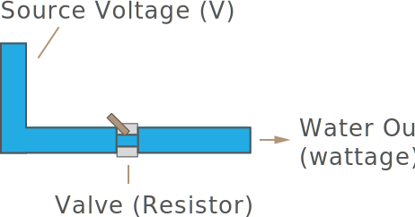
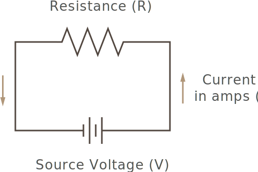
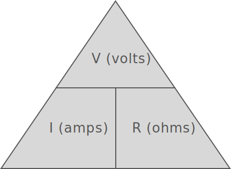
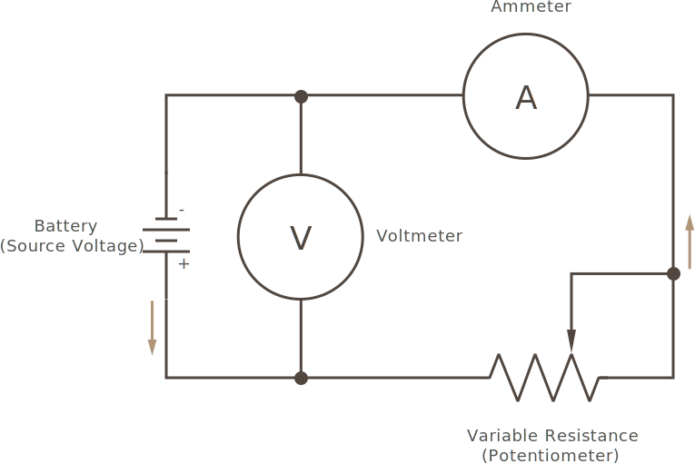
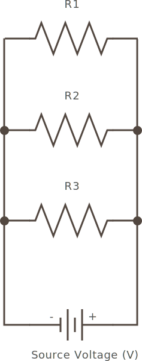

In part two, we learned about the relationship between amperage (quantity) and voltage (force) of electricity. In this part, we're going to explore another pieces of that fundamental relationship, resistence, and how that relationship is codified in _Ohm's Law_.


## Resistors

Some materials let electrons flow in a moderate manner. They are neither excellent conductors, nor absolute insulators. These materials _resist_ the flow of electrical current, but don't impede it completely. Carbon, for instance, is one of these materials. And by mixing in other materials with it, such as clay, the resistance can be changed. By precisely controlling material mixes, resistors can be made that reduce electrical current by specific amounts.

We measure resistance in **Ohms**, which are often expressed in _ohms per unit length_, such as `80 ohms per meter`, or similar, and often, the Greek letter for Omega (`Ω`) is used as the abbreviation. 

From a physical standpoint, resistance occurs because some electrons get [deflected when passing through the atomic lattice of the resistor](https://en.wikipedia.org/wiki/Free_electron_model). Some of these electrons bounce off and are converted to heat energy, radiating away from the resistor.

The heat that a resistor can safely dissipate is dependent on the amount of current that passes through it. So resistors are _rated_ for different amounts of power, measured in watts. 


### Symbol

In an electronic circuit schematic, a resistor is typically symbolized as the following:


## Ohms Law

Going back to the water analogy, we can think of resistance as the valve at the bottom of the water tank:



Given a constant water pressure (voltage), if we put in a valve that was half the size of the pipe, we would expect that the amount of water that flows through would also be divided, proportionally, in half.

This relationship holds true for electricity as well, and is codified in [_Ohm's Law_](https://en.wikipedia.org/wiki/Ohm%27s_law); as more resistance is added to a constant voltage circuit, fewer electrons can make it through. The equation for this relationship can be expressed as:

```
Amperage = Voltage / Resistance
```

For historical reasons, Amperage is often labeled `I`, and sometimes Voltage is labeled `E`.  The most common labeling for Ohm's law is usually:

```
I = V/R
```

Consider the following circuit diagram that includes a battery and a resistor:



If the battery is `1.5V`, and the resistance is `50ohms`, we can calculate the amount of amps that can make it through the circuit as:

```
Amps = 1.5V / 50Ω = 0.3A
```

From that, we can also calculate the wattage/power as `(watts = amps * volts)`:

```
Wattage = 1.5V * 0.3A = 0.045W
```

### Other Forms of Ohm's Law

Using algebra, we can solve the equation of Ohm's law for resistance, or voltage:

#### Solved for Resistance (R)

```
R = V / I
ohms = volts / 
```

#### Solved for Voltage (V)

```
V = I * R
```

### Ohm's Law Pyramid

The _Ohm's Law triangle_, also known as the _power triangle_ is helpful in remembering the various solutions of Ohm's law:



It roughly represents the mathematical relationship of Ohm's law; it's divided vertically by a line that indicates division (below `V`), and horizontally, with a line that stands for multiplication (between `I` and `R`).

So to read it, choose any given unit as the solution, and then use the division/multiplication rules of the lines.

Therefore, starting with a solution for `V`, we have:

```
V = I * R
volts = amps * ohms
```

Solving for `I`:

```
I = V / R
amps = volts / ohms
```

And finally, solving for `R`:

```
R = V / I
ohms = volts / amps
```

## Calculating Resistance

Given the following circuit:



Which includes:

 * **Source Voltage** -  A charged battery.
 * **Variable Resistor (Potentiometer)** - Potentiometer is a resistor that provides varying resistance as the knob is turned.
 * **Voltmeter** - An instrument for measuring voltage.
 * **Ammeter** - An instrument for measuring amperage.

Let's calculate the circuit, in a variety of configurations.

### Simple Resistance Sample Problems

#### 1) Let's say we have a 1.5V battery, and the potentiometer set to 10ohms, how many amps will we have?

```
I = V/R
I = 1.5V/10Ω = 0.15A = 150mA
```

##### 1a) How much total power (wattage) would there be?

```
W = V*A = 1.5V * 0.15A = 0.225W = 225mW
```

#### 2) 12V battery, and 1KΩ resistance?

```
I = V/R
I = 12V / 1,000Ω = 0.012A = 12mA
```

##### 1a) Total power?

```
12V * 0.012A = .144W = 144mW
```


#### 3) Now let's say that we have a 1.5v battery, and ammeter reads 15mA, how many ohms is the potentiometer set to?

```
R = V/I
R = 1.5/.015A = 100Ω
```

#### 4) What if we need to push 100mA through a 10Ω resistor, how much voltage would the battery need to have?

```
V = I*R
V = .100A * 10Ω = 1V
```

### Resistance in Series

Resistors can be placed in series (end to end), in a circuit like the following:


In this case, the total resistance is the _sum_ of each resistor. So for instance, given the following resistors:

 * R1 - 100Ω
 * R2 - 5Ω
 * R3 - 1KΩ

Then the total resistance would be:

```
Total Resistance = 1,000Ω + 100Ω + 5Ω = 1,105Ω
```


### Resistance in Parallel

[parallel configuration:]




#### Conductance; the Siemens

[conductance = siemens (S) = reciprocal of resistance = 1/Ω)

[G is often used for conductance]

```
G = 1/R
R = 1/G
```


Let's consider the same resistor values we had in series, and calculate them in parallel:

 * R1 - 100Ω
 * R2 - 5Ω
 * R3 - 1KΩ

First, we need to convert each value to siemens:

```
G1 = 1/100Ω = .01 S
G2 = 1/5Ω = .2 S
G3 = 1/1KΩ = 1/1000Ω = 0.001 S
```

Once we have their conductance, we add them to get the total conductance:

```
.01 + .2 + .001 = .211 S
```

Converting from `.211` siemens to ohms:

``` 
Resistance = .211 S = 1/.211 = 4.74Ω
``` 

Total resistance with the same resistors as we had in series is now `4.7Ω` in parallel.

#### Parallel Resistor Banks

[sometimes a bank of the same resistors. shortcut to math them]

```
Total Resistance = R / Number of Resistors
```

Therefore, (10), 5KΩ resistors in parallel would be:

```
5,000Ω * 10 = 50,000Ω = 50K
```


## Resistor Power Rating

In addition to resistance, resistors are rated to be able to safely dissipate up to a certain amount of power. This is a resistors _power rating_.

[rating - 1/4watt, so forth, is for the amount of heat it can dissipate]


## See Also
 
 * [Ohm's Law Calculator](http://www.ohmslawcalculator.com/ohms-law-calculator)

<!--
 
# Things to add

 * [Derating and Temperature Coefficient](https://www.digikey.com/en/maker/blogs/a8c993213afd48c3b08b65d2e372197c)

-->