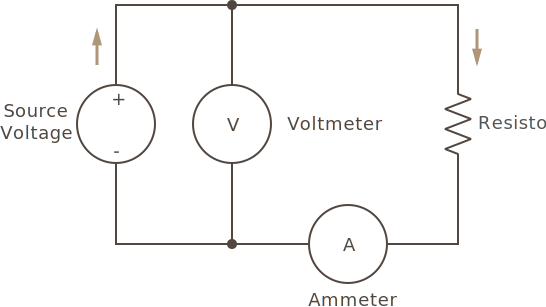

Given the following circuit:



Which includes:

 * **Source Voltage** - A charged battery.
 * **Resistor** - A simple resistor.
 * **Voltmeter** - An instrument for measuring voltage.
 * **Ammeter** - An instrument for measuring amperage.

Let's calculate the circuit, in a variety of configurations.

### Simple Resistance Sample Problems

#### 1) Let's say we have a 1.5V battery, and the potentiometer set to 10ohms, how many amps will we have?

```
I = V/R
I = 1.5V/10Ω = 0.15A = 150mA
```

##### 1a) How much total power (wattage) would there be?

```
W = V*A = 1.5V * 0.15A = 0.225W = 225mW
```

#### 2) 12V battery, and 1KΩ resistance?

```
I = V/R
I = 12V / 1,000Ω = 0.012A = 12mA
```

##### 1a) Total power?

```
12V * 0.012A = .144W = 144mW
```


#### 3) Now let's say that we have a 1.5v battery, and ammeter reads 15mA, how many ohms is the potentiometer set to?

```
R = V/I
R = 1.5/.015A = 100Ω
```

#### 4) What if we need to push 100mA through a 10Ω resistor, how much voltage would the battery need to have?

```
V = I*R
V = .100A * 10Ω = 1V
```

## Calculating Power


## [Next - Resistors in Series](../Resistors_in_Series)

<br/>