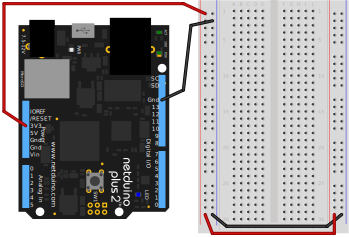
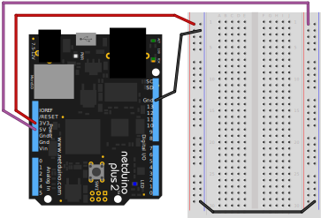

In this lab we're going to build some very simple resistance circuits using a breadboard, which is a common prototyping surface, and measure the resistance in the circuits using a multimeter.

### Requirements

* Resistor pack
* Half size breadboard with power rails
* Multimeter

## Resistor Pack

## Breadboards

Both circuits in this lab will fit on a single half size breadboard, though I recommend buying 3 or more of them; they're cheap and it's nice to be able to keep circuits around.

[need an amazon link]

Breadboards simplify prototyping by creating connections without soldering. The following illustration is of a half size bread board with power rails (my favorite kind for prototyping), with an "xray" view on the right showing the copper traces that connect the _wells_ (holes):

Each row of 5 pins (they're numbered in the illustration, and most good breadboards also have numbering) are connected, and the well or division down the middle of the board divides the two sides, so components can be placed across it, with the leads being separated. Additionally, many breadboards, such as the one pictured above, have power rails along the edges that are connected the whole way down. 

### Power and Ground Rails

Usually, the positive (`+`) side of power rails are connected to the `3.3V` or `5V` pin on the Netduino, and the negative (`-`) side is connected to ground:

This provides a very useful base for adding more complex circuits that share power and ground.

#### 3.3V and 5V Power and Ground

Sometimes, when building circuits, they might require both `3.3V` and `5V` power, in which case, you can wire one power rail to the `3.3V` pin, and one to the `5V` pin, while they both share a ground connnection:

### Multimeters

In this lab, we'll use a multimeter to measure resistance of different resistor combinations.
A multimeter is a must-have tool for hardware developers. A decent multimeter doesn't cost very much, usually less than USD$20, but when purchasing one, I recommend finding one with the following features:

* **Auto-Ranging** - An auto-ranging multimeter simplifies reading values by not requiring you to set the approximate range of reading. So if when reading resistance, it's just one setting, without having to know the amount of resistance that's being measured.
* **Small** - There's little need for a multimeter to be large, and pocket sized multimeters are much easier to carry around.
* **Digital** - Analog (those with a physical gauge) multimeters are nice because they can more effectively show change, but I find that digital multimeters (those with an LCD screen) are much easier to read and use.

As a bonus feature, [transistor hole reader thing]

[Here is a great starter multimeter from Amazon](https://www.amazon.com/gp/product/B072XH5SJ7/ref=as_li_tl?ie=UTF8&camp=1789&creative=9325&creativeASIN=B072XH5SJ7&linkCode=as2&tag=ilderneabs-20&linkId=a5c314e3ce625c8bee20f98f7e4827f3) that costs about USD$15.

## Part 1 - Measuring Series Resistance

## Part 2 - Measuring Parallel Resistance

## [Next - Review](../Review)
