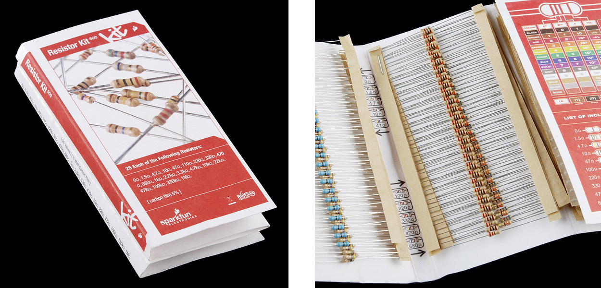
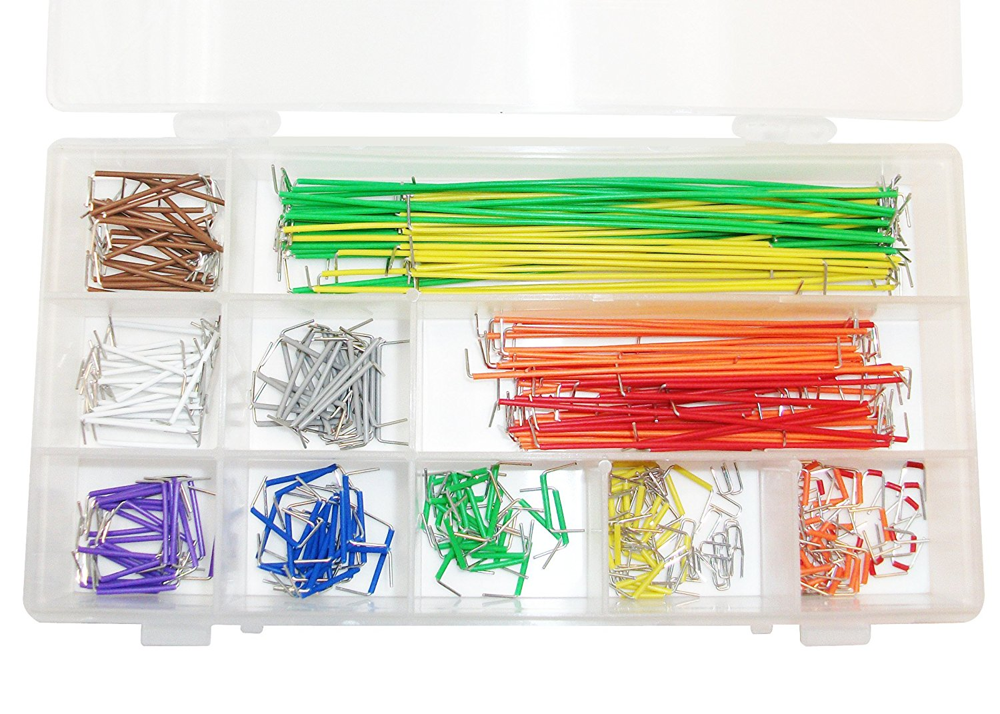
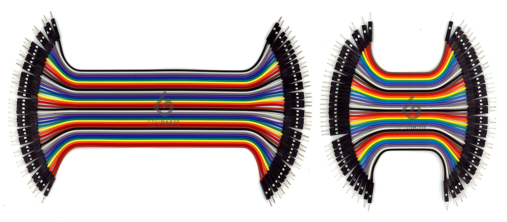
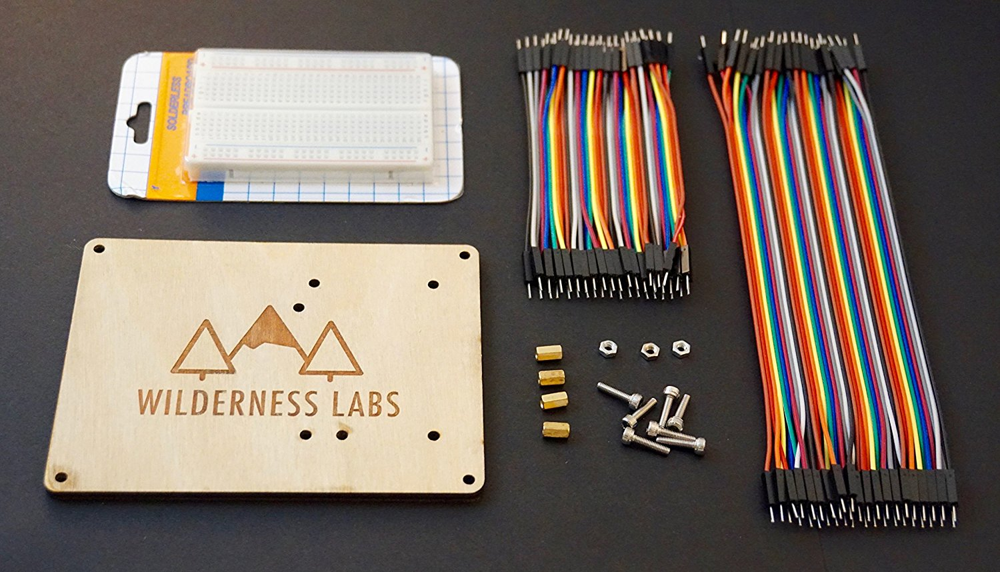
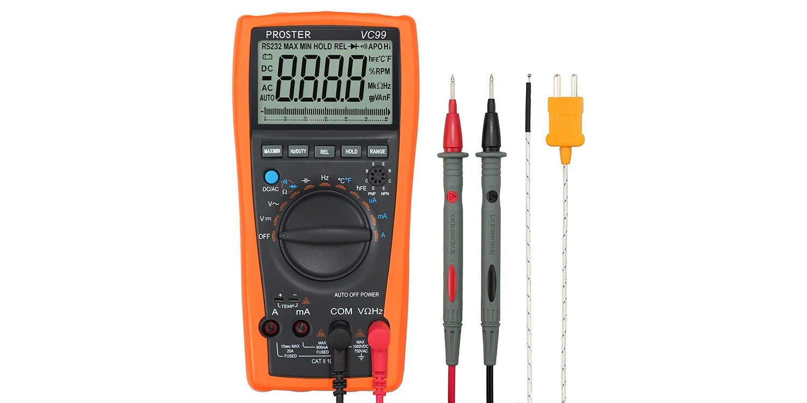

In this lab we're going to build some very simple resistance circuits using a breadboard, which is a common prototyping surface, and measure the resistance in the circuits using a multimeter.

### Requirements

To do this lab, you'll need the following components and tools:

| Item                                   | Approximate Cost (USD) |
|----------------------------------------|------------------------|
| 1/4 Watt resistor kit                  | $8 - $20               |
| Half size breadboard with power rails  | $16 for 10 pieces      |
| Breadboard jumper wires                | $7 - $15               |
| Multimeter                             | $10 - $40              |

## Resistor Pack

This lab will only use a few resistors, but it's worth it to buy a resistor kit. They're inexpensive, and resistors are something that you'll use all the time prototyping. For nearly every circuit we'll build in this entire tutorial, 1/4 watt resistors will be fine. 

Resistor kits are available from a number of suppliers, most kits have a selection of the most common resistors.

SparkFun makes a [great one that runs about USD$8](https://www.sparkfun.com/products/10969) and has 500 of the most common resistors in 5% tolerance:

Joe Knows Electronics also makes [a great kit that contains 860, 1% tolerance resistors for ~USD$20](http://amzn.to/2iwbWtq), and is available on Amazon.com.

## Breadboards

Both circuits in this lab will fit on a single half size breadboard, though I recommend buying 3 or more of them; they're cheap and it's nice to be able to keep circuits around.

A [pack of 10 of them](http://amzn.to/2zUjcZt) runs ~USD$16 on Amazon.com.

Breadboards simplify prototyping by creating connections without soldering. The following illustration is of a half size bread board with power rails (my favorite kind for prototyping), and an "xray" view on the right showing the copper traces that connect the _wells_ (holes):

Each row of 5 pins (they're numbered in the illustration, and most good breadboards also have numbering) are connected, and the well or division down the middle of the board divides the two sides, so components can be placed across it, with the leads being separated. Additionally, many breadboards, such as the one pictured above, have power rails along the edges that are connected the whole way down. 

### Power and Ground Rails

Usually, the positive (`+`) side of power rails are connected to the `3.3V` or `5V` pin on the Netduino, and the negative (`-`) side is connected to ground:

This provides a very useful base for adding more complex circuits that share power and ground.

#### 3.3V and 5V Power and Ground

Sometimes, when building circuits, they might require both `3.3V` and `5V` power, in which case, you can wire one power rail to the `3.3V` pin, and one to the `5V` pin, while they both share a ground connnection:

### Breadboard Jumper Wires

There are two main kinds of breadboard jumper wires; straight wires, and flexible wires.

#### Straight Wires

Straight wires are made from single strand wire and are usually sold in a kit which has a variety of pre-cut sizes and colors. They can be easily bent to fit whatever circuit routing necessary. A [140 piece kit](http://amzn.to/2B6aINg) like the one shown below can be had for ~USD$7 on Amazon.com:

And a [350 piece kit](http://amzn.to/2hEdsJ3) runs around USD$15:

I have both, and prefer the organization of the 350 piece kit, but the 140 piece kit is just fine.

#### Flexible wires

Flexible jumper wires come in combinations of male to male, male to female, and female to female. They are made of multi stranded wires and so are very flexible, and are good for long connections. However, unlike the straight wires, they usually only come in two sizes, so they're not very practical for short connections; circuits built with only them can be very messy. They usually come in a ribbon that can be peeled apart, and a [pack of 80](http://amzn.to/2hFGuIq) run USD$6 on Amazon.com:

For most circuits, male to male are all that you'll need, but certain circuits later will require male to female wires. 

#### Lab Requirement

It's nice to have both straight and flexible wires, but for this lab, the straight wires will be sufficient.

### Wilderness Labs Hack Kit

We make a [Wilderness Labs hack kit](http://amzn.to/2iyFoPx) that comes with a nice half size breadboard, flexible jumper wires, and laser etched board to mount a Netduino and the included breadboard:

### Multimeters

In this lab, we'll use a multimeter to measure resistance of different resistor combinations.
A multimeter is a must-have tool for hardware developers. A decent multimeter doesn't cost very much, usually less than USD$20, but when purchasing one, I recommend finding one with the following features:

* **Auto-Ranging** - An auto-ranging multimeter simplifies reading values by not requiring you to set the approximate range of reading. So if when reading resistance, it's just one setting, without having to know the amount of resistance that's being measured.
* **Small** - There's little need for a multimeter to be large, and pocket sized multimeters are much easier to carry around.
* **Digital** - Analog (those with a physical gauge) multimeters are nice because they can more effectively show change, but I find that digital multimeters (those with an LCD screen) are much easier to read and use.

As a bonus feature, [transistor hole reader thing]

[Here is a great, pocket-sized, starter multimeter from Amazon](https://www.amazon.com/gp/product/B072XH5SJ7/ref=as_li_tl?ie=UTF8&camp=1789&creative=9325&creativeASIN=B072XH5SJ7&linkCode=as2&tag=ilderneabs-20&linkId=a5c314e3ce625c8bee20f98f7e4827f3) that costs about USD$13 and will get you through most of this tutorial:

For a more professional multimeter, [this one](http://amzn.to/2hEjvNG) runs $37 and has a [transistor thingy], capacitance measuring, and more:

## Part 1 - Measuring Series Resistance

## Part 2 - Measuring Parallel Resistance

## [Next - Review](../Review)
