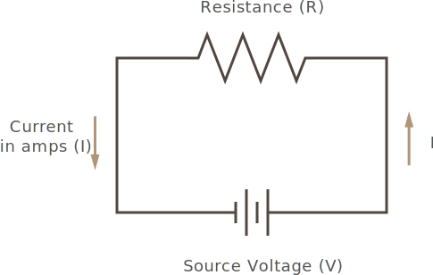

In addition to amount of resistance, resistors have two other important characteristics that describe them: _power rating_ and _tolerance_.

## Power Rating

When power flows through a resistor, some of the energy is converted into heat. The amount of heat a resistor can safely dissipate is 

[]

 are rated to be able to safely dissipate up to a certain amount of power. This is a resistors _power rating_.

[rating - 1/4watt, so forth, is for the amount of heat it can dissipate]


## Power Calculation Shortcuts

On the last page, we learned how to calculate the amount of power (in wattage) passes through a resistor circuit by first using ohm's law to calculate both voltage and amperage, and then calculate the power from that. However, we can use a couple power calculation shortcuts to calculate power if we only know amperage and resistance, or voltage and resistance.

### Power Calculation when Amperage and Resistance is Known

Recall that the definition of the `watt` is `amps * volts`, and `I` is historically used to stand in for amps, and `P` means (p)ower in wattage, so we can state: 

```
Power = I(in amps) * Voltage
 - or - 
P = I * V
```

And ohm's law, solved for voltage, is:

```
V = I * R 
```

We can substitute ohm's law (`I * R` for `V`), into the watt/power definition:

```
P = I * (I * R) = I^2 * R
```

Therefore, if we know amperage and resistance, we can calculate power in a circuit as:

```
P = I^2 * R
```

### Power Calculation when Voltage and Resistance is Known:

We can also solve for power if we only know voltage and resistance. 

Starting with ohm's law, solved for amperage:

```
I = V / R
```

We can substitute that into the watt definition

```
P = Watts = V * I = V * (V / R) = V^2 / R
```

Thefore, if we know voltage and resistance, we can calculate power in a ciruit as:

```
P = V^2 / R
```

### Power Rating Practice Problems

Recalling the simple resistant circuit:



And our power calculation shortcuts:

```
P = I^2 * R
```
```
P = V^2 / R
```

Let's walk through some sample problems:

#### 1) If the current is 100mA, and the resistance is 20Ω, what power rating must the resistor have?

```
P = 0.100A ^2 * 20Ω = 0.2W
```

The nearest power rating to `0.2` would usually be a 1/4 watt.

#### 2) If the source voltage is 5V, and the resistance is 100Ω, what minimum power rating must the resistor haved?

```
P = 5^2 / 100Ω = 0.25W = 1/4 watt.
```

We can test this by doing the long hand, as well. First, let's use ohm's law to solve for current/amperage:

```
I = V / R = 5V / 100Ω = 0.05A
```

And then solving for power:

```
P = 5V * 0.05A = 0.25W = 1/4 watt
```

## Tolerance


## [Next - Resistors in Series](../Resistors_in_Series)


<br/>