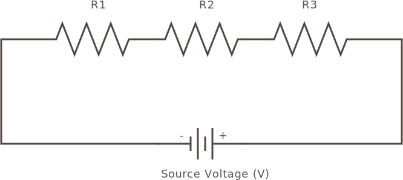

Resistors can be placed in series (end to end), in a circuit like the following:



In this case, the total resistance is the _sum_ of each resistor. So for instance, given the following resistors:

 * **R1** - `100Ω`
 * **R2** - `5Ω`
 * **R3** - `1kΩ`

Then the total resistance would be:

```
Total Resistance = 1,000Ω + 100Ω + 5Ω = 1,105Ω
```

## Common Current

Resistors in a series share a common current, that is the amount of amps flowing through each one is the same, since there's only one path. 


So for instance, given the previously calculated resistance of `1,150Ω`, if we were to supply `5V` of electrical force, we can use ohm's law to calcuate the current at any given point as:

```
I = 5V * 1,150Ω = 0.004A = 4mA
```

So no matter where in the circuit that we measure the current, we would get the same value of `4mA`:


### Power Calculation

[wtf]


## Advantages and Disadvantages of Series Resistors

Because series resistance is simply the sum of each of the individual resistances, stringing resistors together end to end allows for a specific resistance to be built using various combinations of individual resistors. This can be especially useful when using spare parts for protototyping.

A disadvantage of series resistance is that if one resistor fails open (no longer conducting current across it), the whole series circuit will also fail open. If the resistor fails as a short (it no longer provides resistance, but becomes a conductor), the totality of resistance in the series will be lowered by its amount of resistance.

## Voltage Division

Series resistance is also the fundamental circuit for _voltage division_, which we'll discuss in a later tutorial part.


## [Next - Resistors in Parallel](../Resistors_in_Parallel)

<br/>