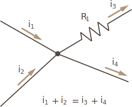

Kirchhoff's first law is also known as _Kirchhoff's current law_, _Kirchhoff's point rule_, or _Kirchhoff's junction rule_, and it states very simply; the amount of current flowing into a point is the same amount flowing out:

[conservation of charge; charge isn't lost because it has no where to go]

This might seem like common sense, given what we know about the physics of electricity, but at the time he discovered this (1845), very little was actually known about the underlying physics. 

[codified as:]

[Σ IIN = Σ IOUT]

[current in are +, currents leaving are -]

### Circuit Example

## [Next - Kirchhoff's Voltage Law](../Kirchhoffs_Voltage_Law)
