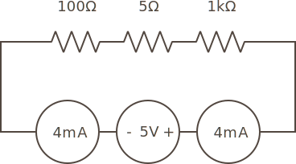

In part 4, we learned from Ohm's law that resistance reduces the amount of current that flows through a circuit, but [voltage also drops]

[recall that each resistor in a series experiences the same amount of current:]



I = 5V / 1,105Ω = .004525A


```
V = I * R

R1 Voltage = .004525A * 100Ω = .4525V
R2 Voltage = .004A * 5Ω = .0226V
R3 Voltage = .004A * 1,000Ω = 4.525V

Total voltage 5V

```

## Voltage Law

_Kirchhoff's voltage law_ states that the sum of all voltage drops around a circuit loop is equal to the sum of all voltage sources.

[Vs = V1 + V2 + V3]

[5V at one end of the circuit, 0V at the other end]

[the sum of all voltages around a circuit loop is zero.]
[the sum of all voltage drops is equal to the sum of all voltage sources]


## [Next - Voltage Division](../Voltage_Division)

<br/>