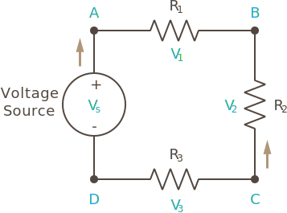
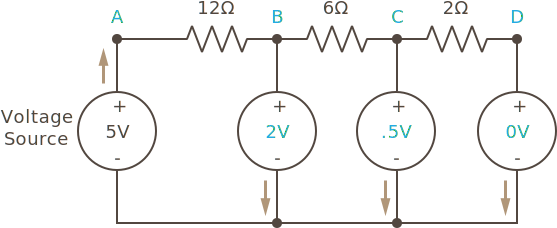
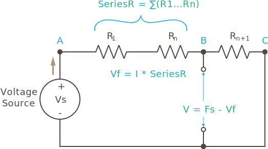

In part 4, we learned from Ohm's law that resistance reduces the amount of current that flows through a circuit, but it turns out, voltage is also reduced.

In fact, _Kirchhoff's voltage law_ states that the sum of all voltage drops around a circuit loop is equal to the sum of all voltage sources. In other words, if we had a circuit loop as in following illustration, with a `5V` voltage source, the total drop in voltage across all the resistors would be `5V`:



Algebraically, we can express this as:

```
Vs = V1 + V2 + V3
```
Where `V1` represents the voltage drop at `R1`, and so forth.

This means that at point `A`, the voltage would be `5V`, and at point `D`, the voltage is `OV`. It turns out, that the voltage through each resistor is proportionate to that resistors part of the overall resistance. So if that resistance represents one half of the total resistance, then the voltage drop through that resistor will also be half of the total voltage drop, or `2.5V`, since `5V * .5 = 2.5V`.

## Deriving from Ohm's Law

We can calculate Kirchhoff's voltage law from Ohm's law.

Recall that in a series resistance, each resistor experiences the same amount of current:


In this case, the total resistance (series resistances are additive), is `20Ω`, therefore the current is:

```
Given:
I = V / R

Therefore:
I = 5V / 20Ω = 0.25A = 250mA
```

So each resistor sees `0.25A` of current. 

Now, recalling Ohm's law solved for voltage (`V = I * R`), we can calculate the voltage drop for that current at each resistor:

```
R1 Voltage = 0.25A * 2Ω = 0.5V
R2 Voltage = 0.25A * 6Ω = 1.5V
R3 Voltage = 0.25A * 12Ω = 3V
```

If we add each of these voltage drops up:

```
Total voltage drops = 0.5V + 1.5V + 3V = 5V = Voltage Source
```

The total amount of voltage drop is the exact same amount as the voltage source!

## Voltage Drop

Revisiting the previous circuit, if we put a voltmeter between points `B`, `C`, `D`, and ground, we'd get `2V`, `.5V`, and `0V`, respectively:



This is because the voltage drop is removed from the source voltage to get the output voltage after each resistor:

```
B -> Common/Ground = 5V - 3V = 2V
C -> Common = 2V - 1.5V = .5V
D -> Common = .5V - .5V = 0V
```

### Forward Voltage

Voltage drop is often referred to as _forward voltage_ (V<sub>f</sub>). In many components, their voltage drop is actually the same amount of voltage that they require to work. For example, lights such as LEDs require a particular forward voltage to be met in order for them to have enough energy to work.

### Simplifying Series Resistance

Since know that resistors in series are additive, if we want to know the voltage drop at any point between resistors in series (as in the above diagram), we can simplify the previous circuit by considering any series resistances as a single resistor by adding them up, as illustrated in the following circuit diagram:



Note that the sigma (`∑`) symbol means mathematical sum, and `R...Rn` means `R` through `Rn`.  

Using the same numbers from before, to calculate the forward voltage (voltage drop) at `B`:

```
Vf = I * R1; therfore:
Vf = 0.25A * 18Ω = 4.5V
```

That means that there is only `0.5V` from the original `5V` of electromotive force at point `B`, since we have to remove the drop from the source voltage:

```
V (at point B) = 5V - 4.5 = 0.5V
```

By definition, `0.5V` is ALSO the voltage drop from `B` to `C`.  This becomes a little clearer if we simplify the circuit diagram even further:


### Voltage Drop is Proportionate

This reveals something interesting; the voltage drop at any given point in a circuit is _proportionate_ to the resistance at that point to the overall resistance. <!-- If the resistances were changed such that `R1`'s voltage drop were `3V`, then the voltage drop at `R2` would have to be `2V`, since it would have to add up to a total of `5V`. -->

This makes more sense if we remember that we calculated the total amount of current using `I = V / R`:

```
I = Vs / (R1 + R2)
```

And then substitute that into `I` of the `Vf = I * R1` voltage drop calculation:

```
Vf = (Vs / (R1 + R2)) * R1;
```

We can test this using the values from before:

```
Vf = 0.25A * 18Ω = 4.5V
```

And of course, removing that from the source voltage, gives us `0.5V`, as with before:

```
Vout = Vs - Vf
Vout = 5V - 4.5V = 0.5V
```


## [Next - Voltage Division](../Voltage_Division)

<br/>