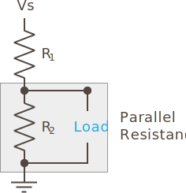

Voltage dividers are useful circuits that have a variety of uses, but for the type of practical circuitry that we're concerned with, they serve two primary functions; level shifting, and reading resistive sensors.

Additionally, [potentiometers]

### Level Shifting

As the name implies, one of the primary uses they have is to adjust, through division, the level of a signal to a lower level. For instance, a 5V analog sensor may output 0V to 5V, depending on the input level of what it's sensing. For example a 5V temperature sensor may output a voltage of 5V at the highest temp it can sense, and 0V at the lowest temperature. However, Netduino has analog inputs that can read voltage from 0V to 3.3V. So in order to convert (or _level shift_) the signal from a 5V sensor to a 3.3V analog input, it needs to be divided.

### Reading Resistive Sensors

Another, perhaps non-obvious, usage is for reading resistive sensors. Resistive sensors have a variable resistance, depending on whatever input their sensing. For instance, a photoresistor may have 30kΩ of resistance in the dark, but only 1kΩ of resistance in bright sunlight. There's no way to measure resistance directly with a Netduino, but if the resistive sensor is put in place of one of the resistors in a voltage divider circuit, the `Vout` voltage can be calculated based on the known resistance of the other resistor in series.

### Potentiometers

[explain]

## Practical Considerations

However, whether they're used to level shift, or read resistive sensors, there are some practical considerations that must be understood before they can be used effectively.

### Load and the Third Leg

When you attach a load to Vout, the values of the voltage divider circuit changes. This is because a load has resistance, and that means that `R2` + `Load` become a parallel resistance circuit:



This means that when calculating the divider resistance, you must consider the resistance of the load.

For instance, if we were to use the voltage divider discussed early (`R1 = 8Ω`, `R2 = 12Ω`), and the load had a fixed resistance of `3Ω`, we can calculate the total resistance of the bottom half of the divider by adding together the conductance of `R2` and `RLoad` (recall that parallel resistance is calculated by adding together the conductance, or _G_, in siemens (S), which is the reciprocal of resistance): 

```
Given: 
G = 1 / R
G of R2 = (1 / 12Ω) = 0.083 S
G of RLoad = (1 / 3Ω) = 0.33 S

Therefore:
Total G = .42 S
Total Resistance of Load and R2 =  1 / 0.42 = 2.4Ω
```

So instead of getting `3V` to the load, if we calculate `Vout`, we'd actually get something much smaller:

```
Given:
Vout = Vs * (R2 / (R1 + R2))

And:
R2 now = R2 + RLoad

Therefore:
Vout = 5V * (2.4Ω / 10.4Ω)) = 0.23V
```

In this case, the load would only see `0.23V`!

### Variable Load Resistance

The consideration of load resistance gets much more complex when the resistance of that load can change over time. 

[this problem is exacerbated in the case that the resistance of the load changes]


# BLAH

### Power Efficiency and Practical Usage

Ok, so does it make sense to recommend that you use the largest total resistance that still allows for the necessary current the ADC needs?

In my case, I'm using an STM32F4 chip, and the data sheet says that the ADC has the following characteristics:

ADC Sampling Switch Resistance : 6KΩ
External Input Impedance : 50kΩ
Internal Sample and Hold Capacitor : 4pF

So the peak current draw would be:

```
I = V / R
I = 3.3 / 6000 = 0.0006 = .6mA
```

Therefore, 

```
R = V / I
R = 3.3V / 0.0006A = 5,500Ω = 5.5kΩ
```

But then the problem I see there is that the total resistance is less than the sampling resistance. Wouldn't that blow my voltage divider math out of the water?

## [Next - Resistive Sensors](../Resistive_Sensors)

<br/>