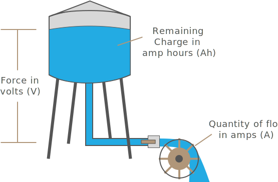

### [Part 1 - Physics of Electricity](Part1)

Part 1 explores the fundamental physics that give electricity its behavior. As a bonus, after reading this, you'll know how magnets work!

### [Part 2 - Quantifying Electricity; Amps, Volts, and Watts](Part2)

Part 2 builds on the physical fundamentals and explores the ability of electricity to do work and introduces amperage, voltage, and wattage.

### [Part 3 - Resistance & Ohm's Law](Part3)

### [Part 4 - Current Types; AC & DC](Part4)

