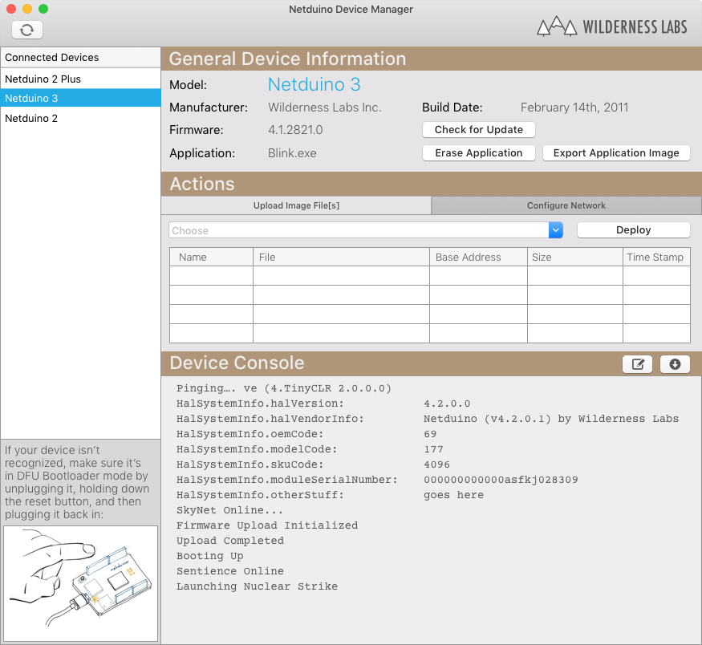

# Updating Netduino Firmware

Ensuring that your Netduino has the latest firmware means that it will be up to date with the current Netduino-specific .NET Micro Framework runtime. Additionally, unless your Netduino has the latest firmware, you may have issues deploying your application to it.

## Netduino Device Manager

1. Launch the _Netduino Device Manager_:

2. While your Netduino is unplugged, hold down the button and then plug it in, to put it into _DFU Bootloader Mode_:

2. Select your device from the left, click *Check for Update*, and follow the instructions.