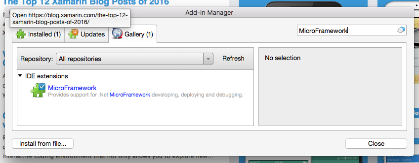

# Getting Started with Netduino
Instructions for Netduino 2, 3, and Go! boards.

# 1) Installation

## Windows
Download and run the following:

1) [.NET Micro Framework (NETMF) SDK (v4.3.2. QFE2)](http://static.netduino.com/downloads/netmfsdk/v4.3.2-QFE2/MicroFrameworkSDK.MSI)
2) NETMF Plugin for Visual Studio (VS) 2015 or [VS 2013](http://static.netduino.com/downloads/netmfsdk/v4.3.2-QFE2/netmfvs2013.vsix)
3) Netduino SDK v5

## Mac

Download and install the following:

1) Xamarin Studio 6 (also works with v5)
2) Netduino SDK v5 (for Mac)

Launch Xamarin Studio and install the NETMF plug-in:

1) Open the *Xamarin Studio* menu and select *Add-ins...*.
2) Select the *Gallery* Tab
3) In the *search* box, type `MicroFramework`:

4) Click *install* and follow the directions
5) Restart Xamarin Studio

## 2) Check your Board Firmware

