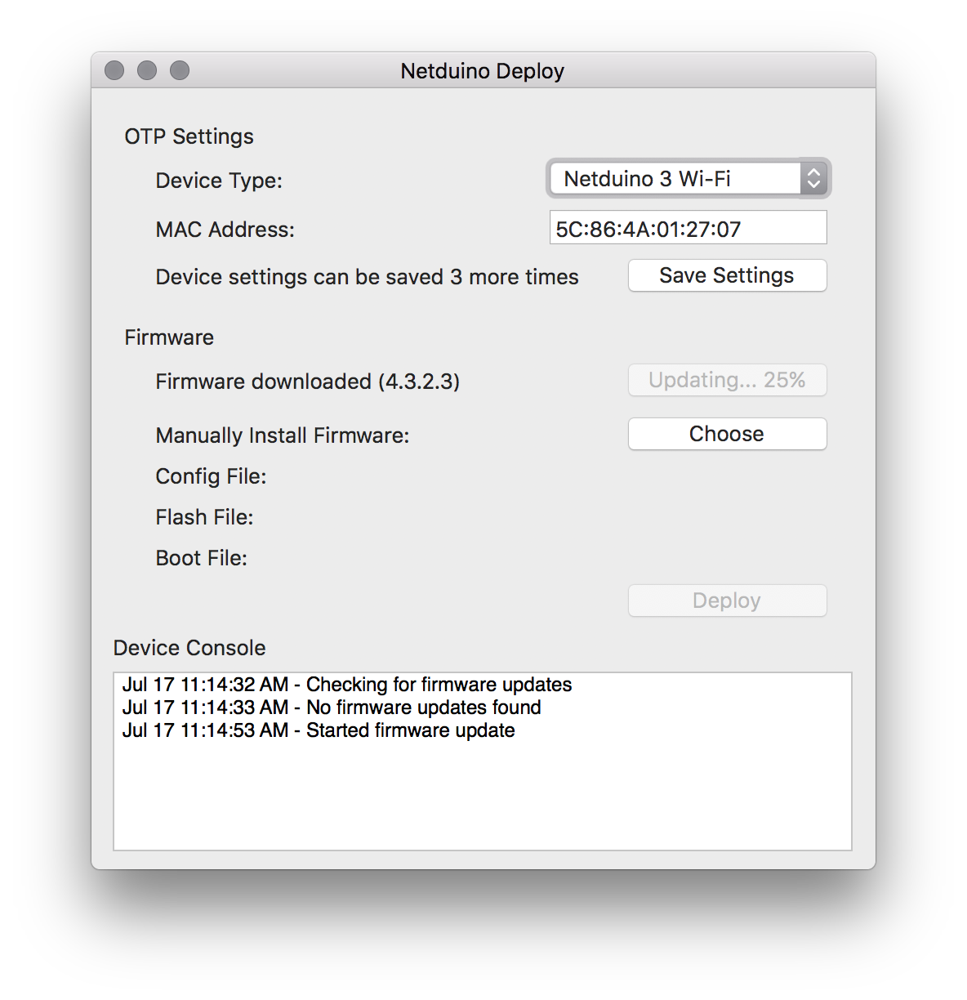
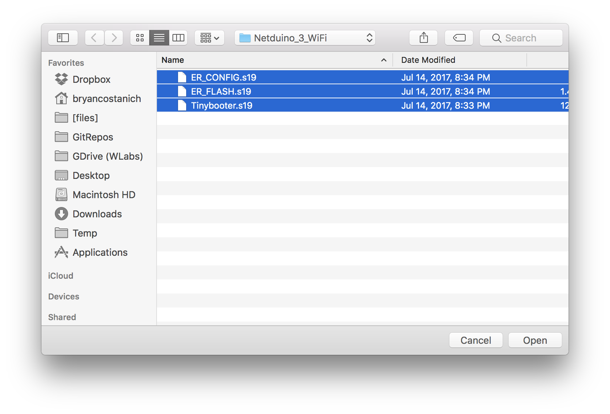
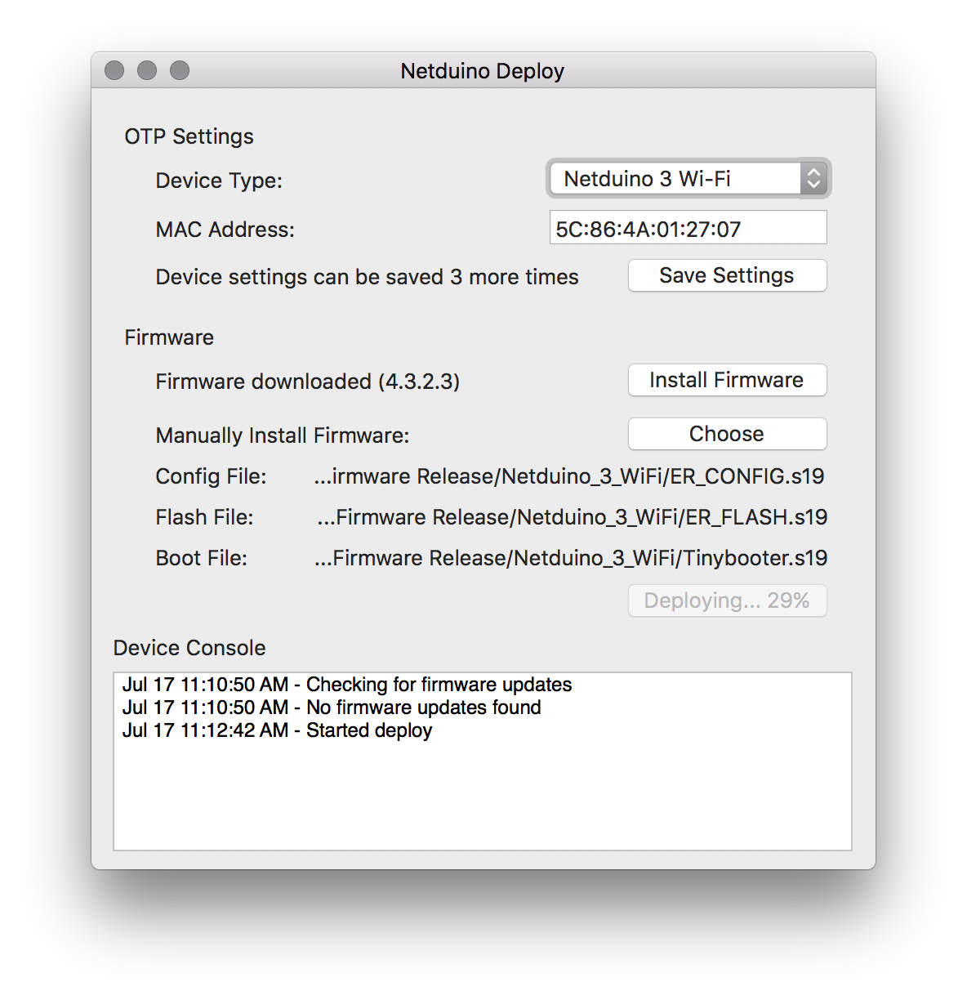

Ensuring that your Netduino has the latest firmware means that it will be up to date with the current Netduino-specific .NET Micro Framework runtime. Additionally, unless your Netduino has the latest firmware, you may have issues deploying your application to it.

Instructions are OS specific:

 * **[Windows Instructions](#Windows)**
 * **[Mac Instructrions](#Mac)**

## Windows (Using MFDeploy)

1. Download the latest Netduino firmware files from the [downloads page](../Downloads). You'll need both the `ER_CONFIG` and `ER_FLASH` files for your specific Netduino model.

2. Launch **MFDeploy**. MFDeploy is installed as part of the Netduino NetMF SDK.

3. Select `USB` from the device selection area, and then your device from the drop down to the right of that:

4. In the **Image File** area, click the **Browse** button and navigate to the folder that has the `ER_CONFIG` and `ER_FLASH` files, select them, and click **Open**:

5. Click the **Deploy** button to deploy the files.

6. After it's done deploying, the console output should have something similar to the following:

## Mac (Using Netduino Mac Firmware Deploy Tool)

 1. While your Netduino is unplugged, hold down the button and then plug it in, to put it into _DFU Bootloader Mode_:

 2. Launch the _Netduino Mac Deploy_ (available from the [downloads](../Downloads/) page):
 3. Click the `Install Firmware` button, firmware should install:
 
 
### Manual Installation of Firmware from .hex or .s19 files

The Mac Firmware tool also enables manual firmware deployment:

 1. Follow steps 1 & 2 above.
 2. Click the `Choose` button, and select either the `.hex` or `.s19` `ER_CONFIG` and `ER_FLASH` files:
 
 3. Click `Deploy` and it should deploy the firmware:
 
