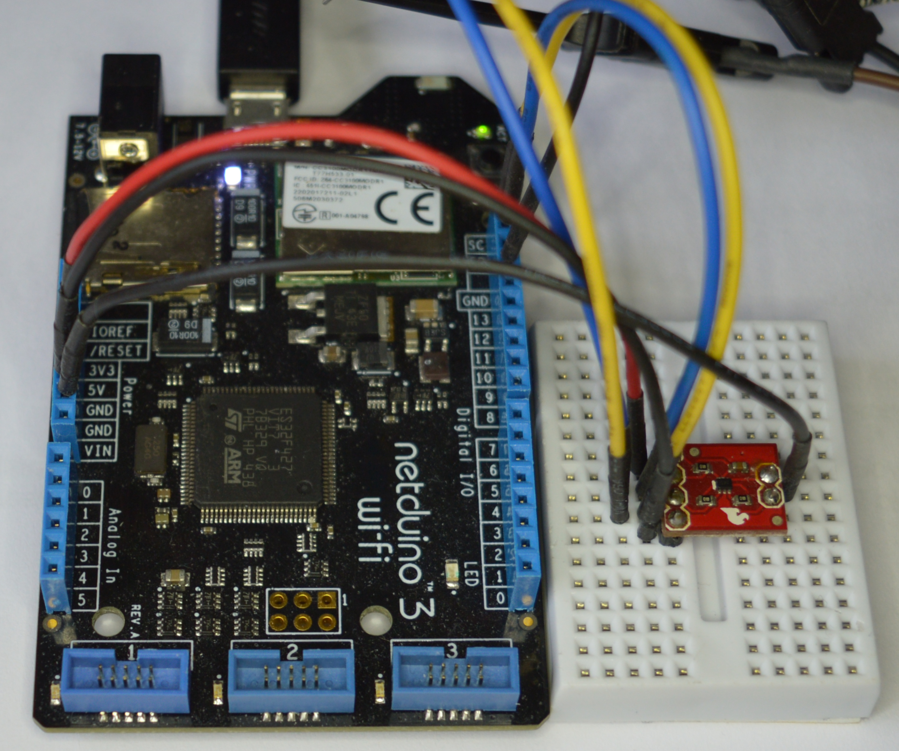
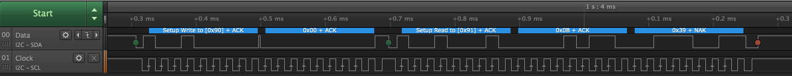

I2C (Inter-Integrated Circuit) is a communication protocol allowing bi-directional communication between two or more devices using only two wires.


The two bus wires used are usually labelled `SDA` (Data) and `SCK` (Clock).  Typical clock speeds are 100KHz for low speed devices with speeds of 3.4MHz possible for high speed devices.  Common speeds encounterd by hobbyists are 100KHz and 400KHz. 

Devices on the bus will act as either a _master_ or a _slave_ devices.  Both _master_ and _slave_ can transmit and receive on the bus.

##### **Review Notes**

> The overview section could use a little more "beginner's mind" here. After reading the overview, the main question that I'm left with is, "what is it good for?" Also, if there are only two wires, what about power? How are peripherals powered? Are those in addition to the data lines? How does I2C compare to SPI or Serial? What are the advantages of I2C? Also, you mention devices on the bus. So I assume that it handles multiple devices? How does that work? Later you talk about addressing, which seems to make sense, given what you're saying about the bus, but I think a little clarity in the overview would go a long way to providing a conceptual overview for what's going to happen in the rest of the doc. Something like, "I2C supports multiple devices on the same bus (meaning they all share the same communication wires), through the use of addressing. This makes I2C useful for [explain the scenario(s) here a bit]" etc. In fact, I think we should have a "Bus" topic under /Hardware/Circuits that gives a quick definition and sample circuit. 

> Note that I added back ticks to `SDA` and `SCK`, indicating they are hardware pins. We should add that bit of guidance to our writer notes.

### Device Addresses

The use of multiple devices on the single bus is made possible through device addresses.  Each device on the bus is allocated a specific address.  Some devices allow the address to be configured to one or more alternatives to help with address collision.  This is achieved using _address pins_ which would be tied low or high depending upon the device and the address required.

Addresses are 7-bits in length giving a maximum number of 128 devices on the bus.  In practice, however, there are often far fewer due to bus capacitance issues.

##### **Review Notes**

> I would define address collision inline. Maybe something like "to help with address collisio (in which multiple devices have the same primary address)".

> Also, I think a code snippet here would go a long way to provide a more concrete understanding of the concept. Specifically, maybe addressing a device or something. 

> I added a ", however," to the last line. I think you'll want to explain the capicitance issues. What specifically is the issue? Is there a practical limit usually? Like 5? 50? How does having multiple devices affect the speed in which you can communicate with them, since they're on a bus?

### Read / Write Bit

A Master device will start the communication session by sending the address of the device it wishes to communicate with along with a single bit that indicates the mode of the communication: _read_ or _write_.  The combination of the 7-bit address and the single read / write bit gives an eight bit packet header.

##### Review Notes

> the read/write bit content feels out of place. it needs context. maybe "Device Addressing, and Read/Write Bit" should be subsections under a "Communicating with I2C Devices" heading? 

### Pull-up Resistors

Both of the bus lines (`SDA` and `SCK`) require pull-up resistors to be connected to them.  The value of the pull-up resistor will depend upon the capacitance of the bus.  The number of components on the board, type of substrate used will all influence the bus capacitance.

Most I2C breakout boards are supplied with pull-up resistors already on the breakout board.  In the case where one is not supplied, then a 4K7 resistor is usually good enough for prototyping.

This in-depth article on the [Effects of Varying I2C Pull-Up Resistor](http://dsscircuits.com/articles/effects-of-varying-i2c-pull-up-resistors) explains why pull-up resistors are important and how to determine the ideal value for the resistor.

##### Review Notes

> I think we need a topic on pulling up or down with resistors, which we'd then link to:

  "require [pull-up resistors](/Hardware/Circuits/PullingUpAndDown_WithResistors/) to be connected..." 
  
> That article needs to be super beginner minded.

> Should 4K7 be `47k`?

> Also, I think we need a topic in [Circuits](/Hardware/Circuits] about circuit capacitance. I also added a comma after "supplied"

> As an editorial note, I would change the last sentence to:

> For a more in depth discussion on why pull-up resistors are important and how to determine ideal resistance value, see the [Effects of Varying I2C Pull-Up Resistor (external link)](http://dsscircuits.com/articles/effects-of-varying-i2c-pull-up-resistors) article.


### Further Information

[This Wikipedia article](https://en.wikipedia.org/wiki/I%C2%B2C) contains a description of the protocol, the various modes and the bus characteristics.

##### Review Notes

> I think we should put **Additional Resources** at the end of the doc and standardize on a format. I put some guidance in the style guide. 


## Netduino I2C Pins

The Netduino has two pins allocated for the I2C protocol.  These pins are labelled **SD** (for `SDA`) and **SC** (for `SCK`) and can be found above the 14 digital pins on the right of the board as viewed below:


#### Reviewer Notes

I think we want to use **bold** for labeling here. I'm open to ideas though.

Also, what do you think about moving the pinout diagrams to the [Common_Files](/Common_Files) folder? Seems like we're using it all over the place, and it would make addressing a lot easier (single backslash vs. ../../../ nonsense). :D

## TMP102 I2C Temperature Breakout Board

Use of the I2C bus on the Netduino will be illustrated using a temperature module.  The TMP102 is a commonly available temperature module capable of measuring temperatures in the range -40&deg;C to +125&deg;C with a maximum resolution of 0.0625&deg;C.  This device uses I2C and can be powered by a 3.3V signal, ideal for use with Netduino.

#### Reviewer Notes

> I think that if we put inline code in the conceptual sections after the overivew, we should probably move the concrete example here to a separate doc. Probably [TMP102 I2C Example](/Netduino/I2C/TMP102_Example) or similar?

Let's chat about that. I think it's generally a good idea to separate these things, but we'll probably need to work through it a bit to get it right and set the pattern. I think we're breaking new tech writing ground here.

### Purchasing

TMP102 breakout modules can be purchased from [Sparkfun](https://www.sparkfun.com/products/13314).

## Using I2C on the Netduino

Reading the current temperature from the TMP102 will illustrate the basic software requirements for successful communication with an I2C device, namely a simple read operation. 

### Wiring up the TMP102 and Netduino

Firsly, ensure that the Netduino is disconnected from power and the USB connector.  Once complete, place the TMP102 into a piece of breadboard (you will need to solder male pins to the breakout board first).

Next make the following connections between the temperature breakout board and the Netduino:

| TMP102 Pin Name | Netduino Pin Name | Wire Color in Photo Below |
|-----------------|-------------------|---------------------------|
| SDA             | SD                | Blue                      |
| SCK             | SC                | Yellow                    |
| V<sub>cc</sub>  | 3.3V              | Red                       |
| GND             | GND               | Black                     |
| ADD0            | GND               | Black                     |



There are two yellow and two blue leads in the photo.  The second blue and yellows lead are connected to a [logic analyzer](https://en.wikipedia.org/wiki/Logic_analyzer), more on this later.

### Software

Open Visual Studio (or Xamarin Studio) and follow the instructions on the [Getting Started](../../GettingStarted) page and start a new project.  Copy the following code and paste it into the _program.cs_ file replacing the default code.

```CSharp
using Microsoft.SPOT;
using Microsoft.SPOT.Hardware;
using System.Threading;

namespace TMP102
{
    public class Program
    {
        public static void Main()
        {
            //
            //  Create a new I2C device for the TMP102 on address 0x48 with the clock
            //  running at 50 KHz.
            //
            I2CDevice tmp102 = new I2CDevice(new I2CDevice.Configuration(0x48, 50));
            //
            //  Create a transaction to read two bytes of data from the TMP102 sensor.
            //
            byte[] buffer = new byte[2];
            I2CDevice.I2CTransaction[] reading = new I2CDevice.I2CTransaction[1];
            reading[0] = I2CDevice.CreateReadTransaction(buffer);
            while (true)
            {
                //
                //  Read the temperature.
                //
                int bytesRead = tmp102.Execute(reading, 100);
                //
                //  Convert the reading into Centigrade and Fahrenheit.
                //
                int sensorReading = ((buffer[0] << 4) | (buffer[1]) >> 4);
                double centigrade = sensorReading * 0.0625;
                double fahrenheit = centigrade * 1.8 + 32;
                //
                //  Display the readings in the debug window and pause before repeating.
                //
                Debug.Print(centigrade.ToString() + " C / " + fahrenheit.ToString() + " F");
                Thread.Sleep(1000);
            }
        }
    }
}
```

Reconnect the Netduino to the USB cable then save and run the application.  If everything has been connected correctly you will start to see temperature measurements in the _Application Output / Debug_ window.

#### Key Elements

The data sheet for the TMP102 states that the default address for the TMP102 is 0x48, so the first task is to create a new _I2CDevice_ object that defines how we connect to the TMP102:

```CSharp
I2CDevice tmp102 = new I2CDevice(new I2CDevice.Configuration(0x48, 50));
```

The above code creates the _tmp102_ object where the device has an address of 0x48 and the communication speed will be 50KHz.

Temperature readings are returned from the TMP102 as a two byte value and so a buffer is needed to store the results of the read opertiation:

```CSharp
byte[] buffer = new byte[2];
```

NETMF uses transaction to communicate with I2C devices.  Using an array of transactions allows multiple operation to be completed at the same time.  In this case, there is only one read operation and the array of transations consists of a single element:

```CSharp
I2CDevice.I2CTransaction[] reading = new I2CDevice.I2CTransaction[1];
reading[0] = I2CDevice.CreateReadTransaction(buffer);
```

More complex cases allow multiple operations to be executed as a simple ooperation simply by adding more transations to the array.

In the above code, an array _reading_ is created to hold the single transaction that should be executed.  Two transaction types are supported and these are created with the _I2CDevice.CreateReadTransaction_ and the _I2CDevice.CreateWriteTransaction_ methods.

At this point the initialisation and set up is complete.  The main program loop is entered and the temperature reading is read repeatedly using the following statement:

```CSharp
int bytesRead = tmp102.Execute(reading, 100);
```

The _Execute_ method above takes an array of transactions, in our case the single read transaction and a timeout value in milliseconds.

The remainder of the code simply calculates the temperature using the formula derived from the data sheet.

#### Program Output

Successful deployment of the application should reduce in a stream of temperature readings, one per second:

```
22.5625 C / 72.612500000000011 F
22.5625 C / 72.612500000000011 F
22.5625 C / 72.612500000000011 F
22.5625 C / 72.612500000000011 F
22.5625 C / 72.612500000000011 F
22.5625 C / 72.612500000000011 F
```

#### Logic Analyser Output

As noted earlier, a second yellow and blue wire can be seen connected to the circuit.  These allow the logic analyzer to be connected to the circuit.

The logic analyzer was configured to read data for two seconds.  The data was then processed by an I2C protocol decoder.  This resulted in the following trace:


The trace has been annotated to indicate the signal line and the protocol being analyzed.

Starting from the left of the data signal:

- Start bit indicated by the green dot
- Device address and access mode (0x91)
- Two data bytes (0x15 and 0xC0)
- Stop bit indicated by the red dot

It is interesting to note that the device address and mode byte are encoded with the device address transmitted first followed by the mode bit.  I2C uses 1 to represent a read transaction and 0 to represent a write transaction.

In the case of the above application, the address is 0x48 and Netduino is reading from the device.  Read mode is indicated by a 1 and write by a 0.  This results in a packet header of 0x91:

| Item                   | b7 | b6 | b5 | b4 | b3 | b2 | b1 | b0 | Notes                                    |
|------------------------|----|----|----|----|----|----|----|----|------------------------------------------|
| Device address         |  1 |  0 |  0 |  1 |  0 |  0 |  0 |  0 | Device address shifted left by one place |
| Read / Write indicator |  0 |  0 |  0 |  0 |  0 |  0 |  0 |  1 | Read = 1                                 |
| Packet header          |  1 |  0 |  0 |  1 |  0 |  0 |  0 |  1 | Address or-ed with mode bit = 0x91       |

When reading the logic analyzer traces, read operations to this device have the first byte set to 0x91 whilst write operations to the same device have the first byte set to 0x90.

# Writing to Registers and Multiple Transactions

As noted above, the _Execute_ method can execute multiple transactions in a single call.  This will be illustrated in the following application that will:

- Reconfigure the TMP102 to return a 13-bit temperature reading
- Read the temperature as a 13-bit value

Configuration of the TMP102 is managed by a number of registers.  It should be noted that the use of registers to store data and configuration is common to both I2C and [SPI](../SPI/index.md) devices.

## Registers

In the above example the application used the default power on state for the TMP102.  The default state allows the application to read the temperature.  The temperature itself is maintained in one of the internal registers and the read operation is simply returning the value in the register.

The number of registers and their meaning are ususlly documented in the data sheet for the component in question.

### TMP102 Registers

The TMP102 has five registers:

- Current temperature
- Configuration
- T<sub>LOW</sub>
- T<sub>HIGH</sub>
- Pointer

The current temperature register is read only and is the one that the above application reads.  The remaining four registers are read-write registers and can be used to change the operation of the TMP102.

#### Pointer Register

The pointer register is an 8 bit wide register that indicates which of the remaining four registers should be accessed.  Applications can write to bits 0 and 1 of this register, bits 2-7 should be set to zero.  The pointer register is interpreted as follows:

| b1 | b0 | Description              |
|----|----|--------------------------|
|  0 |  0 | Temperature register     |
|  0 |  1 | Configuration register   |
|  1 |  0 | T<sub>LOW</sub> register |
|  1 |  1 | T<sub>HIGH</sub>         |

The default power on value of the TMP102 pointer register is 0 (temperature register).

#### Temperature Register

The temperature register holds 0&deg;C at power up.  Folllowing a conversion the temperatutre reading is transferred to the temperature register.  The two byte register holds a 12 (or 13) bit value indicating the last reading along with a single bit indicating if this is a 12 or 13 bit reading.

##### 12-bit Reading:

Byte 1:

| b7  | b6  | b5  | b4  | b3  | b2  | b1  | b0  |
|-----|-----|-----|-----|-----|-----|-----|-----|
| T11 | T10 | T09 | T08 | T07 | T06 | T05 | T04 |

Byte 2:

| b7  | b6  | b5  | b4  | b3  | b2  | b1  | b0  |
|-----|-----|-----|-----|-----|-----|-----|-----|
| T03 | T02 | T01 | T00 |  0  |  0  |  0  |  0  |

##### 13-bit Reading:

Byte 1:

| b7  | b6  | b5  | b4  | b3  | b2  | b1  | b0  |
|-----|-----|-----|-----|-----|-----|-----|-----|
| T12 | T11 | T10 | T09 | T09 | T08 | T07 | T05 |

Byte 2:

| b7  | b6  | b5  | b4  | b3  | b2  | b1  | b0  |
|-----|-----|-----|-----|-----|-----|-----|-----|
| T04 | T03 | T02 | T01 | T00 |  0  |  0  |  1  |


#### Configuration Register

The configuration register controls how the TMP102 functions.  This register is a 16-bit register and as noted, this is a read-write register.  The control register allows the configuration of the following:

- Extended Mode
- Alert
- Conversion Rate
- Shutdown Mode
- Thermostat Mode
- Fault Queue
- Copnversion Resolution
- One-Shot/Conversion Ready

For the purpose of this exercise the application will be changing only the _Extended Mode_ (EM) bit in the control register.  Setting this bit to 0 sets the TMP102 to use 12-bit mode.  A value of 1 will set the TMP102 to use 13-bit mode.

From the data sheet, the EM bit is bit 4 in the second byte of the configuration register.

### Writing To Registers

The Pointer Register changes the register being adccessed.  Multiple reads will use the previous value in the Pointer Register if a new value is not supplied.  Write opertaions require the pointer register to be supplied for each write operation.

## Software

The specification for the application was defined as follows:

- Reconfigure the TMP102 to return a 13-bit temperature reading
- Read the temperature as a 13-bit value

The code for this becomes:

```CSharp
using Microsoft.SPOT;
using Microsoft.SPOT.Hardware;
using System.Threading;

namespace TMP102ReadWrite
{
    public class Program
    {
        /// <summary>
        /// Convert a byte to a two character hex string.
        /// </summary>
        /// <returns>Hexadecimal representation of the byte as a string.</returns>
        /// <param name="val">Byte to convert into a string.</param>
        public static string ByteToHex(byte val)
        {
            const string hex = "0123456789abcdef";
            return(new string(new char[] { '0', 'x', hex[(val & 0xf0) >> 4], hex[val & 0x0f] }));
        }

        /// <summary>
        /// Reads the TMP 102 configuration.
        /// </summary>
        /// <remarks>
        /// Create transactions to read the current configuration.  A write transaction
        /// is necessary to change the pointer register to point to the configuration
        /// registers.  A read transaction will then read the current configuration.
        /// </remarks>
        /// <param name="device">TMP102 I2CDevice object to read the configuration from.</param>
        private static byte[] ReadTMP102Configuration(I2CDevice device)
        {
            I2CDevice.I2CTransaction[] readConfiguration = new I2CDevice.I2CTransaction[2];
            byte[] pointerBuffer = new byte[1];
            pointerBuffer[0] = 1;
            readConfiguration[0] = I2CDevice.CreateWriteTransaction(pointerBuffer);
            //
            byte[] currentConfig = new byte[2];
            readConfiguration[1] = I2CDevice.CreateReadTransaction(currentConfig);
            device.Execute(readConfiguration, 100);
            Debug.Print("Configuration register: " + ByteToHex(currentConfig[0]) + ", " + ByteToHex(currentConfig[1]));
            return (currentConfig);
        }

        /// <summary>
        /// Main program loop.
        /// </summary>
        public static void Main()
        {
            //
            //  Create a new I2C device for the TMP102 on address 0x48 with the clock
            //  running at 50 KHz.
            //
            I2CDevice tmp102 = new I2CDevice(new I2CDevice.Configuration(0x48, 50));
            //
            //  Read the configuration prior to updating the conversion mode to 13-bit mode.
            //
            byte[] currentConfig = ReadTMP102Configuration(tmp102);
            //
            //  Now we have the configuration, set up to change the configuration between
            //  12 and 13 bit mode and read data from the sensor.
            //
            I2CDevice.I2CTransaction[] changeConfig = new I2CDevice.I2CTransaction[1];
            byte[] newConfiguration = { 0x01, currentConfig[0], (byte) (currentConfig[1] | 0x10) };
            changeConfig[0] = I2CDevice.CreateWriteTransaction(newConfiguration);
            tmp102.Execute(changeConfig, 100);
            Thread.Sleep(1000);
            //
            //  Now setup for reading the temperature.
            //
            I2CDevice.I2CTransaction[] reading = new I2CDevice.I2CTransaction[2];
            byte[] repointToTemperatureRegister = { 0x00 };
            reading[0] = I2CDevice.CreateWriteTransaction(repointToTemperatureRegister);
            byte[] temperatureData = new byte[2];
            reading[1] = I2CDevice.CreateReadTransaction(temperatureData);
            while (true)
            {
                //
                //  Read the temperature.
                //
                int bytesRead = tmp102.Execute(reading, 100);
                Debug.Print("Temperature data: "+ ByteToHex(temperatureData[0]) + ", " + ByteToHex(temperatureData[1]));
                //
                //  Convert the reading into Centigrade and Fahrenheit.
                //
                int sensorReading = 0;
                double centigrade = -273.15;
                double fahrenheit = centigrade * 1.8 + 32;
                if ((temperatureData[1] & 0x01) == 1)
                {
                    sensorReading = ((temperatureData[0] << 5) | (temperatureData[1]) >> 3);
                    Debug.Print("13-bit value retrieved.");
                }
                else
                {
                    sensorReading = ((temperatureData[0] << 4) | (temperatureData[1]) >> 4);
                    Debug.Print("12-bit value retrieved.");
                }
                centigrade = sensorReading * 0.0625;
                fahrenheit = centigrade * 1.8 + 32;
                //
                //  Display the readings in the debug window and pause before repeating.
                //
                Debug.Print(centigrade.ToString() + " C / " + fahrenheit.ToString() + " F");
                Thread.Sleep(1000);
            }
        }
    }
}
```

### Key Elements

The application will read the configuration twice, once to verify the power on state, the second time to verify that the change from 12-bit mode to 13-bit mode has been applied.

```CSharp
private static byte[] ReadTMP102Configuration(I2CDevice device)
```

This method will take an _I2CDevice_ object and read the configuration.  The method uses two transactions, a write transaction will adjust the pointer register to point to the configuration register:

```CSharp
I2CDevice.I2CTransaction[] readConfiguration = new I2CDevice.I2CTransaction[2];
byte[] pointerBuffer = new byte[1];
pointerBuffer[0] = 1;
readConfiguration[0] = I2CDevice.CreateWriteTransaction(pointerBuffer);
```

The second transaction reads the configuration from the TMP102:

```CSharp
byte[] currentConfig = new byte[2];
readConfiguration[1] = I2CDevice.CreateReadTransaction(currentConfig);
```

Finally, the method executes the two transactions and displays the configuration inhexadecimal:

```CSharp
device.Execute(readConfiguration, 100);
Debug.Print("Configuration register: " + ByteToHex(currentConfig[0]) + ", " + ByteToHex(currentConfig[1]));
```

A key point to note here is that a write and a read transaction are both executed together in a single method call.

Executing the above will result in a write following by a read:


The second green dot indicates the change from the write operation (setting the pointer register) to the read operation (reading the configuration register).

Next operation is to change the mode to 13-bit mode by changing the configuration register:

```CSharp
byte[] currentConfig = ReadTMP102Configuration(tmp102);
I2CDevice.I2CTransaction[] changeConfig = new I2CDevice.I2CTransaction[1];
byte[] newConfiguration = { 0x01, currentConfig[0], (byte) (currentConfig[1] | 0x10) };
changeConfig[0] = I2CDevice.CreateWriteTransaction(newConfiguration);
tmp102.Execute(changeConfig, 100);
Thread.Sleep(1000);
```

This results in the following data transmission:


The _Sleep_ method call ensures that the TMP102 has time to make at least one measurement before the application starts to read the temperature from the sensor.

```CSharp
I2CDevice.I2CTransaction[] reading = new I2CDevice.I2CTransaction[2];
byte[] repointToTemperatureRegister = { 0x00 };
reading[0] = I2CDevice.CreateWriteTransaction(repointToTemperatureRegister);
byte[] temperatureData = new byte[2];
reading[1] = I2CDevice.CreateReadTransaction(temperatureData);
```

The read operation differs from the first application as it ensures that it is reading from the temperatre register but explicitly setting the register (write transaction) before it reads the data from the register:



#### Program Output

Successful deployment will give output similar to the following:

```
Configuration register: 0x60, 0xa0
Temperature data: 0x0c, 0xb1
13-bit value retrieved.
25.375 C / 77.675000000000011 F
Temperature data: 0x0c, 0xb1
13-bit value retrieved.
25.375 C / 77.675000000000011 F
Temperature data: 0x0c, 0xb1
13-bit value retrieved.
25.375 C / 77.675000000000011 F
```

##### Review Notes

> I wrapped the output here in a code block.