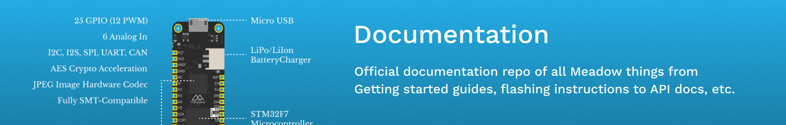

Hello, and welcome to the Documentation repo for Wilderness Labs! These docs are probably best viewed at the [developer.wildernesslabs.co](http://developer.wildernesslabs.co), but they should be readable here, as well. You'll also find all the source code to the [samples](samples/) here.

## Running Locally

This repo is compiled using [Docusuaurus V2](https://docusaurus.io/docs/2.x). You can run and browse this site locally, which is especially useful if you're contributing documentation, or you just want an offline experience.

### To browse locally:

#### [Install npm and node](https://docs.npmjs.com/downloading-and-installing-node-js-and-npm) (if not already installed)

1. Open a terminal and navigate to the `Documentation/` folder and run:

    ```console
    npm install
    ```

1. To start the site in localhost run:

    ```console
    npm start
    ```

The site should be available locally at: `http://localhost:3000/`.

Changes should automatically be picked up and displayed on the site.

Please use the [Docusaurus guides and documentation](https://docusaurus.io/docs/2.x) if you wish to make serious modifications to the user experience of the site. If you run into any issues editing content, like getting links to resolve or html to render, checkout the [Docusaurus tips and tricks](Contributing/docusaurus-tips) page.

## Developer tips

### Table of Contents changes

Depending on changes you want to make to navigation elements, you will need to look in special locations within Docusaurus files. Note that navigation changes may require more review in the pull request process as well, to ensure we keep things ideal for user experience.

### Top navigation

If we need to alter the top navigation elements, it will require modifications to the `/Documentation/docusaurus-config/theme-config.js` file. Edits to this file will definitely require local testing and more review before we make high-impact user-facing changes.

#### Sidebars

If you want to add or alter the left-hand table of contents, there are special JavaScript files Docusaurus uses. These sidebar files are available in the [`/Documentation/src/sidebars/`](https://github.com/WildernessLabs/Documentation/tree/main/src/sidebars) folder, and they are all processed in the [**sidebars.js** file](https://github.com/WildernessLabs/Documentation/blob/main/src/sidebars/sidebars.js), where it is configured for when a specific sidebar will be used based on the current requested path.

### When links don't seem to work

If you see an error for a link you are adding that you are fairly certain is correct, verify that the page filename doesn't contain any special characters. While they may be valid for URL use, sometimes Docusaurus will fail to handle links with characters.

For example, if you want to link to the [`Deploying_Meadow.OS` path](https://developer.wildernesslabs.co/Meadow/Getting_Started/Deploying_Meadow.OS/), the period (`.`) in that last folder name should be fine, but Docusaurus will fail to find the desired destination. Instead, you will need to link to a URL-encoded folder: `.../Deploying_Meadow%2EOS/` (where `%2E` is the "percent-encoded" period character).

### Redirects

When files move or shortcuts are needed, we can use the [Docusaurus plug-in **plugin-client-redirects**](https://docusaurus.io/docs/api/plugins/@docusaurus/plugin-client-redirects/) that is available on the docs site. While not as effective as server-side redirects and HTTP status codes, it allows us to keep old user links, bookmarks, and archived docs content taking users to the latest content.

These redirect rules are established in the [`/Documentation/docusaurus.config.js` file within the `plugins` section](https://github.com/WildernessLabs/Documentation/blob/main/docusaurus.config.js#L52). (The exact line may change as that configuration file is modified, but look for the `@docusaurus/plugin-client-redirects` section.)

Rules include a `from` location(s) and a desired `to` destination. If you need a single `from`, just use a string (`from: "/old/url"`). If you need to redirect multiple pages to a single new location, make the `from` field an array of strings (`from: ["/some/url", "/another/url"]`).

### Tabs

In several places, we want to present similar variations of instructions based on operating system (OS) or development environment without requiring the user to scroll through other options. This is handled by using tabs with a special XML syntax of `Tabs` and `TabItem`, where the user will select their choice and be presented with just those instructions. This [tab functionality is built into Docusaurus](https://docusaurus.io/docs/next/markdown-features/tabs) and is also documented there.

Currently, we use tabs with the `groupId` of `os` and `ide`. Here's an example use, separated by OS. If the user hasn't selected a tab, the `default` attribute indicates which TabItem is shown.

```xml
<Tabs groupId="os" queryString="currentOs">
  <TabItem value="windows" label="Windows" default>
    ...
  </TabItem>
  <TabItem value="macos" label="macOS">
    ...
  </TabItem>
  <TabItem value="linux" label="Linux">
    ...
  </TabItem>
</Tabs>
```

Adding the `queryString` attribute to the Tabs group allows the selected tab to be set by the requested URL querystring. In this case, if the URL contains `?currentOs=macOS`, the user will load the page with the macOS tab preselected. This allows links to be made to specific tabs or even sections within a tab.

## [Contributing](Contributing)

Wilderness Labs welcomes and encourages constrictive contributions. We believe that documentation is best when a diverse community of folks with a variety of perspectives and experience share their wisdom and findings with others. Additionally, documentation contributions are a great way to capture learnings that you may even reference yourself.

For more information, please see the [Contributing](Contributing) page.

## License

### Copyright

Content copyright Wilderness Labs.

Electronics tutorial copyright Bryan Costanich.

### Documentation Prose

All the documentation prose is released under a [Creative Commons
Attribution + Noncommercial + NoDerivatives (CC BY-NC-ND) license](Licenses/CreativeCommons_BY_NC_ND.md). Feel free to share verbatim in non-commercial usage and provide attribution. Commercial usage may be granted in certain use cases. If you need a more permissive license, please contact us at [hello@wildernesslabs.co](mailto:hello@wildernesslabs.co).


[Human Readable Version of the License](https://creativecommons.org/licenses/by-nc-nd/4.0/)

### Code Samples and Code Snippets

All code samples and code snippets, whether they be full applications, or embedded snippets within the documentation are released under the [Apache 2 license](Licenses/Apache2_License.md). Feel free to use and distribute the code as you see fit, under the very permissive terms of the license.
