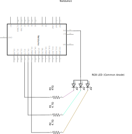

This sample illustrates a simple program to cycle an RGB LED through each of its primary colors; red, green, and blue.

It was tested with a [Chanzon, Common Anode RGB LED](https://www.amazon.com/gp/product/B01C19ENFK/ref=oh_aui_detailpage_o04_s01?ie=UTF8&psc=1 )

The forward voltage on the LED is: 

 * Red: 2V-2.2V
 * Green: 3V-3.2V
 * Blue: 3V-3.2V

And a current draw of 20mA for each color.

Using the RGB calculation described [here](/Hardware/Reference/Components/LEDs/Driving_w_Resistor/), we get the following necessary resistance:

```
3.3V - 2.2V (red) = 1.1V
3.3V - 3.2V (green and blue) = .1V
```

Therefore, the resistance neccessary is:

```
Red R = 1.1V / 0.020A = 55Ω
Green R & Blue R = 0.1V / 0.020A = 5Ω
```

A `47Ω` and two, `4.7Ω` resistors are close enough.

Note that particular LED is "Common Anode", meaning the long pin needs to be hooked to positive voltage. This inverts the logic, so it would be on, when the led pin is off (grounded at 0V).

A common cathode LED would probably not need that logic inversion.

## Code

```csharp
using System;
using Microsoft.SPOT;
using Microsoft.SPOT.Hardware;
using System.Threading;
using SecretLabs.NETMF.Hardware.Netduino;

namespace RGB_Blinky
{
    public class Program
    {
        public static void Main()
        {
            OutputPort redLed = new OutputPort(Pins.GPIO_PIN_D3, false);
            OutputPort greenLed = new OutputPort(Pins.GPIO_PIN_D4, false);
            OutputPort blueLed = new OutputPort(Pins.GPIO_PIN_D5, false);

            // just for seeing that the program is running
            OutputPort onboardLed = new OutputPort(Pins.ONBOARD_LED, false);

            // because it's common anode, on is actually false. if you're using
            // a common cathode LED, you'll want to reverse this.
            bool ledOn = false;
            bool ledOff = true;

            while (true)
            {
                onboardLed.Write(true);
                  
                // make it RED
                redLed.Write(ledOn);
                greenLed.Write(ledOff);
                blueLed.Write(ledOff);

                Thread.Sleep(250);

                onboardLed.Write(false);

                // make it GREEN
                redLed.Write(ledOff);
                greenLed.Write(ledOn);
                blueLed.Write(ledOff);

                Thread.Sleep(250);

                // Make it BLUE
                redLed.Write(ledOff);
                greenLed.Write(ledOff);
                blueLed.Write(ledOn);

                Thread.Sleep(250);
            }
        }
    }
}
```

## Schematic



### Breadboard View

