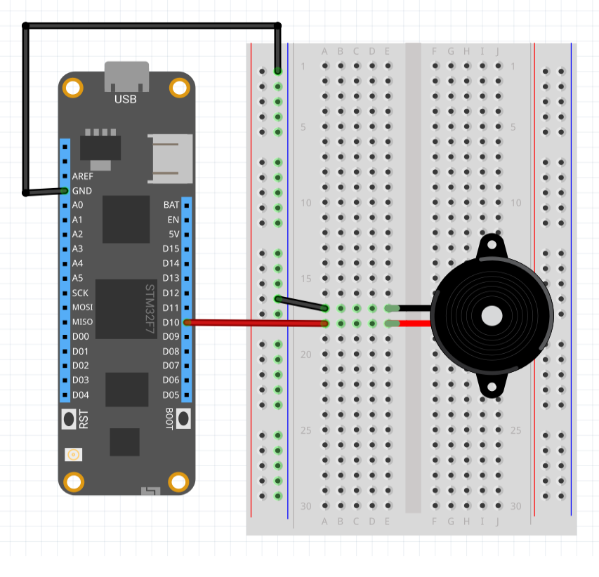

The PiezoSpeaker class represents a simple piezo speaker that can be used to generate tones across a range of frequencies. They typically perform well between 1-5kHz but may go as high as 100kHz. Implements IToneGenerator.

The positive pin of the piezo speaker connects to a PWM capable pin on the Meadow and the negative pin connects to common/ground. A resistor can be placed in-line to reduce volume.


---
uid: Meadow.Foundation.Audio.PiezoSpeaker
example: [*content]
---

The following example shows how to initialize a PiezoSpeaker and play a melody using an array of notes:

```csharp
using System.Threading;
using Meadow;
using Meadow.Devices;
using Meadow.Foundation.Audio;

namespace PiezoSpeaker_Sample
{
    public class Program
    {
        static IApp app;
        public static void Main(string[] args)
        {
            if (args.Length > 0 && args[0] == "--exitOnDebug") return;

            // instantiate and run new meadow app
            app = new MeadowApp();
        }
    }
    
    public class MeadowApp : App<F7Micro, MeadowApp>
    {
        const int NUMBER_OF_NOTES = 16;
        float[] melody;

        public MeadowApp()
        {
            melody = new float[NUMBER_OF_NOTES]
            {
                NoteFrequencies.NOTE_A3,
                NoteFrequencies.NOTE_B3,
                NoteFrequencies.NOTE_CS4,
                NoteFrequencies.NOTE_D4,
                NoteFrequencies.NOTE_E4,
                NoteFrequencies.NOTE_FS4,
                NoteFrequencies.NOTE_GS4,
                NoteFrequencies.NOTE_A4,
                NoteFrequencies.NOTE_A4,
                NoteFrequencies.NOTE_GS4,
                NoteFrequencies.NOTE_FS4,
                NoteFrequencies.NOTE_E4,
                NoteFrequencies.NOTE_D4,
                NoteFrequencies.NOTE_CS4,
                NoteFrequencies.NOTE_B3,
                NoteFrequencies.NOTE_A3,
            };

            var piezo = new PiezoSpeaker(Device.CreatePwmPort(Device.Pins.D10));

            while (true)
            {
                for (int i = 0; i < NUMBER_OF_NOTES; i++)
                {
                    //PlayTone with a duration in synchronous
                    piezo.PlayTone(melody[i], 600);
                    Thread.Sleep(50);
                }

                Thread.Sleep(1000);

                //PlayTone without a duration will return immediately and play the tone
                piezo.PlayTone(NoteFrequencies.NOTE_A4);
                Thread.Sleep(2000);

                //call StopTone to end a tone started without a duration
                piezo.StopTone();

                Thread.Sleep(2000);
            }
        }
    }

    public static class NoteFrequencies
    {
        public const float NOTE_A3  = 220;
        public const float NOTE_B3  = 247;
        public const float NOTE_CS4 = 277;
        public const float NOTE_D4  = 294;
        public const float NOTE_E4  = 330;
        public const float NOTE_FS4 = 370;
        public const float NOTE_GS4 = 415;
        public const float NOTE_A4  = 440;
    }
}
```

### Example Circuit

