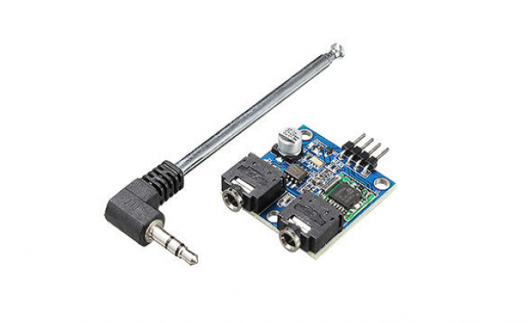

The TEA5767 FM module is based on the TEA5767GH which is a single-chip, electronically tuned, FM stereo radio for low-voltage applications with fully integrated Intermediate Frequency (IF) selectivity and demodulation. 

It can be connected to a microcontroller through an I2C interface to digitally control its tuning frequency and other characteristics, giving room for opportunities to digitize some of its operations. It comes with tow headphone jacks, one for connection to a headphone/speaker while the other is for connection to the antenna which usually comes with the module.



### Purchasing

You can get TEA5767 module with an antenna include it from the following suppliers:

* [ebay](https://www.ebay.com/itm/76-108MHZ-TEA5767-FM-Stereo-Radio-Module-Cable-Antenna-for-Arduino-/221610856360)
* [newegg](https://www.newegg.ca/p/2S7-01JA-0KY52?item=9SIAJHJ8XC0373&source=region&nm_mc=knc-googleadwordscamkpl-pc&cm_mmc=knc-googleadwordscamkpl-pc-_-pla-lyx+tech+ltd-_-gadgets-_-9SIAJHJ8XC0373&gclid=Cj0KCQjwoKzsBRC5ARIsAITcwXFdQwVcwKklE8IqlrxY8GWLK0dcccGzBlp7OGjuNijObuUBybiqWuwaAqjwEALw_wcB)

### Code Example

The following example shows how to initialize a TEA5767 and look for radio stations:

```csharp
using System;
using System.Threading;
using Meadow;
using Meadow.Devices;
using Meadow.Foundation.Audio.Radio;

namespace TEA5767_Sample
{
    class Program
    {
        static IApp app;
        public static void Main(string[] args)
        {
            if (args.Length > 0 && args[0] == "--exitOnDebug") return;

            // instantiate and run new meadow app
            app = new MeadowApp();
        }
    }
    
    public class MeadowApp : App<F7Micro, MeadowApp>
    {
        protected Tea5767 radio;

        public MeadowApp()
        {
            Console.WriteLine("Initializing...");
            
            radio = new Tea5767(Device.CreateI2cBus());

            TestTEA5767();
        }

        protected void TestTEA5767() 
        {
            Console.WriteLine("TestTEA5767...");

            for (int i = 0; i < 8; i++)
            {
                Thread.Sleep(1000);

                radio.SearchNextSilent();

                Console.WriteLine($"Current frequency: {radio.GetFrequency()}");
            }

            radio.SelectFrequency(94.5f);
        }
    }
}
```

### Circuit Example

To wire a TEA5767 to your Meadow board, connect the following:

| TEA5767 | Meadow Pin    |
|---------|---------------|
| GND     | GND           |
| SCL     | D08 (SCL Pin) |
| SDA     | D07 (SDA Pin) |
| VCC     | 3V3           |

It should look like the following diagram:


