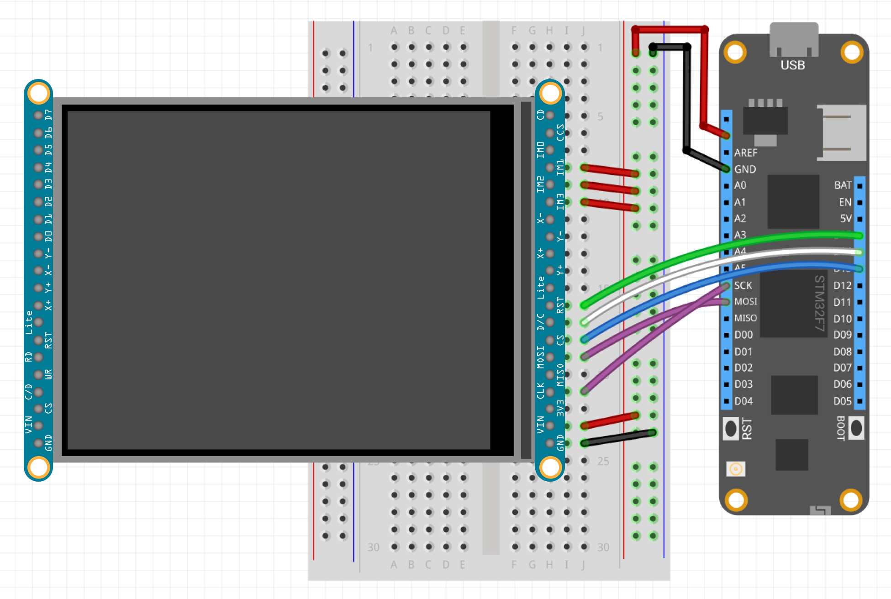

| Ili9341 | |
|--------|--------|
| Status |  |
| Source code | [GitHub](https://github.com/WildernessLabs/Meadow.Foundation/tree/main/Source/Meadow.Foundation.Peripherals/Displays.TftSpi) |
| Datasheet(s) | [GitHub](https://github.com/WildernessLabs/Meadow.Foundation/tree/main/Source/Meadow.Foundation.Peripherals/Displays.TftSpi/Datasheet) |
| NuGet package | <a href="https://www.nuget.org/packages/Meadow.Foundation.Displays.TftSpi/" target="_blank"></a> |

The **ILI9341** is a display controller used to drive color displays over SPI using 12, 16 or 18 bbp. These displays require a backlight. These displays are commonly found with a resolution of 320x240.

The Meadow.Foundation ILI9341 driver currently only supports 16bpp RGB565.

### Code Example

```csharp
Ili9341 display;
MicroGraphics graphics;

public MeadowApp()
{
    Console.WriteLine("Initializing ...");

    var config = new SpiClockConfiguration(new Frequency(12000, Frequency.UnitType.Kilohertz), SpiClockConfiguration.Mode.Mode0);
    var spiBus = Device.CreateSpiBus(Device.Pins.SCK, Device.Pins.MOSI, Device.Pins.MISO, config);

    Console.WriteLine("Create display driver instance");

    display = new Ili9341
    (
        device: Device,
        spiBus: spiBus,
        chipSelectPin: Device.Pins.D13,
        dcPin: Device.Pins.D14,
        resetPin: Device.Pins.D15,
        width: 240, height: 320
    )
    {
        IgnoreOutOfBoundsPixels = true
    };

    graphics = new MicroGraphics(display);
			
ics.CurrentFont = new Font12x16();
    graphics.Clear();
    graphics.DrawTriangle(10, 30, 50, 50, 10, 50, Meadow.Foundation.Color.Red);
    graphics.DrawRectangle(20, 45, 40, 20, Meadow.Foundation.Color.Yellow, false);
    graphics.DrawCircle(50, 50, 40, Meadow.Foundation.Color.Blue, false);
    graphics.DrawText(5, 5, "Meadow F7", Meadow.Foundation.Color.White);
    graphics.Show();

    DisplayTest();


```

[Sample project(s) available on GitHub](https://github.com/WildernessLabs/Meadow.Foundation/tree/main/Source/Meadow.Foundation.Peripherals/Displays.TftSpi/Samples/Ili9341_Sample)

### Wiring Example

 To wire a ILI9341 to your Meadow board, connect the following:

| ILI9341 | Meadow Pin |
|---------|------------|
| LED-    | 3V3        |
| LED+    | GND        |
| MOSI    | MOSI       |
| SCK     | SCK        |
| RESET   | D15        |
| A0      | D14        |
| CS      | D13        |
| VCC     | 3V3        |
| GND     | GND        |

It should look like the following diagram:




