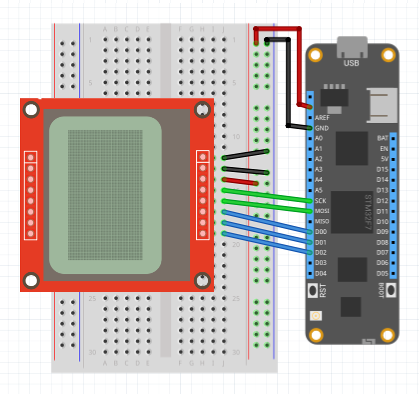

| PCD8544 |             |
|---------|-------------|
| Status  | Working     |
| Source code        | [GitHub](https://github.com/WildernessLabs/Meadow.Foundation/tree/master/Source/Meadow.Foundation.Peripherals/Displays.PCD8544)            |
| NuGet package      | 
| | |


The **PCD8544** display, also known as a Nokia 5110 LCD is very popular among the hardware tinkerers. These modules are used on wide variety of applications that require some sort of interface or display data to the user. They have a resolution of 84*48 dot matrix LCD, and you can easily control them using SPI.

### Purchasing

* [NOKIA 5110 SPI LCD graphic display 84x48](https://www.ebay.com/sch/i.html?LH_CAds=&_ex_kw=&_fpos=&_fspt=1&_mPrRngCbx=1&_nkw=Nokia+5110+arduino&_sacat=&_sadis=&_sop=12&_udhi=&_udlo=&_fosrp=1)

### Code Example

The following example shows how to initialize a TEA5767 and look for radio stations:

```csharp
public class MeadowApp : App<F7Micro, MeadowApp>
{
    Pcd8544 display;
    GraphicsLibrary graphics;

    public MeadowApp()
    {
        Console.WriteLine("Initializing...");

        var config = new Meadow.Hardware.SpiClockConfiguration(
            Pcd8544.DEFAULT_SPEED, 
            Meadow.Hardware.SpiClockConfiguration.Mode.Mode0);

        display = new Pcd8544
        (
            device: Device,
            spiBus: Device.CreateSpiBus(
                Device.Pins.SCK, 
                Device.Pins.MOSI, Device.Pins.MISO, 
                config),
            chipSelectPin: Device.Pins.D01,
            dcPin: Device.Pins.D00,
            resetPin: Device.Pins.D02
        );

        graphics = new GraphicsLibrary(display);
        graphics.Rotation = GraphicsLibrary.RotationType._180Degrees;

        TestPcd8544();
    }

    void TestPcd8544() 
    {
        Console.WriteLine("TestPcd8544...");

        // Drawing with Display Graphics Library
        graphics.Clear(true);
        graphics.CurrentFont = new Font8x12();
        graphics.DrawText(0, 0, "PCD8544");
        graphics.DrawRectangle(5, 14, 30, 10, true);

        graphics.Show();
    }
}
```

[Source code available on GitHub](https://github.com/WildernessLabs/Meadow.Foundation/tree/master/Source/Meadow.Foundation.Peripherals/Displays.Pcd8544/Samples/Displays.PCD8854_Sample) 

### Wiring Example

 To wire a PCD8544 to your Meadow board, connect the following:

| PCD8544 | Meadow Pin |
|---------|------------|
| GND     | GND        |
| LIGHT   | GND        |
| VCC     | 3V3        |
| CLK     | SCK        |
| DIN     | MOSI       |
| DC      | D00        |
| CE      | D01        |
| RST     | D02        |


