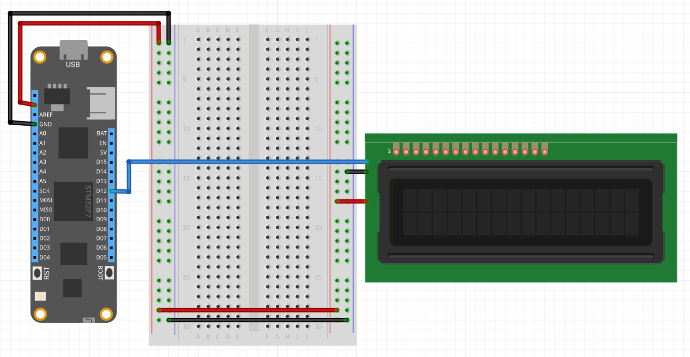

| SerialLCD |             |
|---------|-------------|
| Status        | Not Working             |
| Source code        | [GitHub](https://github.com/WildernessLabs/Meadow.Foundation/tree/master/Source/Meadow.Foundation.Peripherals/Displays.SerialLcd/Driver/Displays.SerialLCD)            |
| NuGet package      | Not published
| | |

Serial LCD backpacks provide a convenient way to display data on a 16x2 or 20x4 LCD display.

### Purchasing

This driver supports the [Sparkfun Serial Backpack](https://www.sparkfun.com/products/retired/258). This can also be purchased as a [kit](https://www.sparkfun.com/products/10097) with both the serial backpack and the LCD.

---
uid: Meadow.Foundation.Displays.SerialLCD
example: [*content]
---

The application below outputs Hello, world on the LCD:

```csharp

    
public class DisplayApp : App<F7Micro, DisplayApp>
{
    public MeadowApp()
    {
        var display = new SerialLCD();
        //
        //  Clear the display ready for the test.
        //
        display.Clear();
        display.SetCursorStyle(SerialLCD.CursorStyle.BlinkingBoxOff);
        display.SetCursorStyle(SerialLCD.CursorStyle.UnderlineOff);
        //
        //  Display some text on the bottom row of a 16x2 LCD.
        //
        display.SetCursorPosition(2, 1);
        display.DisplayText("Hello, world");
    }
}
```

##### Wiring Example

The Serial LCD requires only three connections; power, ground and serial data. The Tx pin on Meadow should be connected to the Rx pin on the serial backpack:

