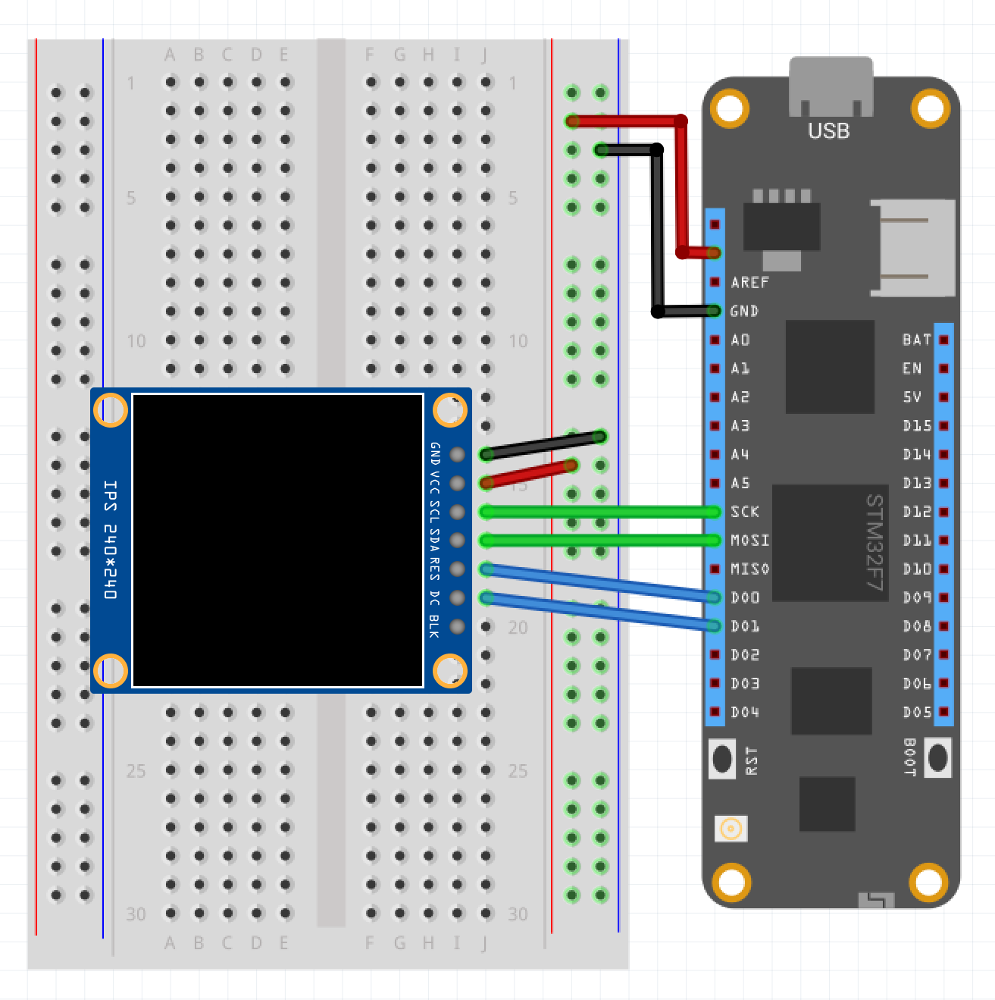

| Ili9486 | |
|--------|--------|
| Status |  |
| Source code | [GitHub](https://github.com/WildernessLabs/Meadow.Foundation/tree/master/Source/Meadow.Foundation.Peripherals/Displays.TftSpi.Ili9486) |
| NuGet package | <a href="https://www.nuget.org/packages/Meadow.Foundation.Displays.TftSpi/" target="_blank"></a> |

### Code Example

```csharp
GraphicsLibrary graphics;

public MeadowApp()
{
    Console.WriteLine("Initializing ...");

    var config = new SpiClockConfiguration(12000, SpiClockConfiguration.Mode.Mode0);
    var spiBus = Device.CreateSpiBus(Device.Pins.SCK, Device.Pins.MOSI, Device.Pins.MISO, config);

    Console.WriteLine("Create display driver instance");

    var display = new Ili9486
    (
        device: Device, 
        spiBus: spiBus,
        resetPin: Device.Pins.D00,
SelectPin: Device.Pins.D02,
        dcPin: Device.Pins.D01,
        width: 320, height: 480
    );

    graphics = new GraphicsLibrary(display);

    graphics.CurrentFont = new Font8x8();
    graphics.Clear();
    graphics.DrawTriangle(10, 10, 50, 50, 10, 50, Meadow.Foundation.Color.Red);
    graphics.DrawRectangle(20, 15, 40, 20, Meadow.Foundation.Color.Yellow, false);
    graphics.DrawCircle(50, 50, 40, Meadow.Foundation.Color.Blue, false);
    graphics.DrawText(5, 5, "Meadow F7");
    graphics.Show();
}

```

[Sample project(s) available on GitHub](https://github.com/WildernessLabs/Meadow.Foundation/tree/master/Source/Meadow.Foundation.Peripherals/Displays.TftSpi.Ili9486/Samples/Displays.TftSpi.Ili9486_Sample)

### Wiring Example

 To wire a Ili9486 to your Meadow board, connect the following:

| Ili9486 | Meadow Pin |
|---------|------------|
| GND     | GND        |
| VCC     | 3V3        |
| SCL     | SCK        |
| SDA     | MOSI       |
| CS      | D02        |
| DC      | D01        |
| RESET   | D00        |

It should look like the following diagram:




