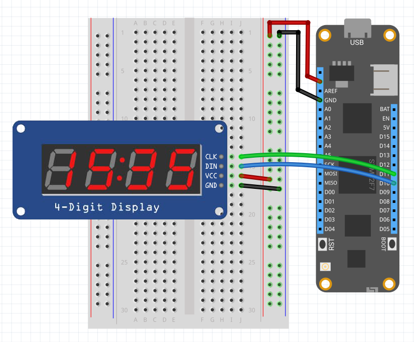

| TM1637        |             |
|---------------|-------------|
| Status        |  |
| Source code   | [GitHub](https://github.com/WildernessLabs/Meadow.Foundation/tree/master/Source/Meadow.Foundation.Peripherals/Displays.Tm1637) |
| NuGet package | <a href="https://www.nuget.org/packages/Meadow.Foundation.Displays.Tm1637/" target="_blank"></a> |

The **TM1637** is a led driver and keyboard scan interface. However, this chip is almost exclusively found pre-assembled with with 4 7-segment displays.

### Purchasing

* [HALJIA 0.91 128x32 pixel OLED Display](https://www.amazon.co.uk/gp/product/B071Z18R1M/ref=oh_aui_detailpage_o03_s00?ie=UTF8&psc=1)

### Code Example

The following example shows how to initialize a TEA5767 and display an array of characters:

```csharp
public class MeadowApp : App<F7Micro, MeadowApp>
{
    Tm1637 display;

    public MeadowApp()
    {
        display = new Tm1637(Device, Device.Pins.D02, Device.Pins.D01);
        display.Brightness = 7;
        display.ScreenOn = true;
        display.Clear();

        var chars = new Character[] 
        { 
            Character.A, 
            Character.B, 
            Character.C, 
            Character.D 
        };

        display.Show(chars);
    }
}
```

[Sample projects available on GitHub](https://github.com/WildernessLabs/Meadow.Foundation/tree/master/Source/Meadow.Foundation.Peripherals/Displays.Tm1637/Samples) 

### Wiring Example

 To wire a TM1637 to your Meadow board, connect the following:

| TM1637  | Meadow Pin    |
|---------|---------------|
| GND     | GND           |
| VCC     | 3V3           |
| SCL     | D08 (SCL Pin) |
| SDA     | D07 (SDA Pin) |

