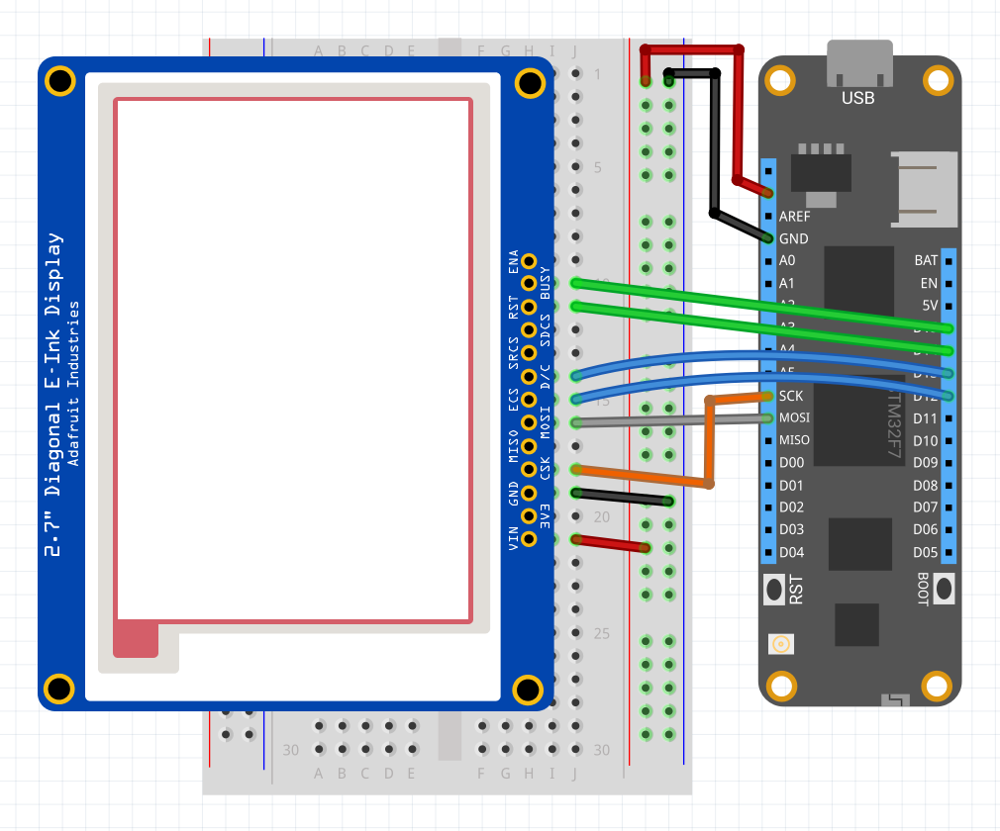

| IL0373 | |
|--------|--------|
| Status |  |
| Source code | [GitHub](https://github.com/WildernessLabs/Meadow.Foundation/tree/master/Source/Meadow.Foundation.Peripherals/Displays.ePaper.IL0373) |
| NuGet package | <a href="https://www.nuget.org/packages/Meadow.Foundation.Displays.ePaper/" target="_blank"></a> |

The **IL0373** is a tri-color display controller for ePaper displays. Data is sent to the controller via SPI and supports partial screen updates.

The IL0373 is commonly paired with 1.54", 2.13" or 2.9" dual or tri-color ePaper displays of various resolutions. 

### Code Example

```csharp
public MeadowApp()
{
    Console.WriteLine("Initialize ...");
 
    var display = new Il0373(device: Device, 
        spiBus: Device.CreateSpiBus(),
        chipSelectPin: Device.Pins.D02,
        dcPin: Device.Pins.D01,
        resetPin: Device.Pins.D00,
        busyPin: Device.Pins.D03,
        width: 176,
        height: 264);

    var graphics = new MicroGraphics(display);

    //any color but black will show the ePaper alternate color 
    graphics.DrawRectangle(1, 1, 126, 32, Meadow.Foundation.Color.Red, false);

    graphics.CurrentFont = new Font8x12();
    graphics.DrawText(2, 2, "IL0373", Meadow.Foundation.Color.Black);
    graphics.DrawText(2, 20, "Meadow F7", Meadow.Foundation.Color.Black);

    graphics.Show();
}

```

[Sample project(s) available on GitHub](https://github.com/WildernessLabs/Meadow.Foundation/tree/main/Source/Meadow.Foundation.Peripherals/Displays.ePaper/Samples/IL0373_Sample)

### Wiring Example

 To control a ILI0373 from Meadow, connect the following:

| IL0373  | Meadow Pin |
|---------|------------|
| BUSY    | D15        |
| RST     | D14        |
| DC      | D13        |
| CS      | D12        |
| CLK     | SCK        |
| DIN     | MOSI       |
| GND     | GND        |
| VCC     | 3V3        |

If your display does not include any of the above pins, they can be omitted. Pass `NULL` into the constructor for the missing pin(s).




