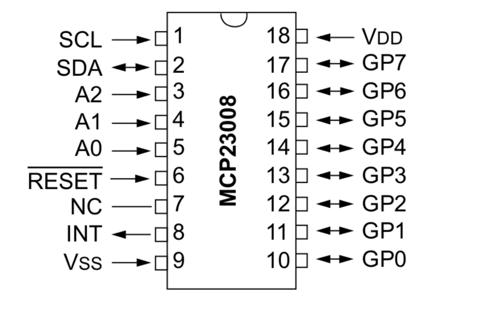
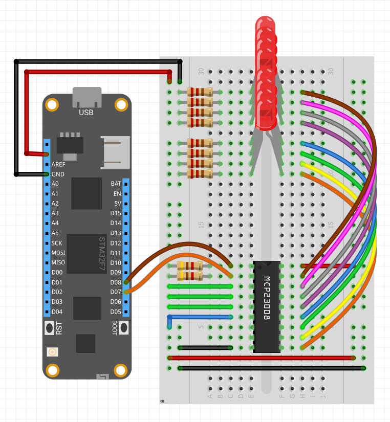

The MCP23008 chip is an 8-bit (8 port) digital I/O expander chip that uses I2C to communicate. It can be used to add additional digital input and output ports to a Netduino and can be combined with up to 8 MCP23008 chips in total, providing up to 64 additional ports.

MCP23008 is a ubiquitous chip in the hardware world and is the typical interface chip for common I2C LCD backpacks, with the 74595 chip being the typical interface chip for SPI LCD backpacks.

NOTE This is a pre-release driver, and interrupts have not been implemented yet.

### MCP Chip Family

In addition to the MCP23008, the MCP family of chips includes; the MCP23017, which is a 16-bit version of the MCP23008, offering 16 digital ports in total, and the MCP23S08 and MCP23S017 which are SPI versions of the MCP23008 and MCP23017, respectively.

### Chip Addressing

The I2C address of the chip is configurable via the address pins and is in the binary form of `0100[A2][A1][A0]`, where `A2`, `A1`, and `A0` refer to the three address pins on the chip:



For example, if all address pins were tied to ground, then the address of the chip would be `0100000` in binary, or `0x20` in hex, and `32` in decimal.

The I2C addresses can then be as follows, where `0` represents an address pin connected to ground, and `1` represents an address pin connected to `3.3V`:

| address header | A2  | A1  | A0  | Resulting Hex Address | Resulting Decimal Address |
|----------------|-----|-----|-----|-----------------------|---------------------------|
| `0100`         | `0` | `0` | `0` | `0x20`                | `32`                      | 
| `0100`         | `0` | `0` | `1` | `0x21`                | `33`                      | 
| `0100`         | `0` | `1` | `0` | `0x22`                | `34`                      | 
| `0100`         | `0` | `1` | `1` | `0x23`                | `35`                      | 
| `0100`         | `1` | `0` | `0` | `0x24`                | `36`                      | 
| `0100`         | `1` | `0` | `1` | `0x25`                | `37`                      | 
| `0100`         | `1` | `1` | `0` | `0x26`                | `38`                      | 
| `0100`         | `1` | `1` | `1` | `0x27`                | `39`                      | 

Because there are 8 address possibilities, it's possible to put 8 MCP23008 chips on a single I2C bus.

To make this simpler, when instantiating an MCP23008 object, there is a constructor overload that takes the address pin configurations instead of an address, so that Netduino.Foundation uses the appropriate address based on the pins, instead of requiring a pre-computed address.

### Other Pins

In addition to the address pins, there are a number of other pins that must be connected up:

 * **Not Reset** - The `RESET` pin is actually a "Not Reset." The line above "Reset" means "not." So unless that pin is pulled high (`3.3V`), the chip will reset itself at random times and you'll get connection errors.
 * **SCL** and **SDA** - The `SCL` and `SDA` pins are the I2C clock and data pins and go to the `SC` and `SD` pins on the Netduino, respectively. Each of these should also generally be pulled high (`3.3V`) via a `4.7kΩ` resistor. See the [I2C guide](http://developer.wildernesslabs.co/Netduino/Input_Output/Digital/I2C/) for more information.
 * **INT** - The `INT` pin is for interrupt notifications, and is only necessary when using the GPIO pins in input mode and you want an event raised when the input value changes.
 * **VSS** and **VDD** - These go to ground and 3.3V power, respectively, and power the chip.

---
uid: Meadow.Foundation.ICs.IOExpanders.MCP23008
example: [*content]
---

The following example shows how to turn on and off the LED using the `IsOn` property, and uses a `StartBlink(onDuration, offDuration)` API method to make the LED blink staying on for 500ms (0.5s) and off for 1000ms (1s):

```csharp
using System.Threading;
using Meadow;
using Meadow.Foundation.LEDs;

namespace LedSample
{
    public class Program
    {
        static IApp _app; 
        public static void Main()
        {
            _app = new App();
        }
    }
    
    public class App : AppBase<F7Micro, App>
    {
        public App ()
        {
            // create a new Led on pin 8
            var led = new Led(Device.Pins.D08);

            while(true)
            {
                led.IsOn = true;    // Led ON
                Thread.Sleep(3000); // 3 seconds
                led.IsOn = false;   // Led OFF
                Thread.Sleep(2000); // 2 seconds
                led.IsOn = true;    // Led ON
                Thread.Sleep(1000); // 1 second

                led.StartBlink(500, 1000);
                Thread.Sleep(5000); // 5 seconds
                led.Stop();
            }
        }
    }
}
```

##### Example Circuit

