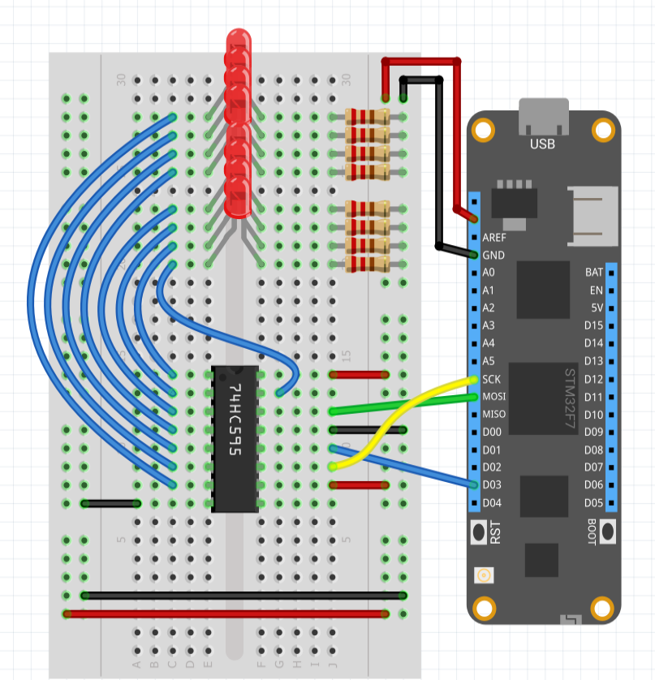

Shift registers offer the ability to increase the number of outputs on a microcontroller by using I2C or SPI interfaces. In the case of the 74xx595 series of shift registers, the SPI interface is used to output a series of bits that are then latched to the output pins of the chip.

This class allows Meadow to control the output pins on a 74HCT595 shift register using the SPI interface.

Note that when using this chip care should be taken to make sure that the total output load of the chip does not exceed the current and thermal dissipation properties for the specific shift register being used.

---
uid: Meadow.Foundation.ICs.IOExpanders.x74595
example: [*content]
---

The application below uses a ShiftRegister74595 object to cycle through the bits on the shift register and light the appropriate LED.

```csharp
using System.Threading;
using Meadow;
using Meadow.Foundation.ICs.IOExpanders;

namespace x74595_Sample
{
    public class Program
    {
        static IApp _app; 
        public static void Main()
        {
            _app = new App();
        }
    }
    
    public class App : AppBase<F7Micro, App>
    {
        public App ()
        {
            var config = new SPI.Configuration(SPI_mod: SPI_Devices.SPI1,
                                             ChipSelect_Port: Pins.GPIO_PIN_D8,
                                             ChipSelect_ActiveState: false,
                                             ChipSelect_SetupTime: 0,
                                             ChipSelect_HoldTime: 0,
                                             Clock_IdleState: true,
                                             Clock_Edge: true,
                                             Clock_RateKHz: 10);
           
           shiftRegister = new x74595(8, config);
           shiftRegister.Clear(true);

           int index = 0;
           while (true)
           {
               shiftRegister[index] = true;
               Thread.Sleep(500);
               shiftRegister[index] = false;
               index = index == 8 ? 0 : index + 1;
           }
        }
    }
}
```

##### Example Circuit

