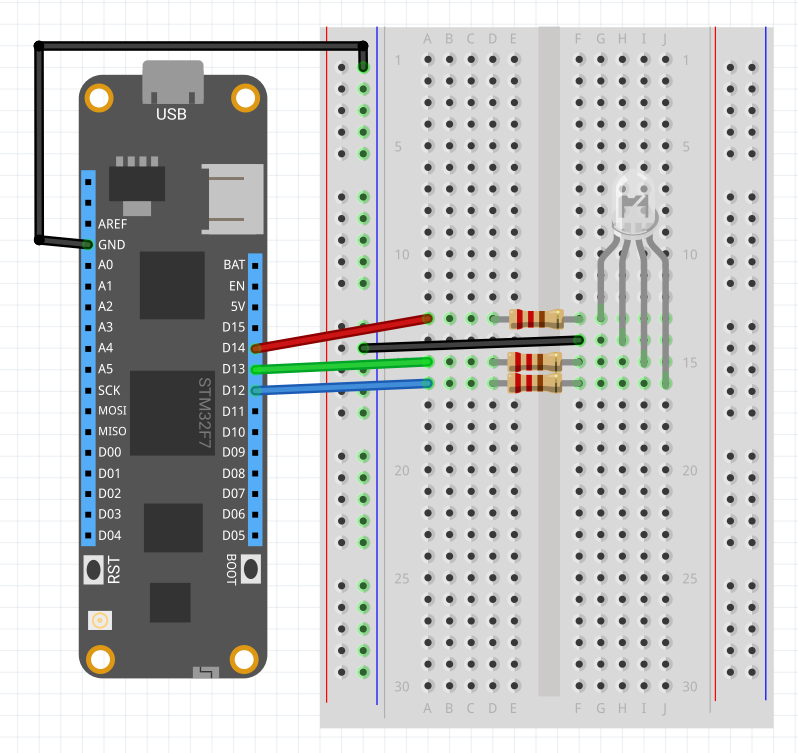

Represents an RGB LED whose color is controlled by three digital output ports. These diodes consist of four legs - one for each of the colors mentioned and one for a common cathode (ground) or common anode (vcc), which is also the longest one.


To connect these LEDs to Meadow, it is recommended to use an external resistor of about 270 to 1K ohms to prevent too much current flowing through it. 

### Circuit of a common anode RGB LED


### Circuit of a common cathode RGB LED



###Displaying all the colors

The following example code loops through all the colors possible with digital output ports only.

```csharp
using System.Threading;
using Meadow;
using Meadow.Foundation.Leds;
using Meadow.Devices;

namespace RgbLedSample
{
    public class Program
    {
        static IApp _app;
        public static void Main()
        {
            _app = new RgbLedApp();
        }
    }

    public class RgbLedApp : App<F7Micro, RgbLedApp>
    {
        public RgbLedApp()
        {
            // create a new common cathode RgbLed (otherwise set IsCommonCathode = false)
            var rgbLed = new RgbLed(
                Device.CreateDigitalOutputPort(Device.Pins.D14),
                Device.CreateDigitalOutputPort(Device.Pins.D13),
                Device.CreateDigitalOutputPort(Device.Pins.D12));

            // alternate between blinking and pulsing the LED 
            while (true)
            {
                for (int i = 0; i < (int)RgbLed.Colors.count; i++)
                {
                    rgbLed.SetColor((RgbLed.Colors)i);
                    Thread.Sleep(500);
                }

                for (int i = 0; i < (int)RgbLed.Colors.count; i++)
                {
                    rgbLed.StartBlink((RgbLed.Colors)i);
                    Thread.Sleep(3000);
                }
            }
        }
    }
}
```
