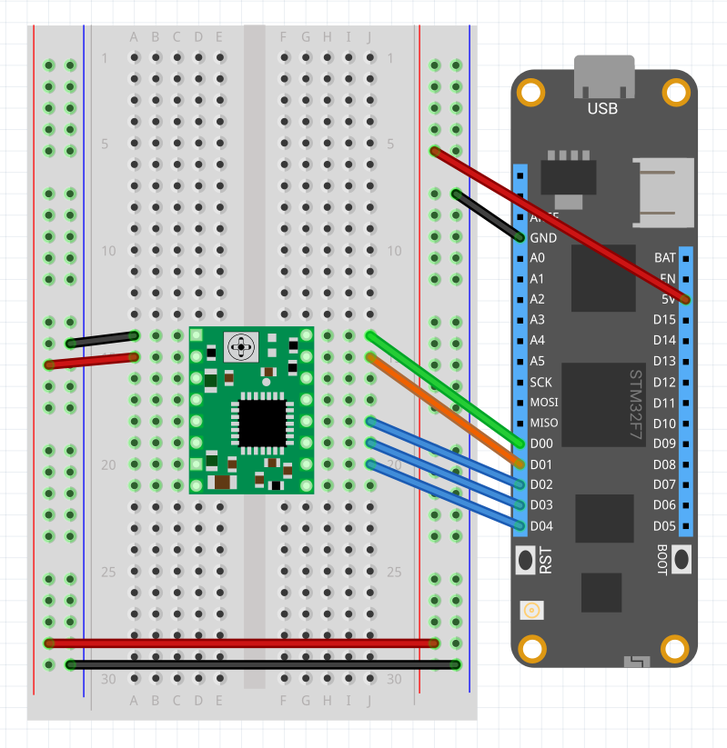

| A4988 | |
|--------|--------|
| Status |  |
| Source code | [GitHub](https://github.com/WildernessLabs/Meadow.Foundation/tree/main/Source/Meadow.Foundation.Peripherals/Motors.Stepper.A4988) |
| Datasheet(s) | [GitHub](https://github.com/WildernessLabs/Meadow.Foundation/tree/main/Source/Meadow.Foundation.Peripherals/Motors.Stepper.A4988/Datasheet) |
| NuGet package | <a href="https://www.nuget.org/packages/Meadow.Foundation.Motors.Stepper.A4988/" target="_blank"></a> |

### Code Example

```csharp
public MeadowApp()
{
    var a = new A4988(Device, Device.Pins.D01, Device.Pins.D00, Device.Pins.D04, Device.Pins.D03, Device.Pins.D02);

    var s = (StepDivisor[])Enum.GetValues(typeof(StepDivisor));
    while (true)
    {
        foreach (var sd in s)
        {
            for (var d = 2; d < 5; d++)
            {
                Console.WriteLine($"180 degrees..Speed divisor = {d}..1/{(int)sd} Steps..{a.Direction}...");
                a.RotationSpeedDivisor = d;
                a.StepDivisor = sd;
                a.Rotate(180);

                Thread.Sleep(500);
            }
        }
        a.Direction = (a.Direction == RotationDirection.Clockwise) ? RotationDirection.Counterclockwise : RotationDirection.Clockwise;
    }
}

```

[Sample project(s) available on GitHub](https://github.com/WildernessLabs/Meadow.Foundation/tree/main/Source/Meadow.Foundation.Peripherals/Motors.Stepper.A4988/Samples/A4988_Sample)

### Wiring Example

To wire a A4988 to your Meadow board, connect the following:

| A4988     | Meadow Pin |
|-----------|------------|
| GND       | GND        |
| VCC       | 5V         |
| STEP      | D01        |
| DIRECTION | D00        |
| M1        | D04        |
| M2        | D03        |
| M3        | D02        |

It should look like the following diagram:



