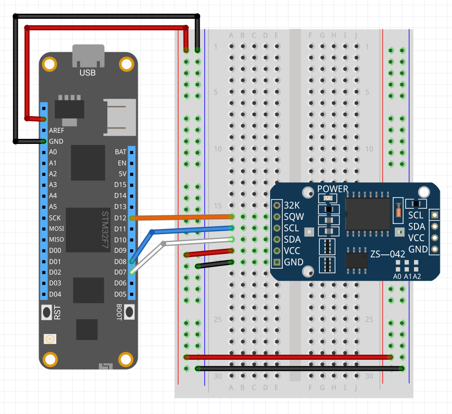

The DS323x ICs offer a low cost accurate real time clock with a temperature compensation crystal oscillator.  This range of chips offers the following functionality:

* Temperature compensation
* Battery backup
* I2C (DS3231) and SPI (DS3234) interfaces.
* Two programmable alarms
* 32.768 KHz square wave output

## Purchasing

A variety of modules are available including low cost modules with integrated EEPROM:

* [DS3231 with integrated EEPROM](https://www.amazon.com/s/ref=nb_sb_noss?url=search-alias%3Daps&field-keywords=ds3231)
* [Sparkfun DS3234 Breakout board](https://www.sparkfun.com/products/10160)

---
uid: Meadow.Foundation.RTCs.DS323x
example: [*content]
---

The following application sets an alarm to trigger at when the current second is equal to 15.  The interrupt routine displays the time and then clears the interrupt flag:

```csharp
using System.Threading;
using Meadow;
using Meadow.Foundation.RTCs;

namespace LedSample
{
    public class Program
    {
        static IApp _app; 
        public static void Main()
        {
            _app = new App();
        }
    }
    
    public class App : AppBase<F7Micro, App>
    {
        public App ()
        {
            DS3231 rtc = new DS3231(0x68, 100, Device.Pins.D08);
            rtc.ClearInterrupt(DS323x.Alarm.BothAlarmsRaised);
            rtc.SetAlarm(DS323x.Alarm.Alarm1Raised, new DateTime(2017, 10, 29, 9, 43, 15), DS323x.AlarmType.WhenSecondsMatch);
            rtc.OnAlarm1Raised += RtcOnAlarm1Raised;
        }

        static void RtcOnAlarm1Raised(object sender)
        {
            DS3231 rtc = (DS3231) sender;
            Debug.Print("Alarm 1 has been activated: " + rtc.CurrentDateTime.ToString());
            rtc.ClearInterrupt(DS323x.Alarm.Alarm1Raised);
        }
    }
}
```

##### Example Circuit

The DS3231 real time clock module (see image below) requires only four (for simple timekeeping) or five (for alarms) connections



| Meadow Pin | Sensor Pin        | Wire Color |
|--------------|-------------------|------------|
| 3.3V         | V<sub>cc</sub>    | Red        |
| GND          | GND               | Black      |
| SC           | SCK               | Blue       |
| SD           | SDA               | White      |
| SQW          | Digital Interrupt | Orange     |

The 32K pin outputs the 32,768 Hz clock signal from the module.  This signal is only available when power is supplied by V<sub>cc</sub>, it is not available when the module is on battery power.

The orange wire is only required if the alarms are being used to interrupt the Meadow.