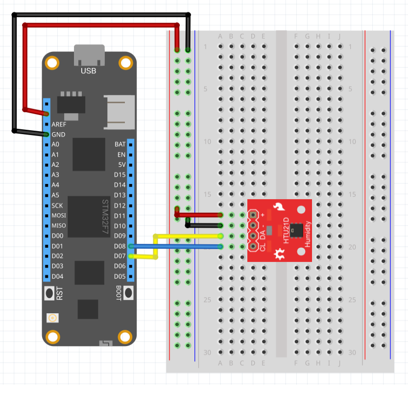

The HTU21D is a low-cost, easy to use, highly accurate, digital humidity sensor. All you need is two lines for I2C communication and you’ll have relative humidity readings such as “45.2%” or “23.1%” and very accurate temperature readings as a bonus!

---
uid: Meadow.Foundation.Sensors.Atmospheric.HTU21DF
example: [*content]
---

An example will be available once the driver is implemented.

##### Example Circuit

