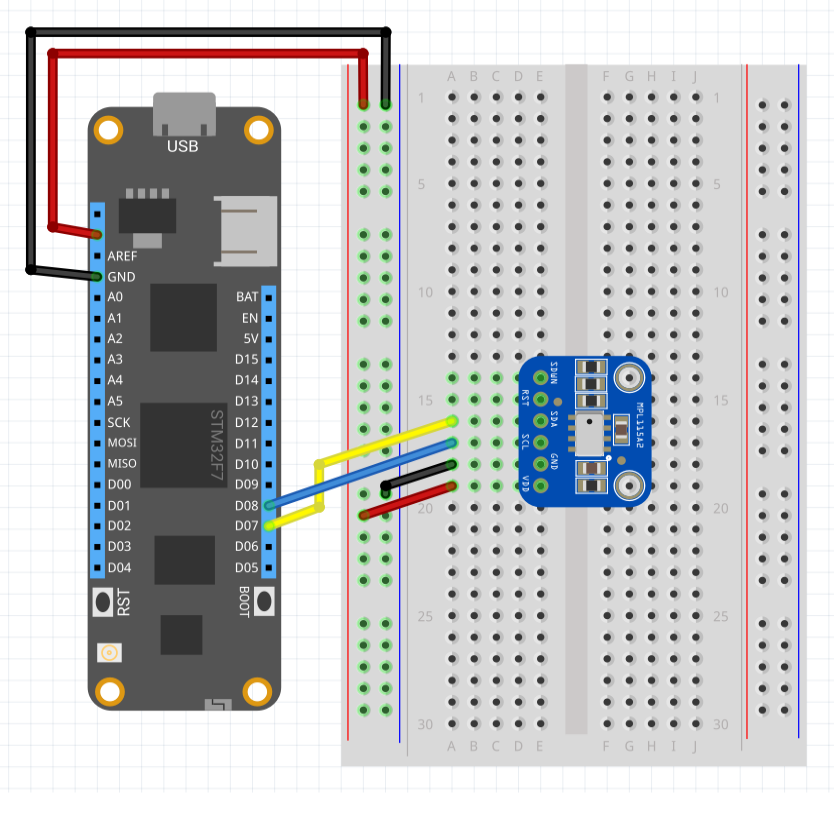

| Mpl115a2 | |
|--------|--------|
| Status |  |
| Source code | [GitHub](https://github.com/WildernessLabs/Meadow.Foundation/tree/main/Source/Meadow.Foundation.Peripherals/Sensors.Atmospheric.Mpl115A2/Driver) |
| Datasheet(s) | [GitHub](https://github.com/WildernessLabs/Meadow.Foundation/tree/main/Source/Meadow.Foundation.Peripherals/Sensors.Atmospheric.Mpl115A2/Datasheet) |
| NuGet package | <a href="https://www.nuget.org/packages/Meadow.Foundation.Sensors.Atmospheric.Mpl115a2/" target="_blank"></a> |

The **MPL115A2** is a low cost device for reading barometric pressure.

* I2C digital interface (address: `0x60`)
* Resolution: 1.5 hPa
* Range: 100-1150 hPa up to 10Km

[Sample projects available on GitHub](https://github.com/WildernessLabs/Meadow.Foundation/tree/main/Source/Meadow.Foundation.Peripherals/Sensors.Atmospheric.Mpl115A2/Samples/) 

## Purchasing

The MPL115A2 sensor is available on a breakout board from Adafruit

* [Adafruit MPL115A2 Breakout Board](https://www.adafruit.com/product/992)

The application below connects the MPL115A2 to two interrupt handlers.  These interrupt handlers (events) will display the `Temperature` and `Pressure` properties when the handlers are triggered.  The sensor is checked every 500 milliseconds.

### Code Example

```csharp
Mpl115a2 sensor;

public override Task Initialize()
{
    Console.WriteLine("Initializing...");

    sensor = new Mpl115a2(Device.CreateI2cBus());

    var consumer = Mpl115a2.CreateObserver(
        handler: result =>
        {
            Console.WriteLine($"Observer: Temp changed by threshold; new temp: {result.New.Temperature?.Celsius:N2}C, old: {result.Old?.Temperature?.Celsius:N2}C");
        },
        filter: result =>
        {
            //c# 8 pattern match syntax. checks for !null and assigns var.
            if (result.Old?.Temperature is { } oldTemp &&
                result.New.Temperature is { } newTemp)
            {
                return (newTemp - oldTemp).Abs().Celsius > 0.5; // returns true if > 0.5°C change.
            }
            return false;
        }
    );
    sensor.Subscribe(consumer);

    sensor.Updated += (sender, result) => {
        Console.WriteLine($"  Temperature: {result.New.Temperature?.Celsius:N2}C");
        Console.WriteLine($"  Pressure: {result.New.Pressure?.Bar:N2}Bar");
    };

    return Task.CompletedTask;
}

public override async Task Run()
{
    var conditions = await sensor.Read();
    Console.WriteLine($"Temperature: {conditions.Temperature?.Celsius}°C, Pressure: {conditions.Pressure?.Pascal}Pa");

    sensor.StartUpdating(TimeSpan.FromSeconds(1));
}

```

[Sample project(s) available on GitHub](https://github.com/WildernessLabs/Meadow.Foundation/tree/main/Source/Meadow.Foundation.Peripherals/Sensors.Atmospheric.Mpl115A2/Samples/Mpl115a2_Sample)

### Wiring Example

Connecting the MPL115A2 to Meadow requires four connections:



In this diagram, the shutdown (`SDWN`) and reset (`RST`) pins have been left floating.  Both of these pins are active low and can be tied to V<sub>cc</sub> in normal operation.

Note that the Adafruit breakout board has `10K` pull-up resistors on the `SDA` and `SCK` lines.


