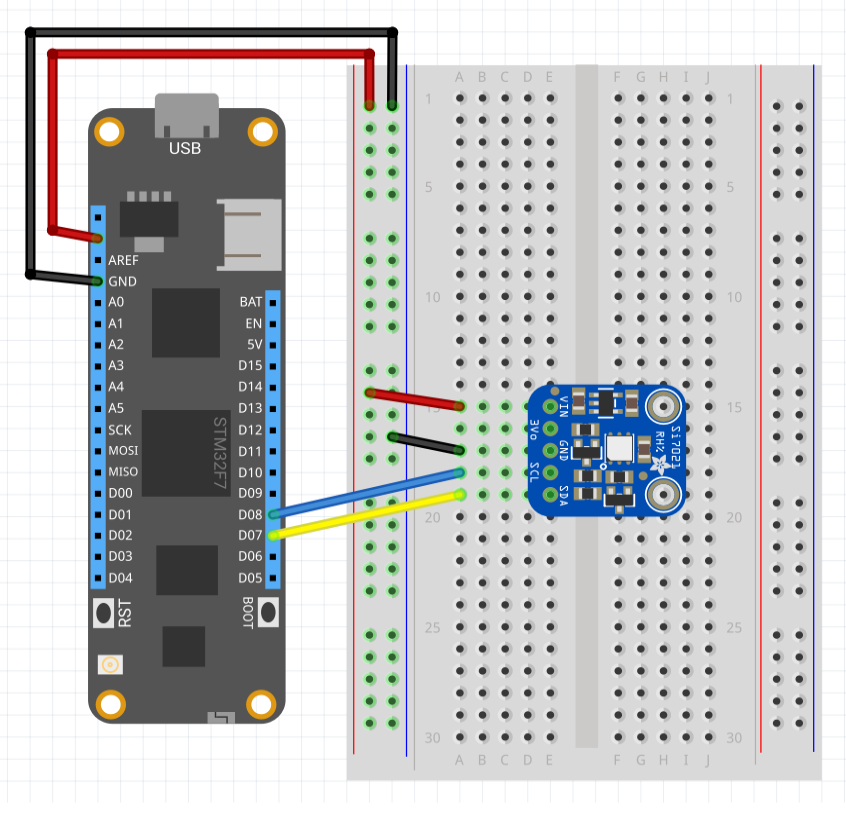

The Si7021 is a small temperature and humidity sensor with an I2C interface.

## Purchasing

The Si7021 is available on a breakout board from the the following suppliers:

* [Adafruit Si7021 Breakout Board](https://www.adafruit.com/product/3251)
* [Sparkfun Si7021 Breakout Board](https://www.sparkfun.com/products/13763)
* [Tessel Climate Module](https://www.seeedstudio.com/Tessel-Climate-Module-p-2225.html)

Note that the Tessel Climate module is compatible with this library.

---
uid: Meadow.Foundation.Sensors.Atmospheric.SI7021
example: [*content]
---

The SI7021 can operate is a polling or interrupt mode.  The default operation is interrupt mode.

### Interrupt Mode

The following sample demonstrates how to put the SI7021 sensor into interrupt mode.  The sensor will generate an interrupt every 100 ms (default setting for the polling period).

```csharp
using System.Threading;
using Meadow;
using Meadow.Foundation.Sensors.Atmospheric;

namespace SI7021_Sample
{
    public class Program
    {
        static IApp _app; 
        public static void Main()
        {
            _app = new App();
        }
    }
    
    public class App : AppBase<F7Micro, App>
    {
        public App ()
        {
            Console.WriteLine("SI7021 Interrupt Example");

            var si7021 = new SI7021(updateInterval: 2000);
            Console.WriteLine("Serial number: " + si7021.SerialNumber);
            Console.WriteLine("Firmware revision: " + si7021.FirmwareRevision);
            Console.WriteLine("Sensor type: " + si7021.SensorType);

            si7021.TemperatureChanged += (s, e) =>
            {
                Console.WriteLine("Temperature changed to: " + si7021.Temperature.ToString("f2"));
            };
            Thread.Sleep(Timeout.Infinite);
        }
    }
}
```

### Polling Mode

The following application reads a number of static properties from the sensor (`SerialNumber` etc.).  The current temperature and humidity are then read once a second and displayed through the debugger interface:

```csharp
using System.Threading;
using Meadow;
using Meadow.Foundation.Sensors.Atmospheric;

namespace SI7021_Sample
{
    public class Program
    {
        static IApp _app; 
        public static void Main()
        {
            _app = new App();
        }
    }
    
    public class App : AppBase<F7Micro, App>
    {
        public App ()
        {
            Console.WriteLine("SI7021 Polling Example");
            
            var si7021 = new SI7021(updateInterval: 0);
            Console.WriteLine("Serial number: " + si7021.SerialNumber);
            Console.WriteLine("Firmware revision: " + si7021.FirmwareRevision);
            Console.WriteLine("Sensor type: " + si7021.SensorType);

            while (true)
            {
                Console.WriteLine("Temperature: " + si7021.Temperature.ToString("f2"));
                Thread.Sleep(1000);
            }
        }
    }
}
```

##### Example Circuit



Both the Sparkfun and Adafruit boards have pull-up resistors already installed on the breakout boards and so these are not required to use the sensor.