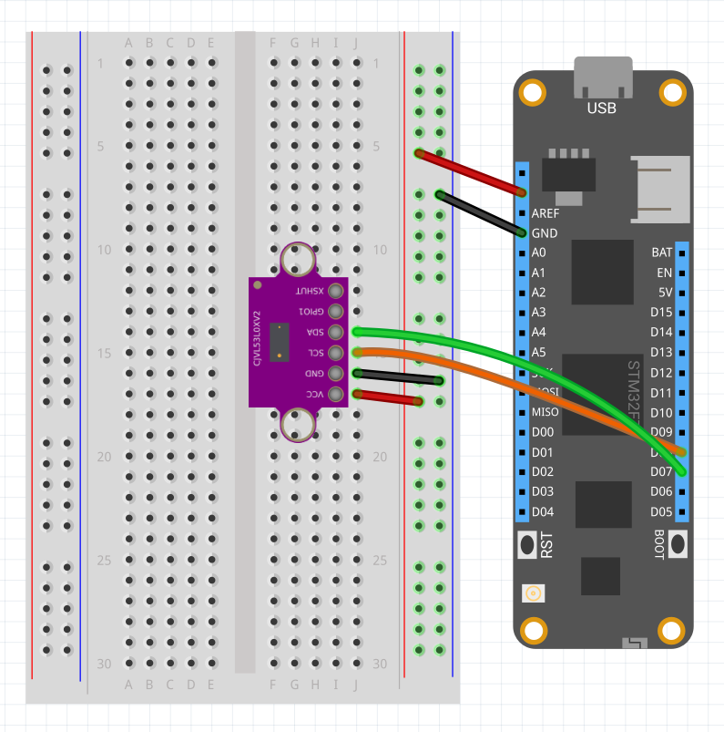

| Vl53l0x       |             |
|---------------|-------------|
| Status        |  |
| Source code   | [GitHub](https://github.com/WildernessLabs/Meadow.Foundation/tree/master/Source/Meadow.Foundation.Peripherals/Sensors.Distance.Vl53l0x) |
| NuGet package | <a href="https://www.nuget.org/packages/Meadow.Foundation.Sensors.Distance.Vl53l0x/" target="_blank">
                    </a> |

### Code Example

```csharp
public class MeadowApp : App<F7Micro, MeadowApp>
{
    Vl53l0x sensor;

    public MeadowApp()
    {
        var i2cBus = Device.CreateI2cBus(I2cBusSpeed.FastPlus);
        sensor = new Vl53l0x(Device, i2cBus);

        sensor.Updated += SensorUpdated;
        sensor.StartUpdating();
    }

    private void SensorUpdated(object sender, Meadow.Peripherals.Sensors.Distance.DistanceConditionChangeResult e)
    {
        if (e.New == null || e.New.Distance == null)
        {
            return;
        }

        Console.WriteLine($"{e.New.Distance.Value}mm");
    }
}
```

### Wiring Example

To wire a Vl53l0x to your Meadow board, connect the following:

| Vl53l0x | Meadow Pin  |
|---------|-------------|
| GND     | GND         |
| SCL     | D08 (SCL)   |
| SDA     | D07 (SDA)   |
| VCC     | 3V3         |

It should look like the following diagram:

