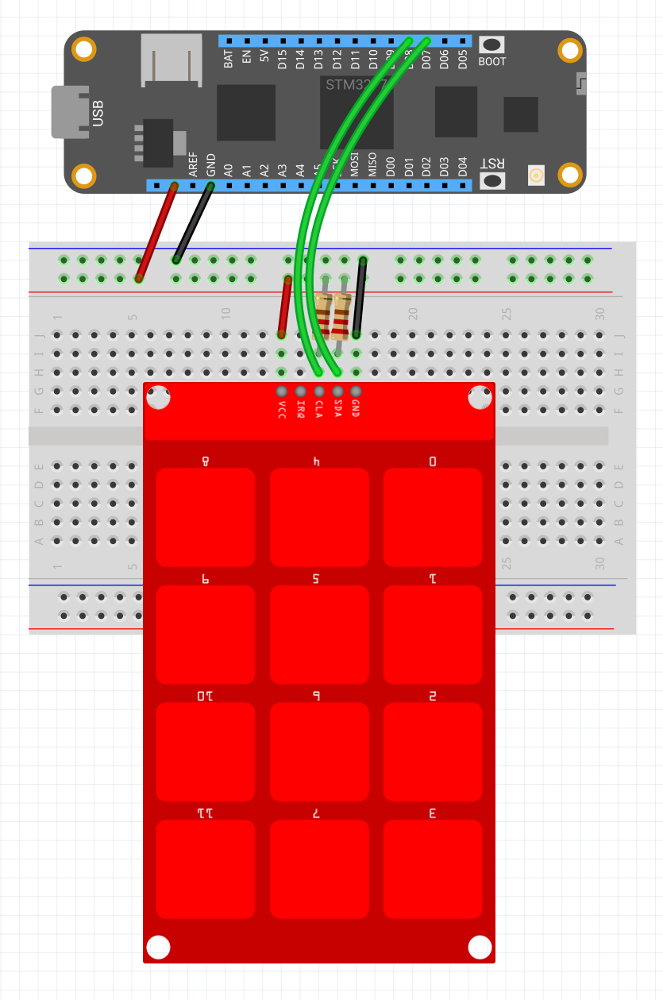

| Mpr121       |             |
|---------------|-------------|
| Status        |  |
| Source code   | [GitHub](https://github.com/WildernessLabs/Meadow.Foundation/tree/master/Source/Meadow.Foundation.Peripherals/Sensors.Hid.Mpr121) |
| NuGet package | <a href="https://www.nuget.org/packages/Meadow.Foundation.Sensors.Hid.Mpr121/" target="_blank">
                    </a> |

### Code Example

```csharp
public class MeadowApp : App<F7Micro, MeadowApp>
{
    Mpr121 sensor;

    public MeadowApp()
    {
        sensor = new Mpr121(Device.CreateI2cBus(Meadow.Hardware.I2cBusSpeed.Standard), 90, 100);
        sensor.ChannelStatusesChanged += SensorChannelStatusesChanged;
    }

    void SensorChannelStatusesChanged(object sender, ChannelStatusChangedEventArgs e)
    {
        string pads = string.Empty;

        for(int i = 0; i < e.ChannelStatus.Count; i++)
        {
            if(e.ChannelStatus[(Mpr121.Channels)i] == true)
            {
                pads += i + ", ";
            }
        }

        if (string.IsNullOrEmpty(pads))
        {
            Console.WriteLine("none");
        }
        else
        {
            Console.WriteLine(pads + "touched");
        }
    }
}
```

### Wiring Example

To wire a Mpr121 to your Meadow board, connect the following:

| Mpr121  | Meadow Pin  |
|---------|-------------|
| GND     | GND         |
| SCL     | D08 (SCL)   |
| SDA     | D07 (SDA)   |
| VCC     | 3V3         |

It should look like the following diagram:

