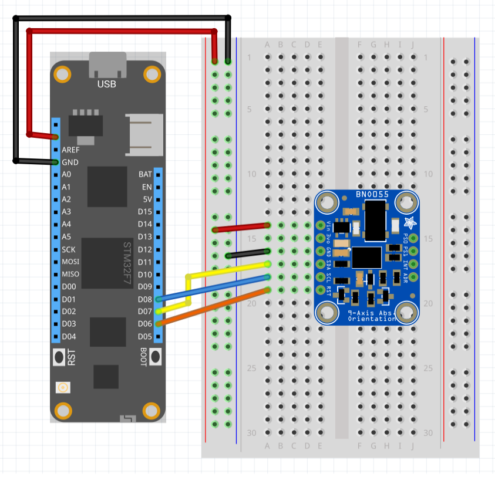

BNO055 is a 9-axis absolute orientation sensor.  The three sensors (accelerometer, gyroscope and magnetometer) with a 32-bit cortex M0 microcontroller.


## Purchasing
* [Tindie BNO-055 9-axis motion sensor with fusion hardware](https://www.tindie.com/products/onehorse/bno-055-9-axis-motion-sensor-with-hardware-fusion/)


---
uid: Meadow.Foundation.Sensors.Motion.BNO055
example: [*content]
---

The application below will send serial data to the [cuberotate](https://learn.adafruit.com/adafruit-bno055-absolute-orientation-sensor/downloads) application on the Adafruit web site.  Rotating the board will rotate the figure on the screen.

```csharp
using System.Threading;
using Meadow;
using Meadow.Foundation.Sensors.Motion;

namespace BNO055_Sample
{
    public class Program
    {
        static IApp _app; 
        public static void Main()
        {
            _app = new App();
        }
    }
    
    public class App : AppBase<F7Micro, App>
    {
        /// <summary>
        /// Pin used to reset the BNO055.
        /// </summary>
        private static DigitalOutputPort _resetPort = new DigitalOutputPort(Device.Pins.D02, true);

        /// <summary>
        /// Serial port used to send data to the computer.
        /// </summary>
        private static SerialPort _comPort = new SerialPort("COM1", 115200, Parity.None, 8, StopBits.One);

        /// <summary>
        /// Convert a boolean value to text for the calibration messages.
        /// </summary>
        public static string BooleanToIntString(bool b)
        {
            return b ? "1" : "0";
        }

        /// <summary>
        ///  Write a message to the com port terminated with '\n'
        /// </summary>
        private static void WriteText(string text)
        {
            string message = text + "\n";
            _comPort.Write(Encoding.UTF8.GetBytes(message), 0, message.Length);
        }

        public App ()
        {
            Console.WriteLine("BNO055 Test Application.");
            
            _resetPort.Write(false);
            Thread.Sleep(10);
            _resetPort.Write(true);
            Thread.Sleep(50);
            
            _comPort.Open();
            WriteText("Orientation Sensor Test");
            WriteText("");
            WriteText("Sensor:       BNO050");
            WriteText("Driver Ver:   1");
            WriteText("Unique ID:    ");
            WriteText("Max Value:    0.0");
            WriteText("Min Value:    0.0");
            WriteText("Resolution:   0.01");
            WriteText("");
            Thread.Sleep(500);
            
            var bno055 = new BNO055(0x29);
            bno055.DisplayRegisters();
            bno055.PowerMode = BNO055.PowerModes.Normal;
            bno055.OperatingMode = BNO055.OperatingModes.ConfigurationMode;
            bno055.OperatingMode = BNO055.OperatingModes.InertialMeasurementUnit;
            bno055.DisplayRegisters();

            Console.WriteLine("Current temperature: " + bno055.Temperature.ToString("f2"));
            
            while (true)
            {
                bno055.Read();
                var reading = bno055.EulerOrientation;
                string orientationMessage = "Orientation: " + reading.Roll + " " + reading.Pitch + " " + reading.Heading;
                string calibrationMessage = "Calibration: " + BooleanToIntString(bno055.IsSystemCalibrated) + " " +
                            BooleanToIntString(bno055.IsGyroscopeCalibrated) + " " +
                            BooleanToIntString(bno055.IsAccelerometerCalibrated) + " " +
                            BooleanToIntString(bno055.IsMagnetometerCalibrated);
                Console.WriteLine(orientationMessage);
                Console.WriteLine(calibrationMessage);
                WriteText(orientationMessage);
                WriteText(calibrationMessage);
                
                Thread.Sleep(100);
            }
        }
    }
}
```

##### Example Circuit

The following diagram shows the BNO055 configured for bas

