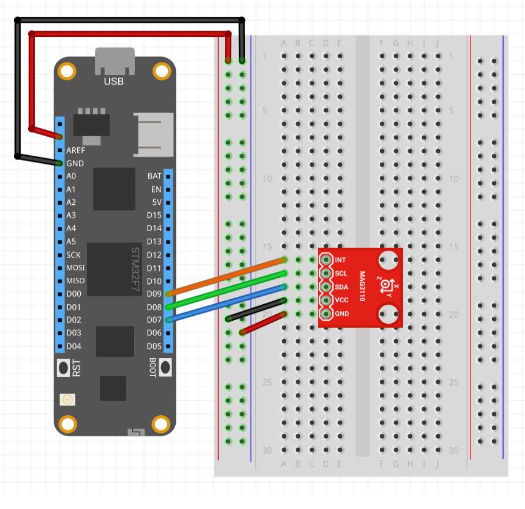

| Mag3110 | |
|--------|--------|
| Status |  |
| Source code | [GitHub](https://github.com/WildernessLabs/Meadow.Foundation/tree/main/Source/Meadow.Foundation.Peripherals/Sensors.Motion.Mag3110) |
| Datasheet(s) | [GitHub](https://github.com/WildernessLabs/Meadow.Foundation/tree/main/Source/Meadow.Foundation.Peripherals/Sensors.Motion.Mag3110/Datasheet) |
| NuGet package | <a href="https://www.nuget.org/packages/Meadow.Foundation.Sensors.Motion.Mag3110/" target="_blank"></a> |

The **MAG3110** is a three axis magnetometer with an I2C interface. The magnetometer is capable of single and continuous readings.

### Code Example

```csharp
Mag3110 sensor;

public override Task Initialize()
{
    Resolver.Log.Info("Initialize...");

    sensor = new Mag3110(Device.CreateI2cBus());

    // classical .NET events can  be used
    sensor.Updated += (sender, result) =>
    {
        Resolver.Log.Info($"Magnetic Field: [X:{result.New.MagneticField3D?.X.MicroTesla:N2}," +
            $"Y:{result.New.MagneticField3D?.Y.MicroTesla:N2}," +
            $"Z:{result.New.MagneticField3D?.Z.MicroTesla:N2} (microTeslas)]");

        Resolver.Log.Info($"Temp: {result.New.Temperature?.Celsius:N2}C");
    };

    // Example that uses an IObservable subscription to only be notified when the filter is satisfied
    var consumer = Mag3110.CreateObserver(
        handler: result => Resolver.Log.Info($"Observer: [x] changed by threshold; new [x]: X:{result.New.MagneticField3D?.X.MicroTesla:N2}, old: X:{result.Old?.MagneticField3D?.X.MicroTesla:N2}"),
        // only notify if there's a greater than 1 micro tesla on the Y axis
        filter: result =>
        {
            if (result.Old is { } old)
            {
                return ((result.New.MagneticField3D - old.MagneticField3D)?.Y > new MagneticField(1, MU.MicroTesla));
            }
            return false;
        });
    sensor.Subscribe(consumer);

    return Task.CompletedTask;
}

public async override Task Run()
{
    var result = await sensor.Read();
    Resolver.Log.Info("Initial Readings:");
    Resolver.Log.Info($"Magnetic field: [X:{result.MagneticField3D?.X.MicroTesla:N2}," +
        $"Y:{result.MagneticField3D?.Y.MicroTesla:N2}," +
        $"Z:{result.MagneticField3D?.Z.MicroTesla:N2} (microTeslas)]");

    Resolver.Log.Info($"Temp: {result.Temperature?.Celsius:N2}C");

    sensor.StartUpdating(TimeSpan.FromMilliseconds(500));
}

```

[Sample project(s) available on GitHub](https://github.com/WildernessLabs/Meadow.Foundation/tree/main/Source/Meadow.Foundation.Peripherals/Sensors.Motion.Mag3110/Samples/Mag3110_Sample)

### Polling Mode

The following application reads the values from the magnetometer and displays the readings on the debug output:

```csharp
public class MeadowApp : App<F7Micro, MeadowApp>
{
    public MeadowApp()
    {
        Console.WriteLine("MAG3110 Test Application");
        Mag3110 mag3110 = new Mag3110();
        mag3110.Standby = false;
        int readingCount = 0;

        while (true)
        {
            mag3110.Read();
            readingCount++;
            Console.WriteLine(
                "Reading " + readingCount.ToString() + 
                ": x = " + mag3110.X.ToString() + 
                ", y = " + mag3110.Y.ToString() + 
                ", z = " + mag3110.Z.ToString());
            Thread.Sleep(1000);
        }
    }
}
```

### Wiring Example

In it's basic configuration the magnetometer requires four connections:

| Meadow Pin   | Sensor Pin     | Wire Color |
|--------------|----------------|------------|
| 3.3V         | V<sub>cc</sub> | Red        |
| GND          | GND            | Black      |
| SC           | SCK            | Green      |
| SD           | SDA            | Blue       |
| D8           | INT1           | Orange     |




