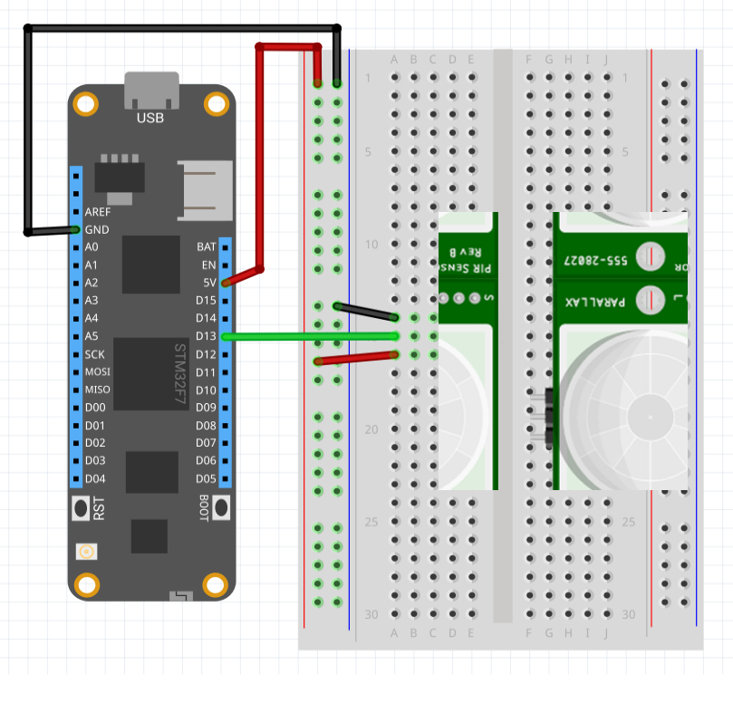

| ParallaxPir | |
|--------|--------|
| Status |  |
| Source code | [GitHub](https://github.com/WildernessLabs/Meadow.Foundation/tree/main/Source/Meadow.Foundation.Peripherals/Sensors.Motion.ParallaxPir) |
| Datasheet(s) | [GitHub](https://github.com/WildernessLabs/Meadow.Foundation/tree/main/Source/Meadow.Foundation.Peripherals/Sensors.Motion.ParallaxPir/Datasheet) |
| NuGet package | <a href="https://www.nuget.org/packages/Meadow.Foundation.Sensors.Motion.ParallaxPir/" target="_blank"></a> |

The Parallax PIR detects motion via infrared. It emits a high signal over the data pin when motion is detected. The pin returns to a low state when motion stops.

### Code Example

```csharp
private ParallaxPir parallaxPir;

public override Task Initialize()
{
    Resolver.Log.Info("Initialize...");

    parallaxPir = new ParallaxPir(Device.CreateDigitalInterruptPort(Device.Pins.D05, InterruptMode.EdgeBoth, ResistorMode.Disabled));

    parallaxPir.OnMotionStart += (sender) => Resolver.Log.Info($"Motion start  {DateTime.Now}");
    parallaxPir.OnMotionEnd += (sender) => Resolver.Log.Info($"Motion end  {DateTime.Now}");

    return Task.CompletedTask;
}

```

[Sample project(s) available on GitHub](https://github.com/WildernessLabs/Meadow.Foundation/tree/main/Source/Meadow.Foundation.Peripherals/Sensors.Motion.ParallaxPir/Samples/ParallaxPir_Sample)

### Wiring Example

The Parallax PIR sensor requires only three connections, power, ground and motion detection signal:


