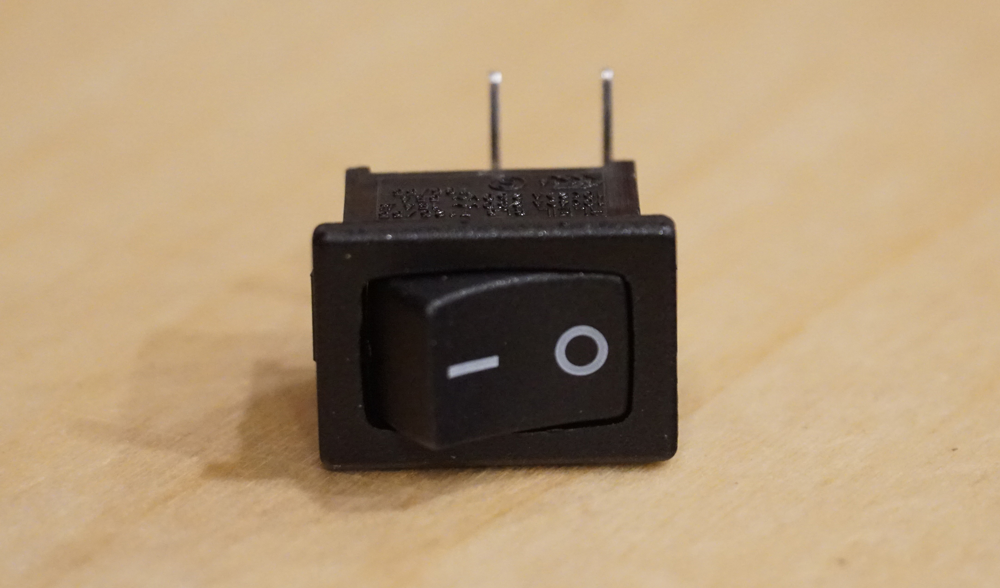
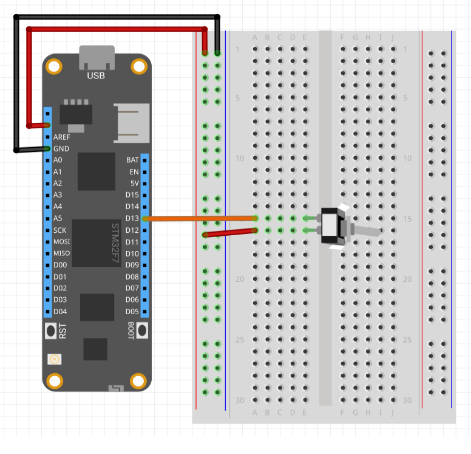

Represents a simple, on/off, Single-Pole-Single-Throw (SPST) switch that closes a circuit to either ground/common or high:



Use the [`CircuitTerminationType`](/API/CircuitTerminationType) to specify whether the other side of the switch terminates to ground or high.

---
uid: Meadow.Foundation.Sensors.Switches.SpstSwitch
example: [*content]
---

The following example shows how to use a SPST switch:

```csharp
using Meadow;
using Meadow.Devices;
using Meadow.Foundation.Sensors.Switches;
using Meadow.Hardware;
using System.Threading;

namespace SpstSwitch_Sample
{
    public class Program
    {
        static IApp _app; 
        public static void Main()
        {
            _app = new App();
        }
    }
    
    public class App : AppBase<F7Micro, App>
    {
        DigitalOutputPort _blueLED;
        SpstSwitch _spstSwitch;

        public App ()
        {
            _blueLED = new DigitalOutputPort(Device.Pins.OnboardLEDBlue, true);

            _spstSwitch = new SpstSwitch(Device.Pins.D13, CircuitTerminationType.High);
            _spstSwitch.Changed += (s, e) =>
            {
                Console.WriteLine("Switch Changed");
                Console.WriteLine("Switch on: " + _spstSwitch.IsOn.ToString());
            };

            Console.WriteLine("Initial switch state, isOn: " + _spstSwitch.IsOn.ToString());
        }
    }
}
```

##### Example Circuit

