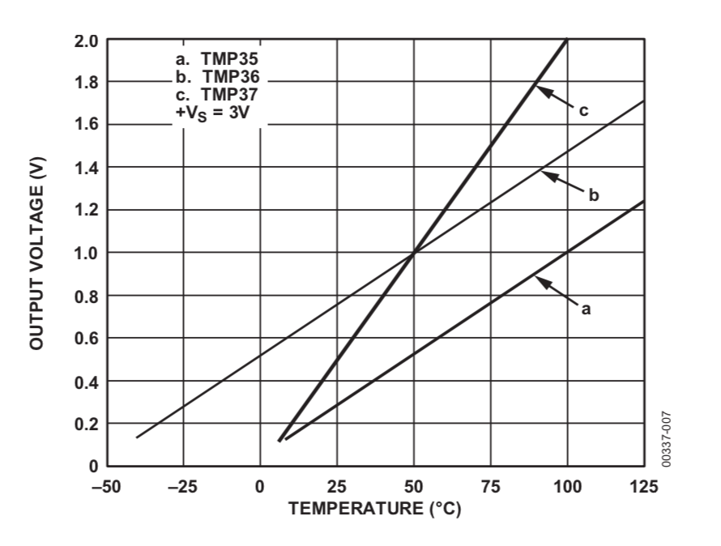
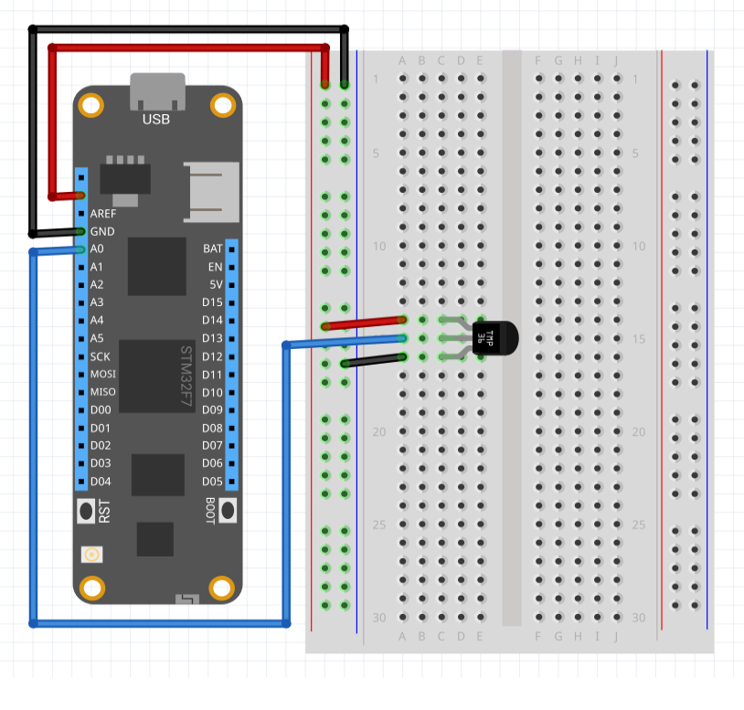

The analog temperature sensor driver can be used with any sensor that has a linear voltage response. It has been tested with the following series of temperature sensors:

* TMP35
* TMP36
* TMP37
* LM35

These sensors exhibit a linear change in the analog voltage for each degree centigrade. This is often presented in the datasheet as follows:



This driver should work with any sensor of this type.

###Purchasing

TMP36 sensors can be purchased from a number of suppliers including:

* [Adafruit](https://www.adafruit.com/product/165)
* [Sparkfun](https://www.sparkfun.com/products/10988)

---
uid: Meadow.Foundation.Sensors.Temperature.AnalogTemperature
example: [*content]
---

The following application demonstrates how to use the TMP36 in interrupt mode. The sensor will be read every second and changes in values greater than +/- 0.1C will generate and interrupt:

```csharp
using System;
using System.Threading;
using System.Threading.Tasks;
using Meadow;
using Meadow.Devices;
using Meadow.Foundation.Sensors.Temperature;
using Meadow.Peripherals.Sensors.Atmospheric;

namespace AnalogTemperature_Sample
{
    public class Program
    {
        static IApp app;
        public static void Main(string[] args)
        {
            if (args.Length > 0 && args[0] == "--exitOnDebug") return;

            // instantiate and run new meadow app
            app = new MeadowApp();

            // keep app alive
            Thread.Sleep(Timeout.Infinite);
        }
    }
    
    public class MeadowApp : App<F7Micro, MeadowApp>
    {
        AnalogTemperature analogTemperature;

        public MeadowApp()
        {
            Console.WriteLine("Initializing...");

            // configure our AnalogTemperature sensor
            analogTemperature = new AnalogTemperature (
                device: Device,
                analogPin: Device.Pins.A00,
                sensorType: AnalogTemperature.KnownSensorType.LM35
            );

            // Example that uses an IObersvable subscription to only be notified
            // when the temperature changes by at least a degree.
            analogTemperature.Subscribe(new FilterableObserver<AtmosphericConditionChangeResult, AtmosphericConditions>(
                h => {
                    Console.WriteLine($"Temp changed by a degree; new: {h.New.Temperature}, old: {h.Old.Temperature}");
                },
                e => {
                    return (Math.Abs(e.Delta.Temperature) > 1);
                }
                ));

            // classical .NET events can also be used:
            analogTemperature.Updated += (object sender, AtmosphericConditionChangeResult e) => {
                Console.WriteLine($"Temp Changed, temp: {e.New.Temperature}ºC");
            };

            // Get an initial reading.
            ReadTemp().Wait();

            // Spin up the sampling thread so that events are raised and
            // IObservable notifications are sent.
            analogTemperature.StartUpdating();
        }

        async Task ReadTemp()
        {
            var conditions = await analogTemperature.Read();
            Console.WriteLine($"Initial temp: { conditions.Temperature }");
        }
    }
}
```

##### Example Circuit

Consider the TMP36, this sensor requires only three connections; power, ground and the analog output:

