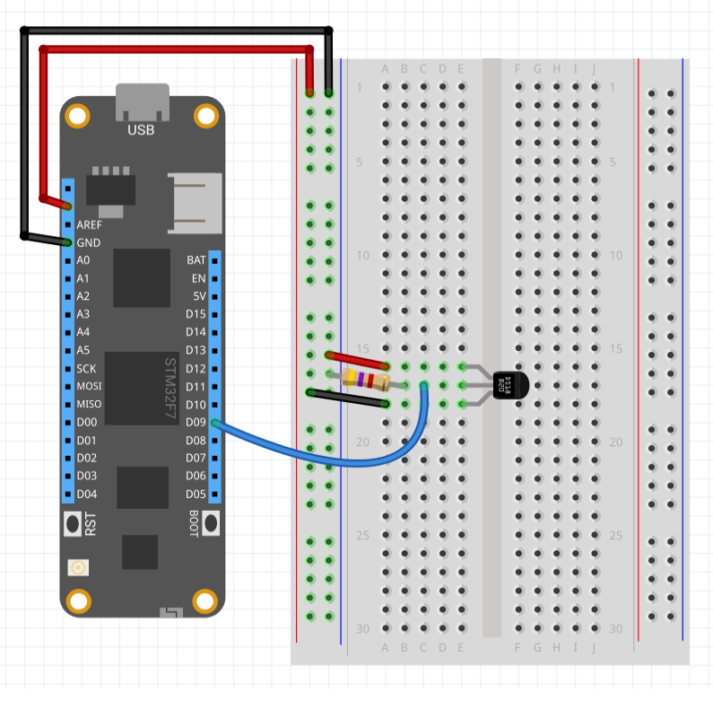

The DS18B20 is a 1-Wire temperature sensor manufactured by Maxim.  The sensor can operate in 9, 10, 11 or 12 bit precision and has a range of -55&deg;C to 125 &deg;C.

Each sensor has a 64-bit unique identifier built in.  This allows multiple sensors to be connected to the same 1-Wire bus.  So for instance, a project could measure internal and external temperature using a single GPIO pin.

# Purchasing

DS18B20 sensors are available in TO-92 packaging and also in a waterproof version from the following suppliers:

* [Adafruit DS18B20 TO-92 Package with Pull-up Resistor](https://www.adafruit.com/product/374)
* [Adafruit Waterproof DS18B20](https://www.adafruit.com/product/381)
* [Sparkfun DS18B20 TO-92 Package](https://www.sparkfun.com/products/245)
* [Sparkfun Waterproof DS18B20](https://www.sparkfun.com/products/11050)

Note that when purchasing a DS18B20 you will require a 4K7 pull-up resistor if one is not already supplied with the sensor.

---
uid: Meadow.Foundation.Sensors.Temperature.DS18B20
example: [*content]
---

The driver for the DS18B20 temperature sensor can operate in interrupt or polling mode.

### Interrupt Mode

The example below will check the temperature every second.  An interrupt will be raised if the difference in temperature between the last reported reading and the current reading is greater than + / - 0.5 &deg;C.

```csharp
using System.Threading;
using Meadow;
using Meadow.Foundation.Sensors.Temperature;

namespace DS18B20_Sample
{
    public class Program
    {
        static IApp _app; 
        public static void Main()
        {
            _app = new App();
        }
    }
    
    public class App : AppBase<F7Micro, App>
    {
        public App ()
        {
            DS18B20 ds18B20 = new DS18B20(Pins.GPIO_PIN_D3, updateInterval: 1000, temperatureChangeNotificationThreshold: 0.5F);
            ds18B20.TemperatureChanged += ds18b20_TemperatureChanged;
            Thread.Sleep(Timeout.Infinite);
        }

        /// Temperature of ds18b20 has changed by more than 0.001 C
        private static void ds18b20_TemperatureChanged(object sender, Netduino.Foundation.Sensors.SensorFloatEventArgs e)
        {
            Debug.Print("Temperature: " + ((DS18B20) sender).Temperature.ToString("F2"));
        }
    }
}
```

### Polling Mode

The following application reads the temperature from the DS18B20 sensor every 0.5 seconds and displays the results in the debug console:

```csharp
using System.Threading;
using Meadow;
using Meadow.Foundation.Sensors.Temperature;

namespace DS18B20_Sample
{
    public class Program
    {
        static IApp _app; 
        public static void Main()
        {
            _app = new App();
        }
    }
    
    public class App : AppBase<F7Micro, App>
    {
        public App ()
        {
            DS18B20 ds18b20 = new DS18B20(Pins.GPIO_PIN_D3, updateInterval: 0);
            while (true)
            {
                ds18b20.Update();
                Debug.Print("Current temperature: " + ds18b20.Temperature);
                Thread.Sleep(500);
            }
        }
    }
}
```

##### Example Circuit

