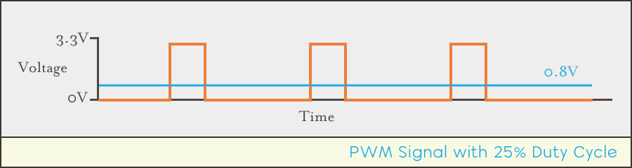

# Introduction

Pulse-Width-Modulation is a way of controlling voltage digitally to emulate an analog signal. By turning a digital output `ON` and `OFF` very rapidly, an intermediate average output voltage can be achieved:

Although PWM is a modulation technique that can be used for communication, it's most often used to:

- Limit the voltage being supplied to a device.
- Vary the output of LEDs.
- Control motors such as servos.

A PWM signal generated by a Meadow is a square wave that can be described by two key parameters known as the _duty cycle_ and _frequency_.

## Duty Cycle

The duty cycle describes the percentage of time the signal is `ON`/`HIGH`, and the average output voltage is directly tied to this parameter. Consider the following wave with a duty cycle of `0.5` (50%):

In the above diagram, the signal is `ON`/`HIGH` half of the time, and `OFF`/`LOW` the other half. The average voltage output is therefore `1.6V`, since `3.3V * 0.5 = 1.6V`.

If the duty cycle were lowered to 25% (`0.25`), then the average voltage output would also be lowered:

In this case, the average voltage output would be around `0.8V`, since `3.3V * 0.25 = 0.825V`

## Frequency

Note that in both cases, the frequency is the same; the rising edges of the signal are aligned to the same point in time. 

So the frequency is the same but the duty cycle is different.

However, for a higher resolution signal, the frequency can be increased while keeping the same duty cycle. Consider the following PWM with a 50% duty cycle but a frequency twice as high as the previous signals:

In this case, the signal is cycling `ON`/`OFF` twice as fast as the 50% cycle before, but still providing the same average voltage output. 

Higher frequencies create smoother signals, and are required in some cases. For instance, when using a PWM signal to control the brightness of an LED, a frequency of at least 60Hz (60 cycles per second) is required because humans will notice a flicker in frequencies below that.

## Signal Generation

PWM signals can be generated via hardware (on the microcontroller) as well as via software. However, except for very slow frequencies, the hardware PWM generator should be used, as it doesn't cause any load on the processor.

### API

[tbd]

# PWM Support in Meadow

## Hardware/Pins

Nearly every digital pin on the Meadow F7 board supports PWM

[separated into timer groups, in which each pin must be set on an integer multiple of each other]

## APIs

[`IPwmPort`](/docs/api/Meadow/Meadow.Hardware.IPwmPort.html) Class

[creating a PWM Port on an F7 pin]

### SoftPwm

For PWM frequencies below 1hz, as found in industrial control systems [HVAC, etc., there is a soft pwm class] 

[SoftPwm class]

# Examples

## Driving an LED

[PwmLed sample code]

## Controlling a Servo

[Servo Core Code]

--
Note that the onboard LED can also be configured as a PWM channel.

