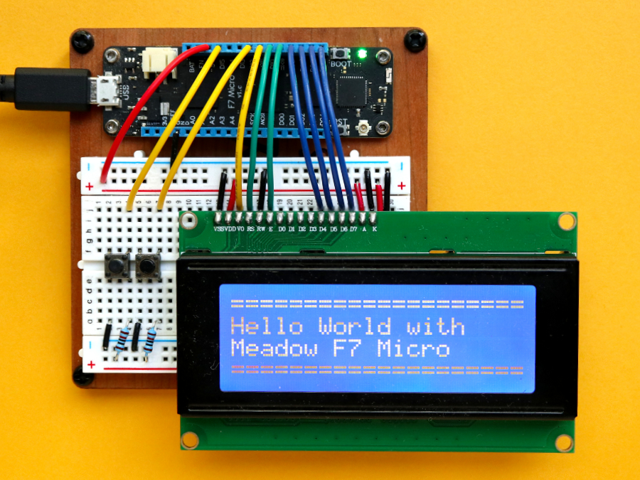
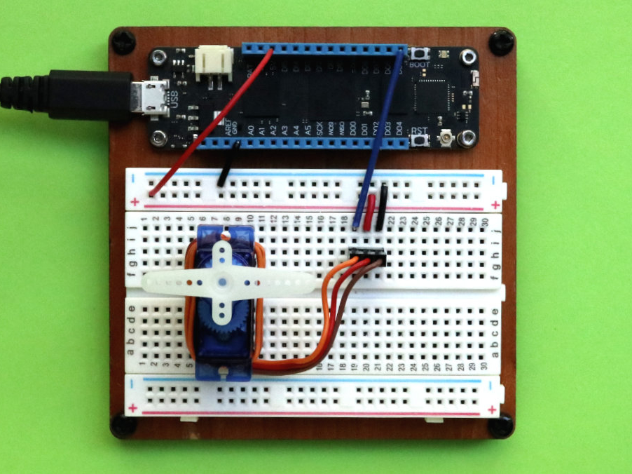
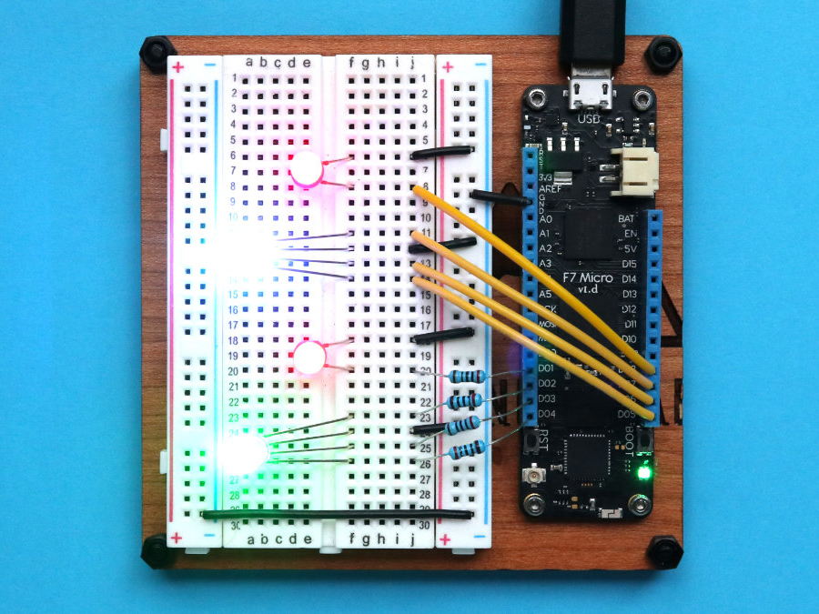
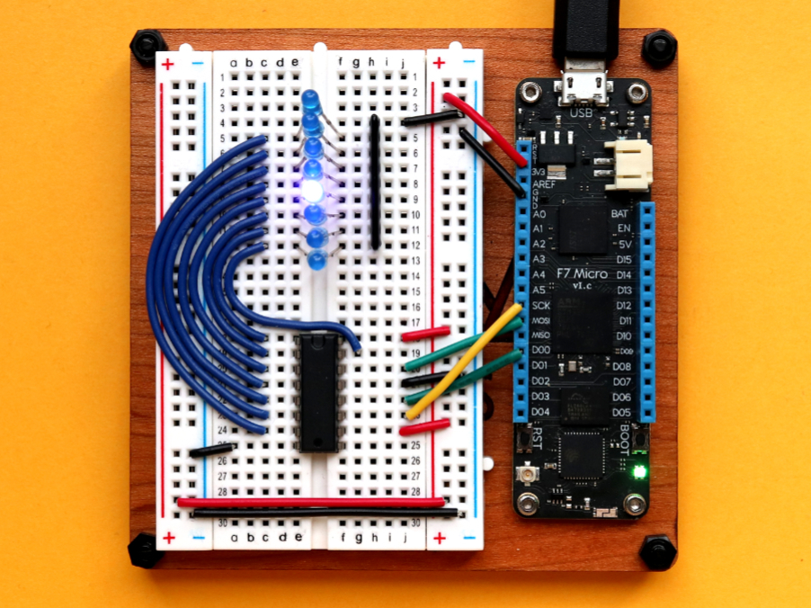
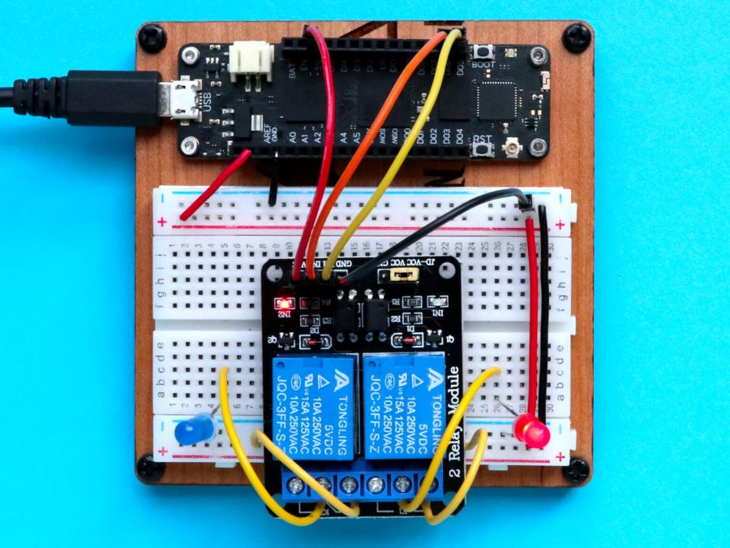
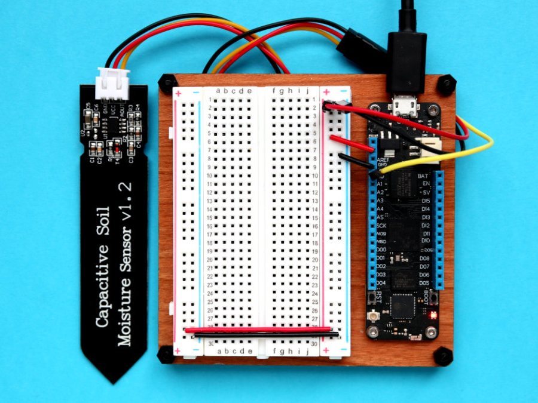

| Post       | Image |
|---------------|-------|
| [Hack Kit Series: Closer look at 20×4 LCD character display](http://blog.wildernesslabs.co/hack-kit-series-closer-look-at-20x4-lcd-character-display/) |  |
| [Hack Kit Series: Closer look at SG90 Micro Servos](http://blog.wildernesslabs.co/hack-kit-series-closer-look-at-sg90-micro-servos/) |  |
| [Hack Kit Series: Closer look at LEDs](http://blog.wildernesslabs.co/hack-kit-series-closer-look-at-leds/) |  |
| [Hack Kit Series: Closer look at 74HC595 IO Expander](http://blog.wildernesslabs.co/hack-kit-series-closer-look-at-74hc595-io-expander/) |  |
| [Hack Kit Series: Closer look at Relays](http://blog.wildernesslabs.co/hack-kit-series-closer-look-at-relays/) |  |
| [Hack Kit Series: Closer look at Push Buttons](http://blog.wildernesslabs.co/hack-kit-series-closer-look-at-push-buttons/) |  |
| [Hack Kit Series: Closer look at Capacitive Soil Moisture sensors](http://blog.wildernesslabs.co/hack-kit-series-closer-look-at-capacitive-soil-moisture-sensors/) |  |