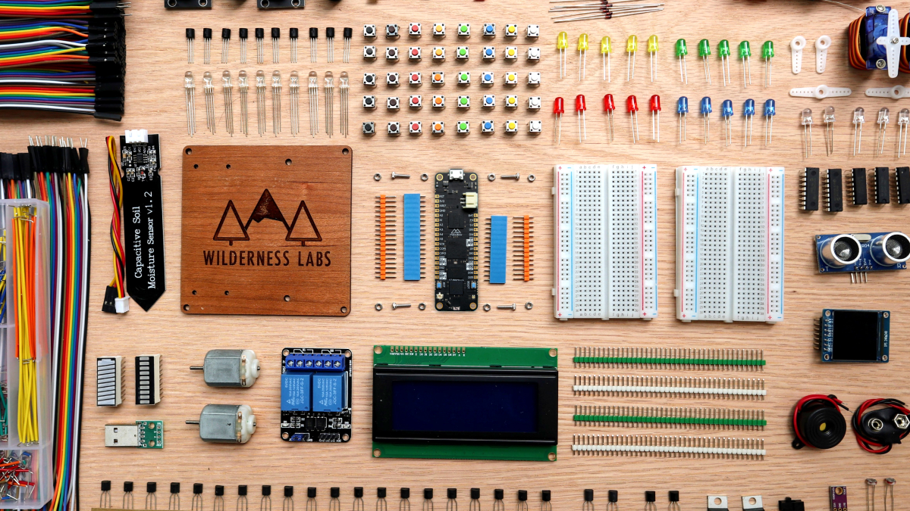

### F7 Feather Dev Kit

| Item                   | QTY | Description | |
|------------------------|:---:|-------------|-|
| Meadow F7 Feather v2 | 1 | Prototype-friendly, embeddable developer board to enable you to prototype on real hardware and embed it directly into products. | 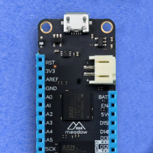 |
| Laser-etched Baseboard | 1 | Baseboard that holds a Meadow and a Half+ size breadboard for prototyping. |  |
| Half+ Breadboard       | 2 | Breadboard for quick, temporary, prototyping. | 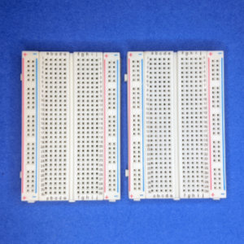 |
| M2x8MM Hex Bolts | 4 | |  |
| M2 Nuts | 8 | |  |

### Large Items

| Item                   | QTY | Description | |
|------------------------|:---:|-------------|-|
| Hack Kit Box           | 1 | Box that holds all the hack goodies. |
| Wire Jumpers (M/M, M/F, F/F) | 1 | A set of flexible jumper wires for breadboard prototyping. |
| Jumper Kit | 1 | Box of various length breadboard jumper wires. |
| [Micro Servo](/docs/api/Meadow.Foundation/Meadow.Foundation.Servos/Servo/) | 1 | Motor with precision 180º rotation control. |  |
| [2-Channel Relay Board](/docs/api/Meadow.Foundation/Meadow.Foundation.Relays/Relay/) | 1 | Digitally controlled, isolated circuit switch for controlling external power, often used to switch household mains electricity (`110V/240V` AC). |  |
| [Distance Sensor (HC-SR04)](/docs/api/Meadow.Foundation/Meadow.Foundation.Sensors.Distance/Hcsr04/) | 1 | Sonar-based distance sensor good for up to 1 meter. |  |
| [Moisture Sensor](/docs/api/Meadow.Foundation/Meadow.Foundation.Sensors.Moisture/Capacitive/) | 1 | Capacitive soil moisture sensor with digital output. |  |
| [4x20 LCD Character Display](/docs/api/Meadow.Foundation/Meadow.Foundation.Displays.Lcd/CharacterDisplay/) | 1 | LCD character display that's 4 lines tall and 20 characters wide. Can be used with TextMenuDisplay to display text menus. |  |
| [ST7789 Color LCD Display](/docs/api/Meadow.Foundation/Meadow.Foundation.Displays/St7789/) | 1 | 1.3", 16bbp color, 240x240 pixel, graphic display. | 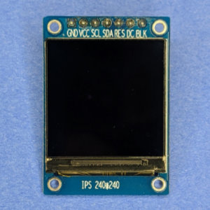 |
| Resistor Kit | 1 | ~300 resistors of varying resistance. | 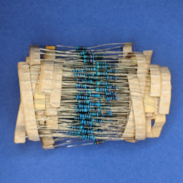 |
| Capacitor Kit | 1 | Various value capacitors for general digital circuit usage. |  |
| Single-row Breakaway Headers | 4 | |  |
| [Rotary Encoder w/Pushbutton](/docs/api/Meadow.Foundation/Meadow.Foundation.Sensors.Rotary/RotaryEncoderWithButton/) + Knobs | 2 | Continuous rotation digital input knob with integrated pushbutton. | 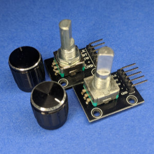 |
| [Piezo Speaker](/docs/api/Meadow.Foundation/Meadow.Foundation.Audio/PiezoSpeaker/) | 1 | Simple, single-frequency sound emitting device for generating tones, beeps, and other simple sounds. |  |
| `9V` Battery Adapter | 1 | Plugs into a `9V` battery and exposes the power and ground via wires. |  |
| DC Motor | 2 | `6V` motor that can be used in conjunction with either the motor controller or BJTs and a `5V` power source. |  |
| USB Breakout | 1 | Used to expose the `5V` and `GND` pins of a USB adapter so that it can be used as an external power supply to drive motors, and such. |  |
| SPDT Switch | 2 | Small two-position switch. |  |

### ICs

| Item                   | QTY | Description | |
|------------------------|:---:|-------------|-|
| [74595 Shift Register](/docs/api/Meadow.Foundation/Meadow.Foundation.ICs.IOExpanders/x74595/) | 2 | 8-port digital output expander chip. Adds 8 additional `DigitalOutputPort`s to a Meadow. Can be chained up to 8 for 64 total additional outputs. | 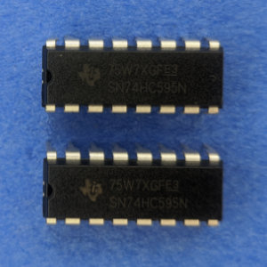 |
| [MCP23008 IO Expander](/docs/api/Meadow.Foundation/Meadow.Foundation.ICs.IOExpanders/Mcp23008/) | 2 | 8-port digital IO expander chip that connects via SPI. Adds 8 additional digital ports that can be used as output or input with changed notification support. | 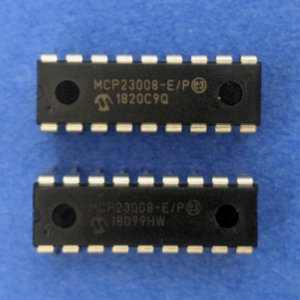 |
| [H-Bridge Motor Controller](/docs/api/Meadow.Foundation/Meadow.Foundation.Motors/HBridgeMotor/) | 1 | SN754410. Provides digital control for two motors using an external power source, controlled via PWM. | 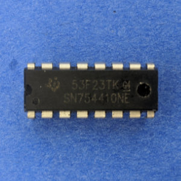 |

### LEDs

| Item                   | QTY | Description |
|------------------------|:---:|-------------|
| [Red, Green, Blue (RGB) LED](/docs/api/Meadow.Foundation/Meadow.Foundation.Leds/RgbPwmLed/) | ~10 | 3-component Light-Emitting-Diode (LED) that can display nearly any color by varying the red, green, and blue input voltage. | 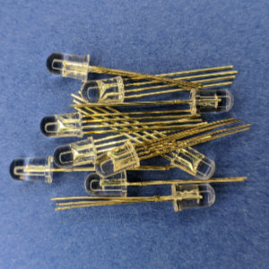 |
| [Various Color LEDs](/docs/api/Meadow.Foundation/Meadow.Foundation.Leds/Led/) | ~25 | 5 types of single-color LEDs. | 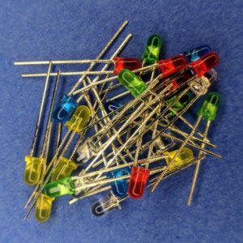 |
| [Rainbow LED Bargraph](/docs/api/Meadow.Foundation/Meadow.Foundation.Leds/LedBarGraph/) | 1 | Green, yellow, red, LED array. |  |
| [Rainbow LED Battery Bargraph](/docs/api/Meadow.Foundation/Meadow.Foundation.Leds/LedBarGraph/) | 1 | Green, yellow, red, LED array that has a battery shape. |  |

### Transistors

| Item                   | QTY | Description | |
|------------------------|:---:|-------------|-|
| BS170 N-Channel MOSFET | 20 | Manufactured through DMOS technology, best suited for low voltage, low current applications like servo motor control, power MOSFET gate drivers and other switching application. | |
| TIP120 Power Transistor | 2 | Great for whenever you need to control medium to high-power electronics such as motors, solenoids, or 1W+ LEDs. | 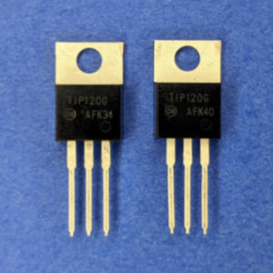 |
| 2N3904 NPN Transistor | 10 | Well suited for TV and home appliance equipment. | 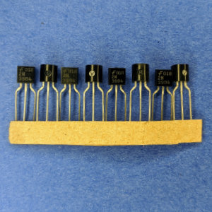 |
| 2N3906 PNP Transistor | 2 | Commonly used PNP bipolar junction transistor intended for general purpose low-power amplifying or switching applications. | 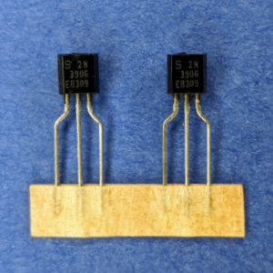 |

### Small Parts

| Item                   | QTY | Description |
|------------------------|:---:|-------------|
| [Push Button (Various Colors)](/docs/api/Meadow.Foundation/Meadow.Foundation.Sensors.Buttons/PushButton/) | ~40 | Simple tactile switches in a variety of colors. |
| [LM35DZ Analog Temperature Sensor](/docs/api/Meadow.Foundation/Meadow.Foundation.Sensors.Temperature/AnalogTemperature/) | 2 | `0ºC - 100ºC` temperature sensor with analog output. |
| Temt6000 Luminosity Sensor | 1 | `5V` light sensor used as an example of how to use a voltage divider to reduce a `5V` analog signal to `3.3V`. See the [Level-Shifting Lab](/Hardware/Tutorials/Electronics/Part5/Level_Shifting_Lab/). |
| Photodiode | 1 | |
| Photoresistor | 2 | Sensor that can measure the amount of light it receives. Needs to be wired up as part of a voltage divider. See the [Resistive Sensor Lab](/Hardware/Tutorials/Electronics/Part5/Resistive_Sensor_Lab/) |
| 1N4004 Diode | ~8 | General purpose, `1A` power rectification diode. |
| 1N914 Diode | 8 | |
| 1N5817 Diode | 10 |  |
| Resistor Network Kit | 1 | 5 different values of 8 resistors in a single package. Typically used in conjunction with LED bargraphs. |
